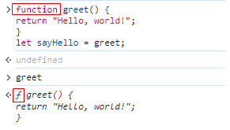
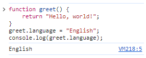
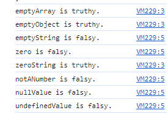
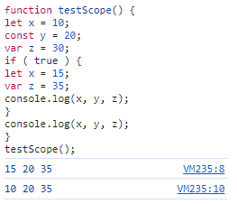
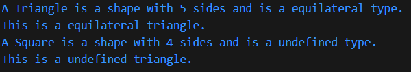
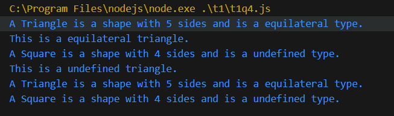
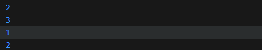
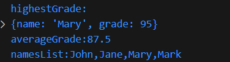

# tutorial 1
# Q1
## 1 What will be the output of sayHello() and why?
"Hello, world!". Because what the `sayHello` storage is the `greet` function. If we execute the `sayHello`, it will show it is a function of greet
## 2 Is greet a function or an object? Justify your answer
function

## 3 Can properties be added to the greet function? If yes, write a code snippet to add a property language with the value "English" to the greet function.

# Q2
## 1.What will be the output of this function?
```javascript
    for (let key in variables) {
        if (variables[key]) {
            console.log(`${key} is truthy.`);
        } else {
        console.log(`${key} is falsy.`);
        }
    }
```
output:

## 2.What is the difference between nullValue and undefinedValue?
1.  `NaN` is an number type value. Usually results from an error or undefined result caused by a math operation
2.  `undefined` if a variable is declared but not assigned, it is undefined. Also the null return function will return a `undefined`
# Q3
## 1. What would be the output of this code and why?

* `let` has block scope, `var` has function scope
* `var` can repeat the same name variable in the same field, but the value will be covered. `let` cannot repeatedly declare the variables of the same name in the same scope.
Also there has other different
1. The variables using `var` and `let` declaration will cause variables hositing, it means that the variable will be elevated to the top of the current scope.  `var` cam ne accesed before the declaration and the value is `undefined`. But `let` cannot be accessed before declaration, will return `ReferenceError`
2. In the `for` loop, variables declared with var still exist in the scope of the loop after the loop ends. But `let` can't
# Q4
## explain
* `bg-blue-500 ` --tw-bg-opacity: 1;background-color: rgba(59,130,246,var(--tw-bg-opacity)); set background color in blue
* `hover:bg-blue-700 ` --tw-bg-opacity: 1; background-color: rgba(29,78,216,var(--tw-bg-opacity)); When mouse hovered on the button, the background color changed to blue gba(29,78,216).
* `text-white ` set font color into white
* `font-bold ` set font weight to 700
* `py-2 ` set padding top and bottom 0.5rem
* `px-4 ` set padding left and right 1 rem
* `rounded` set border radius to .25rem so the button will has rounded corners
## modify
```html
    <!DOCTYPE html>
    <html>

    <head>
        <title>Minimal HTML Page</title>
        <link href="https://cdn.jsdelivr.net/npm/tailwindcss@2. 2.16/dist/tailwind.min.css" rel="stylesheet">
    </head>

    <body>
        <button
            class="bg-green-500 hover:bg-blue-700 text-white    font-bold py-2 px-4 rounded hover:scale-110    transform transition">
            Shop Online
        </button>
    </body>

    </html>
```


# Q5
## 1.

1. `Triangle` inherits from `shape`, so it has the `name` and `side`  properties. based on this, it add a new property `type`. `Triangle` class override the `describe` function, so it will show as the 'A Triangle is a shape with 5 sides and is a equilateral type.'
2. `Triangle` create a new function named `describeType()`. When variable `equilateral` init, it set type as 'equilateral'
3. `Object.create()` will inherit both the properties and function from father Object. If we change the properties of `square`, the properties in `equilateral` will not change.
4. same with 3
## 2.
$shape \to Triangle \to equilateral \to square$
## 3.
I did not get it. It already had a `describe()` function in Triangle class
## 4.

After the `square` change its properites, I change the `equilateral`'s again, and the `square` did not change. It means that it get a new memory space to store the data. 
# Q6
```javascript
    class Bag {
        constructor() {
            this.elements = new Map;
        }

        add(element) {
            this.elements.set(element, (this.elements.get   (element) || 0) + 1);
        }

        remove(element) {
            if (this.elements.has(element)) {
                if (this.elements.get(element) > 1) {
                    this.elements.set(element, this.elements.get    (element) - 1);
                }
                else {
                    this.elements.delete(element)
                }
            }
        }

        count(element) {
            if (this.elements.has(element)) {
                return this.elements.get(element);
            }
        }

        size() {
            let size = 0;
            for (let count of this.elements.values()) {
                size = size + count
            }
            return size;
        }

    }

    const bag = new Bag();
    bag.add('apple');
    bag.add('banana');
    bag.add('apple');
    console.log(bag.count('apple'));
    console.log(bag.size());
    bag.remove('apple');
    console.log(bag.count('apple'));
    console.log(bag.size());
```

# Q7
``` javascript
    var json = '{"name":"John", "age":"30", "city":"New York"}'
    var setList = json.slice(1, -1).split(',')
    var resultLsit = {}
    for (let keyValue of setList) {
        let tmp = keyValue.split(':')
        let key = tmp[0].slice(1, -1)
        let values = tmp[1].slice(1, -1)
        resultLsit[key] = values
    }
    console.log(resultLsit)
```

# Q8
``` javascript
    let students = [
        { name: "John", grade: 90 },
        { name: "Jane", grade: 85 },
        { name: "Mary", grade: 95 },
        { name: "Mark", grade: 80 }
    ];
    // var highestGrade = 0
    // var highestGradeStu = ''
    // students.map(function (item){
    //     if(highestGrade < item.grade){
    //         highestGrade = item.grade;
    //         highestGradeStu = item.name;
    //     }
    // })
    // console.log(highestGradeStu)

    var highestGrade = students.reduce(function(highestGradeStu,    stu){return highestGradeStu.grade<stu.grade?    stu:highestGradeStu})
    console.log('highestGrade:')
    console.log(highestGrade)
    var averageGrade = students.reduce(function(total,item) {return item.grade + total},0)/students.length
    console.log('averageGrade'+averageGrade)
    var namesList = students.map(item => item.name)
    console.log('namesList:'+ namesList)
```
