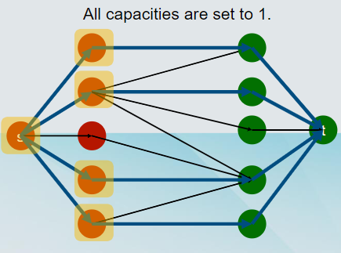
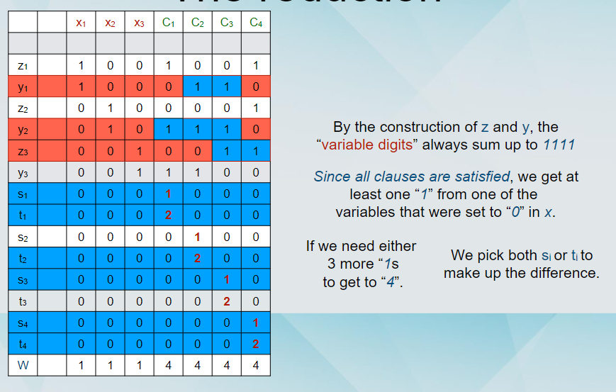

# COMP523 Advanced Algorithmic Techniques
## Introduction to algorithms and basic complexity notions
### Algorithmic techniques
* Brute force
* Divide and Conquer
* Greedy
* Dynamic Programming
* Integer linear program relaxation and rounding
* Competitive analysis
* Branch and Bound
### Types of algorithms
* Seqrching algorithms
* Sorting algorithms
* Graph algorithms
* Approximation algorithms
* Online algorithms
* Randomised algorithms
* Exponential-time algorithms
### What should we expect from algorithms
* **Correctness:** It computes the desired output
* **Termination:** Eventually terminates (or with high probability)
* **Efficiency:**
  * The algorithm runs *fast* and/or uses *limited memory*
  * The algorithm produces a "good enough" outcome
### Loop invariance
* A loop invariant is a property that holds with respect to the loops executed by the algorithm
* For a loop invariant, we must show:
  * **Initialisation:** It is true prior to the first iteration of the loop
  * **Maintenance:** If it is true before an interation of the loop, it remains true before the next iteration.
  * **Termination:** When the loop terminates, the invariant gives us a useful property for correctness
* Quite reminiscent of mathematical induction.
### Loop invariance for InsertionSort
```
INSERTION_SORT(A)
  FOR j<-2 TO lengh[A] 
    DO key<-A[j]
      {Put A[j] into the sorted sequence A[1..j-1]}
      i<-j-1
      WHILE i>0 and A[i]>key
        DO A[i+1]<-A[i]
          i<-i-1
      A[i|1]<-key
```
* Loop invariant: The subarray A[1,...,j-1] consists of the elements originally in A[1,...,j-1] but 
in sorted order.
* Initialisation: Before the first iteration, the subarray is A[1], which contains the first element
and is trivially sorted.
* Maintenance: We move A[j-1], A[j-2], A[j-3], ... by one position to the right, until we find the 
proper position for A[j]. The subarray A[1,...,j] contains the original elements and it is sorted.
* Termination: Termination happens when length[A] is reached, so the counter is j = n+1. The 
loop invariant for j = n+1 is the sorted sequence of the n numbers.
### Running Time
* Different computers have different speeds.
* **Random Access Machine (RAM) model.**
* Instructions:
* Arithmetic (add, subtract, multiply, etc).
* Data movement (load, store, copy, etc).
* Control (branch, subroutine call, return, etc).
* **Each instruction is carried out in constant time.**
* We can count the number of instructions, or the number of steps
```
INSERTION_SORT(A)
  FOR j<-2 TO lengh[A] *n times*
    DO key<-A[j] *n-1 times*
      {Put A[j] into the sorted sequence A[1..j-1]}
      i<-j-1 *n-1 times*
      WHILE i>0 and A[i]>key *sigema j=2 -> n t_j times*
        DO A[i+1]<-A[i] *sigema j=3 -> n t_j times*
          i<-i-1
      A[i|1]<-key *n-1 times*
```

$T(n)=c_1n+c_2(n-1)+c_3(n-1)+c_4\sum_{j=2}^{n} t_j+c_5\sum_{j=2}^{n}(t_j-1)+c_6\sum_{j=2}^{n}(t_j-1)+c_7(n-1)$

* best case: sorted array $t_j =1$ bounded by some *cn* for some constant c
* worst case: Reverse sorted array $t_j=j$ bounded by some *$cn^2$* for some constant c
  
### Memory Usage
* Each memory cell can hold one element of the input
* Total memory usage = Memory used to hold the input + extra memory used by the algorithm (*auxiliary memory*)

### *Worst* vs *Best* vs *Average* Case
* ***Convention***: when we say "the running time of Algorithm A", we mean the worst-case running time, over all possible inputs to the algorithm
* We can also measure the best-case running time, over all possible inputs to the problem.
*  In between: average-case running time.
   * Running time of the algorithm on inputs which are chosen at random from some distribution.
   * The appropriate distribution depends on the application.
   * The analysis can be difficult.

## Asymptotic Notation (渐进表示法)
* When n becomes large, it makes less of a difference if an 
algorithm takes 2n or 3n steps to finish.
* In particular, 3logn steps are fewer than 2n steps.
* We would like to avoid having to calculate the precise 
constants.
* We use asymptotic notation.

$O(g(n))=f(n)$: there exist positive constant $c$ and $n_0$ such that $0\leq f(n)\leq cg(n)$ for all $n\geq n_0$
* For sufficiently large inputs, there is a constant such that c g(n) is 
not smaller than f(n). 
* For example, for sufficiently large inputs, 2n is larger than 3logn. 
Therefore, 3log n = O(n).
* Intuitively, g(n) grows “not slower” than f(n). 
* Use: If we can upper bound the running time of an algorithm by c*g(n), where c is some constant and g(*) is a function of the input, then we can say that the running time is O(g(n))

$\Omega(g(n))=f(n)$: there exist positive constant $c$ and $n_0$ such that $0\leq cg(n)\leq f(n)$ for all $n\geq n_0$
* For sufficiently large inputs, there is a constant such that c g(n) is 
not larger than f(n). 
* For example, for sufficiently large inputs, 3logn is smaller than 
2n. Therefore, 2n = Ω(logn).
* Intuitively, g(n) grows “not faster” than f(n).
* Use: If we can lower bound the running time of an algorithm by c*g(n), where c is some constant and g(*) is a function of the input, then we can say that the running time is Ω(g(n)).


$\Theta(g(n))=f(n)$: there exist positive constants $c_1,c_2$ and $n_0$ such that $0\leq c_1g(n) \leq f(n)\leq c_2g(n)$ for all $n\geq n_0$
* If a function is both O(g(n)) and Ω(g(n)).
* Use: If we can show that the running time of an algorithm 
is lower bounded by c1*g(n) and upper bounded by 
c2*g(n) for some constants c1 and c2 and some function 
g(•) of n, then we can say that the running time is Θ(g(n)).

$o(g(n))=f(n)$: for any constant $c >$ there exists a constant $n_0>0$ such that $0\leq f(n)< cg(n)$ for all $n\geq n_0$
* The bound holds for sufficiently large inputs and for any constant c.
* Equivalent interpretation: $\lim_{n->\infty}\frac{f(n)}{g(n)} = 0$
* As n approaches infinity, f(n) becomes insignificant 
compared to g(n).
* For example: $2n=o(n^2)$

$\omega(g(n))=f(n)$: or any constant $c >$ there exists a constant $n_0>0$ such that $0\leq cg(n)<f(n)$ for all $n\geq n_0$

* The bound holds for sufficiently large inputs and for any constant c.
* Equivalent interpretation: $\lim_{n->\infty}\frac{f(n)}{g(n)} = \infty$
* As n approaches infinity, g(n) becomes insignificant 
compared to f(n).
* For example: $4n^2=\omega(n)$

### Examples:
* $5n^3+100= O(n^3)$
* $5n^3+100=\Omega(n^3)$
* $\log n=o(n^5)$
* $n^5=o(2^n)$
* $\log(4n) = \log n + \log 4 = O(\log n)$
* $log(n^4)=4\log n = O(\log n)$

## Searching in logarithmic time
### BinarySearch pseudocode
* Procedure BinarySearch(x,i,j)
  * if  i = j then
    * if x = A[i],return yes Then run BinarySearch(x,1,n)
    * if x != A[i], return no
  * Else
    * if x = A[(i+j)/2], return yes
    * If x < A[(i+j)/2], return BinarySearch(x, i, (i+j)/2 -1)
    * If x > A[(i+j)/2], return BinarySearch(x, (i+j)/2+1, j)
### Running time of BinarySearch
* All operations take constant time and there is only a constant number of non-comparison operations.
* We will measure the number of comparisons.
* Every call of the procedure performs at most 4 comparisons.
* The number of comparisons performed by BinarySearch is
  * $T(n)\leq T(n/2) + 4$
  * $\leq [T(n/4)+4]+4=T(n/4)+8$
  * $\leq T(n/8)+12$
  * ...
  * $\leq T(n/2^j)+4j$
  * ...
  * $\leq T(n/2^{\log n -1})+4(\log n -1) = T[n/(n/2)]+4(\log n -1)=T(2) + 4(\log n -1)$
  * $\leq 4+4(\log n -1)=4 \log n$

### How to do this formally
* By (strong) induction:
  * Base case: Show that it holds for input size n=1 or n=2
  * Induction step: Assume that it holds for all inputs of size at most n-1(induction hypothesis)
  * Prove that it holds for input size n.
  
  The number of comparisons performed by BinarySearch is T(n) ≤ T(n/2) + 4
  Let’s try to prove that T(n) ≤ 4 log n
  * Base Case: n=2, straightforwardly T(2) ≤ 4 = 4 log 2
  * Inductive step: Assume T(n/2) ≤ 4 log (n/2)
  * It holds that T(n) ≤ T(n/2) + 4 ≤ 4log(n/2) + 4 
  * ≤ 4log n - 4log2 +4 ≤ 4log n

### Divide-and-Conquer
* Split the input into smaller sub-instances.
* Solve each sub-instance separately.
* Combine the solutions of the sub-instances into a solution for the problem.
* Often: For each sub-instance, the algorithm calls itself to solve it (recursion).

The instances become so small that they can be solved 
via a brute force algorithm.

### Memory requirements of BinarySearch

* Memory used as part of the input: 
n (to store the array) + 1 (to store the number x).
  * Auxiliary memory:
  * The algorithm calls itself within its execution.
  * Needs to maintain these executions “active” in memory.
  * How many executions do we have?
    * O(log n).


## Majority (大多数)

### Finding majority in an array
* Given an array of n numbers, a majority element is one that appears more than n/2 times in the array.
* (Ignoring rounding issues, otherwise ceil(n/2) times). 
* Question: Given such an array, find a majority element if it exists, or return that it doesn’t

### Majority pseudocode
* Algorithm Majority(A[1,...,n])
* If |A| = 0 output no, if |A| = 1 output A[1].
* (Assume n = |A| is even).
* Initialise array B of size |A|/2.
* Set j=0
* For i = 1 to n/2, do
  * if A[2i-1] = A[2i] then
    * j=j+1
    * B[j] = A[2i]
* Majority(B[1,...,j])
* If Majority(B[1,...,j]) returns a value x
* Iterate through the array A and count 
the number of occurrences of x.
* if there are more than n/2, output x.
* else, output no
  


### Correctness

Lemma: If x is a majority element in A, then x is a majority element in B.

Proof of correctness of Majority (assuming Lemma): By induction:
  * *Base case*: Majority(B) works correctly for array B of size 1.
  * *Inductive* step: Assume that Majority(B) works correctly for array B of size  smaller than |A| (inductive hypothesis).
  * *Case 1 (There is a majority element in A)*: Then by the Lemma, it is also a majority element in B. Majority(B) will output it, by the inductive hypothesis and the last step of Majority(A) will output it.
  * *Case 2 (There is not a majority element in A)*: Then the last step of Majority(A)  will reject any candidate majority elements returned from Majority(B).


### Proof of the lemma
* Assumption: Suppose to the contrary, that x is a majority element in A but not a majority element in B. 假设x是A中的多数元素但不是B中的多数元素
* Let m be the number of occurrences of x in A. A里面有m个x
* Let k be the number of occurrences of x in B. B里面有k个x
* By the assumption, it follows that other values appear at least k times in B. 因为在这个假设中，x不是b中的多数元素，也就是说除了x之外其他的值在B中也至少出现k次
* This means that other values appear in A at least: 
* 2k times from the pairs that are represented in B by a value different than x plus。 也就是说在A中，其他值至少出现了2k次
* m-2k times, since each occurrence of x in A that is not paired with another x is paired with some other value (since there are 2k pairs xx, there are m-2k other occurrences of x in A). 因为在x在B中有k个，所以至少有k对xx在A中，也就是2k个x。剩下的m-2k个x则是和其他的值进行配对，也就有m-2k个其他值在A中
* In total, this gives 2k+(m-2k) = m occurrences, which contradicts the fact that x is a majority in 
A. Contradiction!(矛盾) 所以A里面一共有2k+m-2k = m个其他值，这与x是A中的多数元素矛盾

## Running Time of Divide an Conquer

### The Master Theorem
Suppose $T(n) \leq \alpha T(\lceil \frac{n}{b} \rceil) + O(n^d)$

for some constants $\alpha>0,\ b>1\ and\ d \geq 0$

$$ T(n)=\left\{
  \begin{aligned}
    O(n^d), if\ d>log_b a  \\
    O(n^d \log_{b}n), if\ d = \log_{b}\alpha\\
    O(n^{\log_{b}\alpha},if\ d <\log_b\alpha)
  \end{aligned}
\right.
$$

$log_b\alpha=\frac{\ln\alpha}{\ln b}$

Mergesort: $T(n)\geq 2T(n/2)+cn\ \ \ \ \ \ \alpha =2,b=2,\log_b\alpha=1,d=1$
Thus, the overall running time of Mergesort is O(n log n)

NinarySearch: $T(n)\geq T(n/2)+c\ \ \ \ \ \ \alpha =1,b=2,\log_b\alpha =0, d=0$
Thus, the overall running time of BinarySearch is O(log n)

Majority: $T(n)\geq T(n/2)+cn\ \ \ \ \ \ \ \alpha=1,b=2,\log_b\alpha=0,d=1$

Thus, the overall running time of Majority is O(n)


### Mergesort
```
Procedure Merge(A, B)
/* Recall that |A| = n and |B| = m */

Initialise array C of size n+m

i=1, j=1

For k=1, ... , m+n-1
  If A[i] ≤ B[j]
    C[k] = A[i]
    i=i+1
  Else
    C[k] = B[j]
    j=j+1

Algorithm Mergesort(A[i,...,j])

If i=j, return I

q=(i+j)/2

Aleft=Mergesort(A[i,...,q])
Aright=Mergesort(A[q+1,...,n])
return Merge( Aleft , Aright  
```

## Breadth-First Search


### simple idea
* Start from the starting vertex s which is at level 0 and consider it explored.
* For any node at level i, put all of its unexplored neighbours in level i+1 and consider them explored.
* Terminate at level j, when none of the nodes of the level has any neighbours which are unexplored.
### Visualising Breadth-First Search
Visualising Breadth-First Search
* Orient the edges along the direction in which they are visited during the traversal. 
  * Some edges are discovery edges, because they lead to unvisited vertices.
  * Some edges are cross edges, because they lead to visited vertices.
* The discovery edges form a spanning tree of the connected component of the starting vertex s.

### Breadth-First Search Pseudocode

```
Algorithm BFS(G,s)
Initialise empty list L0
Insert s into L0
Set i=0
While Li is not empty
  Initialise empty list Li+1
  for each node v in Li
    for all edges e incident to v
      if edge e is unexplored
        let w be the other endpoint of e
        if node w is unexplored
          label e as discovery edge
          insert w into Li+1
        else
          label e as cross edge
i = i+1

```

### Properties of BFS
* For simplicity, assume that the graph is connected.
* The traversal visits all vertices of the graph.
* The discovery edges form a spanning tree.
* The path of the spanning tree from s to a node v at level i has i edges, and this is the shortest path.
* If e=(u,v) is a cross edge, then the u and v differ by at most one level.
### Running time of BFS

* In every iteration, we consider nodes on different levels. 
* Therefore nodes are not considered twice.
* Every edge is examined at most twice.
* Therefore, BFS runs in time O(n+m).


## DAG Directed Acyclic Graphs
* A directed acyclic graph (DAG) G is a graph that does not 
have any cycles. 


### Properties of DAGs
* They appear frequently in applications.
* Example - prerequisite modules: To take module A you need to have taken module B and module C.
* If the module prerequisite relation has a cycle, then it is impossible to get a degree!

### Topological Ordering
* Given a directed graph G, a topological ordering of G is an ordering of the nodes u1, u2, ... , un, such that for every edge e=(ui,  uj), it holds that i < j.
* Intuitively, a topological ordering orders the nodes in a way such that all edges point “forward”.


### Topological Ordering implies DAG
* If graph G has a topological ordering, then G is a DAG.
* Suppose by contradiction that G has a topological ordering (u1, u2, ... , un) but it also has a cycle C.
* Let uj be the smallest element of C according to the topological ordering.
* Let ui be its predecessor in the cycle (i.e., there is an edge e=(ui, uj)).
* ui must appear before uj in the topological order (by the presence edge e). 
* This contradicts the fact that uj was the smallest element of C according to the topological ordering

### Does DAG imply topological ordering?
* TO => DAG was proved via proof-by-contradiction.
* DAG => TO will be proved via “proof-by-algorithm”.
* We will design an efficient algorithm that, given a DAG G, finds a topological ordering of G.

### Source node
* A source node is a node with no incoming edges.
* Lemma: Every DAG has at least one source node.
* Proof by contradiction:
  * Assume that every node has at least one incoming edge.
  * Start from any node u and follow edges from u backwards.
    * Equivalently, we move to a neighbour of u in Grev.
  * We can do that for every node, since by assumption there is no source. 
  * After at least n+1 steps, we will have visited the same node twice.
  * The graph has a cycle, therefore it can’t be a DAG. Contradiction!

### Another simple fact
* If we remove a node u and all its incident edges from a DAG G, the resulting graph G' is still a DAG.
  * if G' had a cycle, the same cycle would be present in G.

### DAG mplies topological ordering

* Proof-by-induction:
  * Base Case: If the DAG has one or two nodes, it clearly has a topological ordering.
  * Inductive step: Assume that a DAG with up to k nodes has a topological ordering (Inductive Hypothesis). We will prove that a DAG with k+1 nodes has a topological ordering.
    * By our lemma, there is at least one source node in G, and let u be such a node.
    * Put u first in the topological ordering (safe, since u is a source).
    * Consider the graph G’, obtained by G if we remove u and its incident edges.
    * G’ is a DAG (by the simple fact) with k nodes.
      * It has a topological ordering by the induction hypothesis.
    * Append this ordering to u.

### DAG proof by algorithm

Algorithm TopologicalSort(G)\\
  Find a source vertex u and put it first in the order.\\
  Let G’=G-{u}\\
  TopologicalSort(G’)\\
  Append this order after u

### Running Time

* We need to find a source u.
* We could check each node of the graph.
* We check n nodes in the first iteration, n-1 nodes in the second, and so on...
* What is the running time of this?
  * O(n2)

### A faster algorithm

* We will be more efficient in the choice of sources.
* We will say that a node is active, if it has not been selected (and therefore removed) as a source by the algorithm.
* We maintain two things:
  * (a) For each node w, the number of incoming edges from active nodes.
  * (b) The set S of all active nodes that have no incoming edges from other active nodes
* In the beginning, all nodes are active and we can initialise (a) and (b)via a pass through the graph (time O(m+n))
* In each iteration:
  * We select a node u from the set S.
  * We delete u.
  * We go through all the neighbours w of u and we reduce their value in (a) (i.e., number of incoming edges from active nodes) by 1.
  * When the value of (a) for some node w goes to 0, w is added to the set S.

## Finding Strongly Connected Components

### Connected component 连通分量

* A connected component of an undirected graph G is subgraph such that any two nodes are connected via some path.
* A strongly connected component of a directed graph Gis subgraph such that any two nodes are mutually reachable.


### Strongly connected component

* if can run the "forward" and "backward" BFS for a node s and find the set of nodes that are mutually reachable from s.
  * This is the strongly connected component of s
  * But BFS might produce different connected components, depending on how we visit the nodes
  * We need a consistent way of visiting them in the "forward" and in the "backward" pass

### Kosajaru's algoirithm
* Perform a DFS on G, starting from an arbitrary nodes s.
* Add the nodes that the DFS tree reaches to a stack.
  * A node is added to the stack when the DFS for that node is completed
* Perform a DFS on $G^rev$, visiting the nodes in the order that they are popped from the stack.
* Output the DFS trees of the second DFS as the strongly connected components


#### running time
O(m+n)
#### Correctness


## Network Flow Definitions
### Definitions
* A flow networks is a directecd graph G=(V,E) with the following properties:
  * Each edge e in E has a nonnegative *capacity (流量) $c_e$*.
  * There is a single *source* node s in V.
    * s does not have any incoming edges
  * There is a single *sink* node t in V.
    * t does not have any outgoing edges
  * All other node in v - {s,t} are called *internal（内部节点）* nodes
  * There is at least one edge incident to each node.
  * **All the capacities are integer numbers.**
### Example

### Flow
* An (s-t) flow is a function f: $E\rightarrow R^+$, mapping each edge e to a nonnegative real number f(e)
* A (feasible 可行的) flow must satisfy the following two properties:
  * (Capacity) For each e in e, we have $0\leq f(e)\leq c_e$
  * (Flow Conservation) For each node v in V - {s,t}, we have that $\displaystyle\sum_{e\ into\ v} f(e) = \displaystyle\sum_{e\ out\ of\ v} f(e)$
* The sources s generates flow. 源产生流
* The sink t absorbs flow. 汇结点结束流
* Value of flow f, denoted val(f):
  * Total flow out of s. v(f)=$\displaystyle\sum_{e\ out\ of\ s} f(e)$
* Generally, define $f^{out}(v)$ and $f^{in}(v)$ for the flow going out of(resp. going into)
* Similarly, define $f^{out}(S)$ and $f^{in}(S)$ for sets of nodes S

## The maximum flow problem - The Ford-Fulkerson Algorithm
### Defined
Givern a flow network G, find a flow of maximum possible value.
* Let’s start with a feasible solution.
  * f(e) = 0 for all e in E. 每条边的当前流量为0
*  try to increase it.
  * The flow originates from s and goes to t.
  * So we have to find an (s-t) path, and route it via this path.
  * How much flow are we allowed to route through this path?
    * As much as the smallest capacity ce of any edge e on the path.
### Example
  
  
  

### The residual graph $G_f$
* The residual graph $G_f$ of G (also called the residual network) is defined as follows:
  * The node set $V_f$ of $G_f$ is the same as V.
  * For each edge e = (u,v) of E on which $f(e)<c_e$, there are $c_e-f(e)$ "leftover" units of capacity.
    * We will call this number the residual capacity of the edge e.
    * We will call the edge e a fowrard edge
  * For each edge e=(u,v) of E on which f(e)>0, there is an edge e'=(v,u) in $E_f$ with a capacity of f(e)
    * We will call the edge e' a backward edge


* Increasing the flow
  * The flow originates from s and goes to t.
  * So we have to find an (s-t) path, and route it via this path
  * we will use paths in the residual graph $G_f$
* Find an (s-t) pth P in the residual graph
  * We will call this an augmenting path.
* Define the bottleneck of P
  * denoted bottleneck(P,f)
  * to be the minimum residual capacity on any edge  on P.成为P上任何边缘的最小剩余容量
* Define the augmentation of flow f into flow f'
  * denoted augment(f,P) 定义流量（f,P）
  * ```
    augment(f, P)
      Let b = bottleneck(P, f)
      For each edge e=(u, v) in P
        If e is a forward edge then
          Increase f(e) in G by b
        Else (e is a backward edge, and let e’ = (v, u))
          Decrease f(e’) in G by b
        EndIf
      EndFor
      Return( f ); 
    ```
  * 
### Feasibility (capacity)
* Consider an arbitrary edge e = (u, v) of P.
  * Suppose that e is a forward edge.
    * 0 ≤ f(e) ≤ f’(e) = f(e) + b ≤ f(e) + ($c_e$ - f(e)) = $c_e$
  * Suppose that e is a backward edge.
    * $c_e$  ≥ f(e) ≥ f’(e) = f(e) - b ≥ f(e) - f(e) = 0
  * The capacity condition holds.
### The Ford-Fulkerson Algorithm
* Start with a *0 flow* f on all edges
* Find an (s-t) pth in the residual graph $G_f$ and consider it as the augmenting path
* Augment the flow f on this path to obtain new flow f'
* Update the residual graph to $G_f'$
* Repeat the same process for flow f' and graph $G_f'$
* Until the residual graph has no more (s-t) paths
```python
Max-Flow

  Initially set f(e) = 0 for all e in E.
  
  While there exists an s-t path in the residual graph Gf
  
    Choose such a path P
    f’ = augment(f, P)
    Update f to be f’
    Update the residual graph to be Gf’
  
  Endwhile
  
  Return ( f )

```
#### Fesibility
* We start from the *0 flow*
  * Obviously feasible
* In each call f'=augment(f,P),where f is a feasible flow we get a feasible flow f’.
  * This is what we established in the previous slides.
* We never, at any step, produce an infeasible flow.

## The maxium flow - Min Cut Theorem

### MKinimum Cut

* A cut C is a partition of the nodes of G into two sets S and T, such that s is in S and t is in T. 切割C是将G的节点划分为两个集合S和T，使得s在S中，t在T中
* The capacity c(S,T) of a cut C is the sum of capacities of all edges “out of S” 切割C的容量C (S,T)是S之外所有边的容量之和
  * these are edges (u, v) where u is in S and v is in T. 这些边是(u, v)其中u在S中，v在T中。
  * 
  * 

### The Max-Flow Min-Cut Theorem 最大流最小割理论

Theorem: In every flow network, the value of the maximum flow is equal to the capacity of the minimum cut. 在所有的流网络中，最大流等于最小割

#### A series of facts
* Fact 1: Let f by any (s-t) flow and (S, T) be any (s-t) cut. Then v(f) = $f^{out}(S) - f^{in}(S)$ v等于流出值减去流入值，下图是5


  * By definition, $v(f) = f^{out}(s)$
  * By definition $f^{in}(s) = 0$
  * Hence, by definition $v(f)=f^{out}(s) - f^{in}(s)$
  * For every other node $v\neq s,t$, we have $f^{out}(v)-f^{in}(v)=0$
  * Therefore we have: $v(f)= \displaystyle\sum_{v\ \in S }(f^{out}(v)-f^{in}(v))$
  * Let's recount, using the edges and the flow f(e)
    * If an edge has both endporint in S, it is counted once for "out" and once for "in", so it contributes 0 如果一条边的起点和终点都在S中，那么他的贡献为0
    * If an edge has its "tail" in S, it is only counted for "out" and once for "in", so it contributes 0. 如果边缘在s中具有尾巴，即不是箭头的那个断点，它的out贡献为1
    * If an edge has its “head” in S, it is only counted for “in” and contributes -1. 如果箭头在S中，那么算in， 贡献为-1
    * Otherwise the edge does not appear in the sum. 其他情况不出现在求和中
  * Therefore $v(f)=\displaystyle\sum_{v\ \in\ S}(f^{out}(v) - f^{in}(v))=\displaystyle\sum_{e\ out\ of\ S}f(e)-\displaystyle\sum_{e\ into\ S}f(e)=f^{out}(S) - f^{in}(S)$
* Fact 2: Let f by any (s-t) flow and (S,T) be any (s-t) cut. Then $v(f)=f^{in}(T) - f^{out}(T)$
* Fact 3: Let f by any (s-t) flow and (S,T) be any (s-t) cut. Then $v(f)\leq c(S,T)$ S到T 之间流量的最大值不会超过割（S,T）容量限制
  * $v(f)=f^{out}(S)-f^{in}(S)\leq f^{out}(S) = \displaystyle\sum_{e\ out\ of\ S}f(e) = \leq \displaystyle\sum_{e\ out\ of\ S}c_e=c(S,T)$
  * 
  * 


* Fact 4: let f by any (s-t) flow in G such that the residual graph $G_f$ has no augmenting paths. Then there is an (s-t) cut C(S*,T*) in G such that $c(S*,T*) = v(f)$
### Proof Fact 4

#### Constructing the cut
* In the residual graph $G_f$, identify the nodes that are reachable from the source s. 在残差图G_f中 从源点s出发的可以到达的点放进S*， 其他的放进T*
  * Put these in S*
  * Put the rest in T*

* Is this a cut
  * s is in S*
  * t is in T*

* Claim: in G, $f(e)=c_e(i.e., e\ in\ G\ is\ saturated\ by\ the\ flow\ f)$ g中的容量ce被流量f填满 那么称为饱和（saturated）
  * If not, e would be a forward edge in $G_f$ 如果没有饱和，那么e是一条前向边（）
  * There would exist a path (s, v) 那么（s,v）中存在一条路径， v可能是t也可能是其他中间节点，因为前向边表示仍有余量可以从s到达v

* Claim: in G, f(e) = 0 给定的图G中e上的流量是0
  * If not, e would generate a backeward edge e' in $G_f$ 如果不是 那么在残余图G_f中生成一条反向边e' 代表从t回到s 的路径
  * There would exist a path (s,u') 那么存在一条从s到u’的路径 u'是s或者其他中间结点
* What do we get from this?
  * All edges out of S* are saturated by f 
  * All edges into S* have 0 flow in f


## Choosing Better Augmenting Paths

Max-Flow
```
  Initially set f(e) = 0 for all e in E
  While there exists an s-t path in the residual graph Gf
    Choose such a path P f' = augment(f,P)
    Update f to be f'
    Update the residual graph to be Gf'
  Endwhile
  Return (f)
```
1. 初始化：将所有边e的流量f(e) 初始设为0
2. 循环直到不存在 s-t 路径：在剩余图$G_f$中存在一条从源节点 s 到汇点 t 的路径时，执行以下操作。
3. 选择路径: 选择一条从源节点 s 到汇点 t 的路径 P
4. 增广流量： 根据路径 P 增加流量 f'
5. 更新流量： 更新流量 f 为 f'
6. 更新剩余图： 根据新的流量 f',更新剩余图$G_{f'}$
7. 结束循环： 如果不存在从源节 s 到汇点 t 的路径，则结束循环
8. 返回结果： 返回最终的流量 f
 
### Max-Flow in polynomial time
#### The Ford-Fulkerson Algorithm

Max-Flow
```
  Initially set f(e) = 0 for all e in E

  While there exists an s-t path in the residual graph Gf

    Choose such a path P
    f' = augment(f,P)
    Update f to be f'
    Update the residual graph to be Gf'

  Endwhile
  Return (f)
```
#### The Edmonds-Karp Algorithm

Max-Flow
```
  Initially set f(e) = 0 for all e in E

  While there exists an s-t path in the residual graph Gf

    Choose the shortest such a path P
    f' = augment(f,P)
    Update f to be f'
    Update the residual graph to be Gf'

  Endwhile
  Return (f)
```
* The EK version of the Ford-fulkerson algorithm runs in time $O(nm^2)$
* The shortest path can be found using a BFS search

## Modelling with Network Flows
### Bipartite graphs

A graph G=(V,E) is bipartite if any only if it can be partitioned into sets A and B such that each edge has one endpoint in A and one endpoint in B. Often, we write $G=(A\cup B,E)$


### Bipartite Matching 二分匹配
Maximum Bipartite Matching or Maximum matching on a bipartite graph G.
最大二部匹配或者在二部图上的最大匹配

* Matching: A subset M of the edges E such that each node v of V appears in at most one e in M
* Maximum matching: A matching with maximum cardinality. (i.e., |M| is maximised)


### from matchings to flows


* Claim: Assume that there is a matching M of size k on G. Then there is a flow f of value k in $G_f$
  * Consider the matching $M=\{(u_1,v_1),...,(u_k,v_k)\}$
  * Consider the flow such that $f(s,u_i)=f(u_i,v_i)=f(v_i,t)=1\ for\ all i=1,...,k$ f(e)=0 other wise
  * This is a fesible flow and obviously has value k
  


### From flows to matchings

* Consider the set M' of edges with f(e) = 1
  * Claim:|M'|=k




### Maximum Flow and Maximum matching

* The size of the maximum matching M in G is equal to the value of the maximum flow f in Gf.
* The edges of M are the edges that carry flow from A to Bin Gf.
* What was the crucial part, that allows us to establish this?
  * The integrality theorem
* Running time 
  * EK $O(nm^2)$
  * FF $O(mF)$

### Baseball Elimination


如果有办法让z成为第一名，那么就有办法让z在赢得所有剩余游戏时成为第一名。


* Assume that the algorithm says yes
  * The value of the flow is equal to the number of remaining games
  * Flow conservation implies:
    * A pair (x, y) will play exactly gxy games
    * A team x will win at most m-wx games
    * Team z can win.
* Assume that the algorithm says no.
  * The maximum flow has value < g*
  * It is not possible to play all the remaining games without giving some team x more than m - wx points.
  * Team z cannot win.

#### Example


## NP Completness

### Polynomial Time Reduction 多项式时间规约

* We are given a problem A that we want to solve.
* We can reduce solving problem A to solving some other problem B 把A分解成若干个B
* Assume that we had an algorithm $ALG^B$ for solving problem B, which we can use at cost O(1). 假设有一个O（1）的算法B
* We can construct an algorithm $ALG^A$ for solving problem A, which uses calls to the algorithm $ALG^B$  as a subroutine. 用算法B构建一个算法A
* If $ALG^A$ is a polynomial time algorithm, then this is a polynomial time reduction如果算法A是一个多项式时间算法，那么这就是一个多项式时间规约

* write as $A\leq_p B$, say "there is a polynomial time reduction from A to B"
### What Is reduction 什么是规约
在计算机科学中，"规约"通常指的是将一个问题转化为另一个问题的过程。具体来说，规约是指通过对一个问题的实例进行转换，使其能够被另一个问题的解决方法所解决。在计算复杂性理论中，规约是一种重要的技术，用于研究问题之间的复杂性关系。

通过规约，我们可以将复杂问题简化为已知的问题，从而更容易地研究和理解问题的性质。规约也被广泛应用于证明问题的困难性和复杂性，特别是在证明 NP-完全性和 NP-难度方面。通过将一个已知的 NP-完全问题规约到一个新的问题，我们可以证明这个新问题也是 NP-完全的，从而证明了新问题的困难性。
### How to work with reductions
* Positive: Assume that I want to solve problem A and I know how to solve problem B in polynomial time.
  * I can try to come up with a polynomial time reduction $A\leq_p B$, which will give me a polynomial time algorithm for solving A. 可以尝试提出一个多项式时间规约，这将提供一个用于求解A的多项式时间算法。
* Contrapositive（对照的）：Assume that there is a problem A for whichi it is unlikely that there is a polynomial time algorithm that solves it. 假设有一个问题A， 它不太可能有一个多项式时间算法来解决它
  * If I come up with a polynomial time reduction $A\leq_P B$, it is also unlikely that there is a polynomial time algorithm that solves B 如果我想提出一个从A到B的多项式时间规约， 则不太可能有一个多项式时间算法解决B
  * B is "at least as hard to solve as" A, because if I could solve B, I could also solve A. b至少和A一样难解， 如果我能解决b，那我也能解决a。这也就暗示着，问题 B 可能也是一个困难的问题，可能是 NP-难的，或者至少与 NP-完全问题相关联。

### Types of reductions
* Turing reduction
  * Notation: $A\leq_T B$
  * A reduction which solves problem A using (polynomially) many calls to an oracle (an algorithm) for solving problem B. 通过(多项式地)多次调用oracle(一种算法)来解决问题A的一种规约
  * Also known as Cook reduction

* Many-one reduction
  * Notation: $A\leq_m B$
  * A reduction which converts instances of problem A to instances of problem B. 将问题A的实例转换为问题B的实例的规约
  * Also known as Karp reduction


### Example: Bipartite Matching $\leq_m$ Maximum Flow

* Maximum Bipartite Matching or Maximum matching on a bipartite graph G
  * Matching: A subset M of the edges E such that each node v of V appears in at most one edge e in E
  * Maximum matching: A matching with maximum cardinality.(i.e., |M| is maximised)

#### Technically speaking

* Here problem A was:
  * Is there a bipartite matching of size at least k?
  * and problem B was:
  * Is there a flow with value at least k?
* Maximum Bipartite Matching and Maximum Flow are optimisation problems
* The reduction used the corresponding decision problems
* 

### Computational classes
* Every problem for which there is a known polynomial time algorithm is in the computational class P. 每一个多项式时间算法都在计算类P里面
  * Searching, sorting, interval scheduling, minimum spanning tree, graph traversal 搜索，排序，区间调度，最小生成树，图遍历
  * The class P contains computational problems that can be solved in polynomial time P类包含可以在多项式时间内解决的计算问题
    * We also say that they can be solved efficiently.

#### The class NP

* Stands for “non deterministic polynomial time”.
* Problems that can be solved in polynomial time by a non-deterministic Turing machine. 非确定性图灵机可以在多项式时间内解决的问题
* More intuitive definition:
  * Problems such that, if a solution is given, it can be checked that it is indeed a solution in polynomial time.
  * Efficiently verifiable
  * 具体来说，一个问题属于 NP 类，如果存在一个确定性的算法（验证算法或证明算法），可以在多项式时间内验证一个候选解是否为该问题的实际解。这个验证过程可以被认为是一个多项式时间的算法，因为验证的步骤数量是多项式时间的函数。换句话说，NP 类中的问题是那些可以在多项式时间内验证其解是否正确的问题，而不是必须在多项式时间内找到解。如果一个问题可以在多项式时间内找到解，那么它不仅属于 NP 类，还属于 P 类，因为 P 类是 NP 类的子集。
  * NP 类中最著名的问题之一是 SAT（可满足性问题），即判断一个布尔公式是否存在满足其的布尔赋值。SAT 问题是 NP 完全问题的代表，这意味着任何 NP 类中的问题都可以在多项式时间内归约到 SAT 问题，而 SAT 问题本身是 NP 类中的一个问题
  * 。

#### The subset sum problem
* We are given a set of n items {1, 2, ... , n}.
* Each item i has a non-negative integer weight wi.
* We are given an integer bound W.
* Goal: Select a subset S of the items such that $\displaystyle\sum_{i\in S} w_i\leq W$ and $\displaystyle\sum_{i\in S} W_i$
* Subset Sum is in NP
* If we are given a candidate solution S, we can easily check whether the following holds or not $\displaystyle\sum_{i\in S} w_i\leq W$. 当给出一个组合S，可以轻易的判断是否满足

### Problem classification
* Problems in P:
  * Searching, sorting, minimum spanning tree, graph traversal, maximum flow, minimum cut, Weighted Interval Scheduling, ...
* Problems in NP:
  * Subset Sum, Knapsack, Weighted Interval Scheduling, Searching sorting, minimum spanning tree, graph traversal, maximum flow, minimu cu

### NP-hardness
* A problem B is NP-hard if for every problem A in NP, it holds that $A\leq_p B$ 一个问题B被称为 NP-hard，如果任何一个 NP 类中的问题A都可以在多项式时间内归约到它.一个问题被称为 NP-hard，如果任何一个 NP 类中的问题都可以在多项式时间内归约到它
  * If every problem in NP is "polynomial time reducible to B".
  * This captures the fact that B is at least as hard as the hardest problems in NP.
* To prove NP-hardness, it seems that we have to construct a reduction from every problem A in NP。这说明B最少和NP最难的问题一样难解
### NP-completeness
* A problem B is NP-complete if 
  * It is in NP
    * i.e., it has a polynomial-time verifiable solution。既有NP的特点，有一个多项式时间可以验证的解
  * It is NP-hard
    * i.e., every problem in NP can be efficiantly reduced to it. 又有nphard的特点，np中的每一个问题都可以的在多项式时间内效规约为它
* Assume problem A is NP-complete假设一个NP-complete问题
  * Then every problem in NP is efficiently reducible to A
* To prove NP-hardness of problem B, it seems that we have to construct a reduction from every problem A_i in NP
  * Actually, it suffices to construct a reduction from A to B
  * A reduction from any otherr problem A_i to B goes "via" A


### Proving NP-completeness
* Suppose that you are given a problem A and you want to prove that it is NP-complete。 对于一个给定的问题，要证明他是NPC
* First, prove that A is in NP.
  * Usually by observing that a solution is efficiently checkable 通常是通过观察一个解决方案是有效可检查的
* Then prove that A is NP-hard.
  * Construct a polynomial time reduction from some NP-complete problem P. 从某个NP完全问题P构造一个多项式时间规约。


## 3SAT
* A CNF formula with m clauses and k literals
  * $\phi = (x_1 \vee \lnot x_2\lor x_3)\land(\lnot x_1\lor x_2 \lor \lnot x_3) \land (x_1 \lor x_2 \lor x_3)$
* 每个子句有三个变量，并且每个子句都以逻辑“或”（OR）连接。
* 所有子句都通过逻辑“与”（AND）连接。
* satisfying assignment: A truth assignment which makes the formula evaluate to 1. 当所有子式都是true的时候的赋值
* Computational problem 3SAT：Decide if the input formula φ has a satisfying assignment. 判断输入公式φ是否具有令人满意的赋值。

* 3 SAT is NP-complete
* 3 SAT is NP-hard

## NP-completeness of the Vertex Cover Problem
### Vertex Cover

* Definition: A vertex cover C of a graph G=(V,E) is a subset of the vertices such that every edge e in the graph has at lest one endpoint in C
* Definition: A minimum vertex cover is a vertex cover of the smallest possible size.
* Vertex Cover
  * Input: Agraph G=(V,E)
  * Output: A minimum vertex cover
* 
* 

### Vertex Cover decision version

* Definition: A vertex cover C of a graph G=(V,E) is a subset of the vertices such that every edge e in the graph has at lest one endpoint in C
* Definition: A minimum vertex cover is a vertex cover of the smallest possible size.
* Vertex Cover
  * Input: Agraph G=(V,E) and a number k
  * Output: Is there a vertex cover of $size \leq k$

### prove
* Vertex Cover is in NP
  * Assume that we are given a vertex cover
  * We can check that is has size k and that it is a vertex 
  cover in polynomial time. 我们可以在多项式时间内验证有一个k大小的顶点覆盖
* Vertex Cover is NP-hard
  * We will construct a polynomial time reduction from 3SAT
  * i.e., we will prove that 3SAT ≤p Vertex Cover.
### The reduction
* Let φ be a 3-CNF formula with m clauses and d variables.
* We construct, in polynomial time, an instance <G, k> of Vertex Cover such that
  * If φ is satisfiable => G has a vertex cover of size at most k
  * If φ is not satisfiable => G does not have any vertex cover of size at most k.
* For every variable x in φ, we create two nodes x and⌝x in G and we connect them with an edge e = (x ,⌝x).

* 对于$\phi$每个子式$I=(I_1,I_2,I_3)$, 我们在G里面建立三个互相连接的结点

* 


#### One direction
* If φ is satisfiable => G has a vertex cover of size at most k.
  * Let $(𝑦_1, 𝑦_2 , ... , 𝑦_𝑑)$ in {0,1}d be a satisfying assignment for φ
  * For the nodes on the top: If yi = 1, include node xi in the vertex cover C, otherwise, include node⌝xi. 如果上面的结点的值是1，就把xi 添加到顶点覆盖，如果不是，就把⌝xi 添加到顶点覆盖
  
  * For the nodes on the bottom: In each triangle, choose a node xi that has been picked on the top and do not include it in the vertex cover. Include the other two nodes. 在下面的三角里，在上面被选中的xi不包含在顶点覆盖里，包含其他两个结点。
  
* claim: The set of nodes we have chosen is a vertex cover
  * Every edge on the top is incident to xi and⌝xi, for some i
  * Every edge on the bottom is incident to some node in C, since we select two out of three nodes.
  * Every edge between the top and to bottom is incident to some node in C: if it is not incident to one at the bottom is it as this label was skipped as it appears at the top.
* Claim: The vertex cover has size k = d + 2m. d是yi的个数，m是下面三角形，也是子式
  * Each variable is selected at the top (either as xi or as ⌝xi)
  * For each clause, we select two nodes at the bottom.

#### Other direction
* If φ is not satisfiable => G does not have any vertex cover of size at most k.
* G has a vertex cover of size at most k => φ is satisfiable.
#### Other direction
* G has a vertex cover of size at most k => φ is satisfiable
* Let C be a vertex cover of size k = d + 2m in G.
* Since it is a vertex cover, it must include at least two out of three nodes in each “clause gadget” at the bottom.
* 由于它是一个顶点盖，因此必须在底部每个“子句小工具”中至少包含三个节点中的至少两个

## Further Reductions and aspects of NP-Completeness
### Vertex Cover decision version
* Definition: A vertex cover C of a graph G=(V, E) is a subset of the nodes such that every edge e in the graph has at least one endpoint in C.
* Definition: A minimum vertex cover is a vertex cover of the smallest possible size.
* Vertex Cover
  * Input: A graph G=(V, E) and a number k
  * Output: Is there a vertex cover of size ≤ k?.
### From optimisation to decision 从优化到决策

* We are given an optimisation problem P (assume minimisation)
  * E.g., find the minimum vertex cover.
* We introduce a threshold k.
* The decision version P_d becomes: Given an instance of Pand the threshold k as input, is there a solution to P of value at most k?
  * E.g., is there a vertex cover of size at most k?
### Optimisation vs decision
* If we can solve P in polynomial time, we can solve Pd in polynomial time. (why?)
  * This implies that if the decision version is NP-hard, so is the optimisation version.
* Often the opposite is also true.
  * If we can solve P_d in polynomial time, we can solve P in polynomial time.
* Vertex Cover (Optimisation)
  * Input: A graph G=(V, E)
  * Output: A minimum vertex cover.
* Vertex Cover (Decision)
  * Input: A graph G=(V, E) and a number k
  * Output: Is there a vertex cover of size ≤ k?.
* Vertex Cover Size (Optimisation)
  * Input: A graph G=(V, E)
  * Output: The size of a minimum vertex cover
* Vertex Cover (Decision)
  * Input: A graph G=(V, E) and a number k
  * Output: Is there a vertex cover of size ≤ k?

### Vertex Cover
* First, find the value k* of the minimum vertex cover using the algorithm for VCd.
* Pick a vertex v in the graph.
  * Remove it (and the incident edges) to get graph G - {v}.
  * Property: If v was in any minimum vertex cover, G - {v} has a minimum vertex cover of size k*-1.
  * Check if the graph G - {v} has a vertex cover of size at most k*-1.
    * Yes: Include v in the vertex cover.
    * No: Do not include v in the vertex cover. 
    * Then move to the next vertex.

### The subset sum problem
* We are given a set of n items {1, 2, ... , n}.
* Each item i has a non-negative integer weight $w_i$.
* We are given an integer bound W
* Goal: Select a subset S of the items such that $\displaystyle\sum_{i\in S} w_i\leq W$ and $\displaystyle\sum_{i\in S} W_i$

#### Equivalent formulation decision version* 

* We are given a set T of n items {1, 2, ... , n}.
* Each item i has a non-negative integer weight $w_i$.
* We are given an integer bound W.
* Goal: Decide if there exists a subset S of the items such that $\displaystyle\sum_{i\in S} w_i=W$

#### Subset Sum is in NP
* If we are given a candidate solution S, we can easily check whether the following holds or not:如果给我们一个候选解S，我们可以很容易地检查以下是否成立
  * $\displaystyle\sum_{i\in S} w_i=W$

#### Subset Sum is in NP-hard
* We will reduce from 3SAT.
* Given a 3CNF formula φ (with m clauses and n variables) we will construct an instance  <T, W> of the subset sum problem such that:
  * φ is satisfiable if any only if there exists a subset S of T whose sum is exactly W.φ是可满足的，当存在T的一个子集S，其和恰好是W
* Assumptions wlog:
  * Every variable appears in some clause
  * A clause does not include both a variable and its negation.
* We will create integers with m+n digits that look like this
* 
* 
* We will set W to have 1 in all “variable digits” and 4 in all “clause digits”.我们将W设置为所有可变位数为1，所有子句位数为4。
* For each variable xi, we create two integers zi and yi. z代表是 y代表否
  * Each of them has 1 in the digit xi and 0 in the other “variable digits”.每个变量xi的位数都是1，其他变量位数都是0。
  
  * If literal xi appears in clause Cj, zi contains a 1 in the corresponding “clause digit”. 如果xi=1 并且出现在Cj中，那么Cj=1:比如(x1 ⌵⌝x2 ⌵⌝x3 ) x1=1 出现在了C1中，那么C1=1，同理C4=1
  * If literal ⌝xi appears in clause Cj, yi contains a 1 in the corresponding “clause digit” 如果xi出现在Cj中，并且在yi中xi=1，那么Cj在yi中等于1
  * All other “clause digits” are set to 0. 剩下的都设成0
* For each clause Cj we create two integers si and ti
  * These have 0 everywhere, except in the corresponding “clause digit”. 这些都是0， 除了对应的子句j的位置
  * 
  * si has a 1 in the corresponding “clause digit” Si在对应的子句数字中有一个1
  * ti has a 2 in the corresponding “clause digit” Ti在对应的子句数字中有一个2

#### Subset Sum is in NP-hard
* We will reduce from 3SAT
* Given a 3CNF formula φ (with m clauses and n variables) we will construct an instance  <T, W> of the subset sum problem such that:
  * φ is satisfiable if any only if there exists a subset S of Twhose sum is exactly W.
* One direction:
  * φ is satisfiable => there exists a subset S of T whose sum is exactly W. 
* Let x be a satisfying assignment.
  * If 𝑥𝑖 =1 include 𝑧𝑖
  * Otherwise, include 𝑦𝑖.
  * Include appropriate choices of si and ti.
  * 通过z和y的构造，可变数字的和总是111
  * 由于所有子句都满足，我们从x中设置为0的一个变量中至少得到一个1。
  
  * 如果我们需要多1个1或者多2个1来得到4, 我们可以选择合适的si或ti来弥补差额。
  * 

### Knapsack