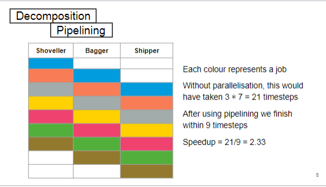
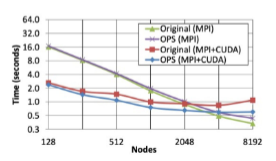
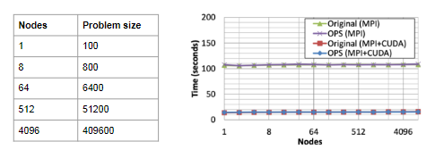
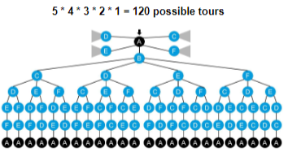
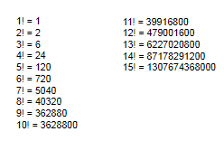
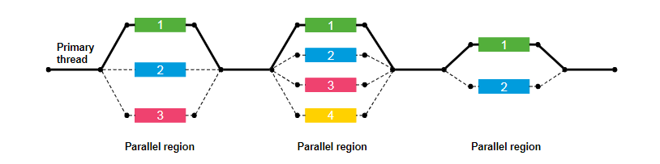

- [Lecture 1](#lecture-1)
  - [Terminology](#terminology)
    - [Parallelism](#parallelism)
    - [Concurrency](#concurrency)
    - [*Processor and core are used interchangeably but they are different*](#processor-and-core-are-used-interchangeably-but-they-are-different)
    - [Processor](#processor)
    - [Core](#core)
    - [Thread](#thread)
    - [Node](#node)
    - [Cluster](#cluster)
- [Lecture 2](#lecture-2)
  - [Whats the reading list](#whats-the-reading-list)
    - [An introduction to parallel programming](#an-introduction-to-parallel-programming)
    - [Parallel programming in OpenMP](#parallel-programming-in-openmp)
    - [using MPI - Portable Parallel Programming With the Message - Passing interface](#using-mpi---portable-parallel-programming-with-the-message---passing-interface)
    - [CUDA by example](#cuda-by-example)
  - [difference between performance and throught](#difference-between-performance-and-throught)
    - [performance](#performance)
    - [Throughput](#throughput)
    - [High performance computing](#high-performance-computing)
    - [Benchmark](#benchmark)
  - [Objectives for HPC](#objectives-for-hpc)
    - [the objectives can vary, major examples are:](#the-objectives-can-vary-major-examples-are)
  - [what makes a supercomputer](#what-makes-a-supercomputer)
  - [using a GPC cluster](#using-a-gpc-cluster)
    - [structure of a cluster](#structure-of-a-cluster)
    - [How do you use a cluster](#how-do-you-use-a-cluster)
    - [How does scheduler view the cluster](#how-does-scheduler-view-the-cluster)
- [Lecture 3](#lecture-3)
  - [what is a scheduler](#what-is-a-scheduler)
    - [How does scheduler view the cluster](#how-does-scheduler-view-the-cluster-1)
    - [context switching](#context-switching)
    - [Partition](#partition)
    - [Nodes](#nodes)
    - [jobes](#jobes)
    - [Commands for SLURM](#commands-for-slurm)
- [Lecture 4](#lecture-4)
  - [Why is my code slow?](#why-is-my-code-slow)
    - [workload balance](#workload-balance)
    - [parallelism](#parallelism-1)
    - [Memory hierarchy](#memory-hierarchy)
    - [Choice of algorithm](#choice-of-algorithm)
  - [What is tcluster topology](#what-is-tcluster-topology)
  - [Measuring runtime](#measuring-runtime)
- [Lecture 5](#lecture-5)
  - [Terminology](#terminology-1)
- [Lecture 6](#lecture-6)
  - [The parallelisation breakdown](#the-parallelisation-breakdown)
  - [Scalability](#scalability)
    - [Speedup](#speedup)
    - [Scalability](#scalability-1)
      - [Ahmdal's law](#ahmdals-law)
      - [Gustafson's law](#gustafsons-law)
- [Lecture 7](#lecture-7)
  - [Assignment walkthrough](#assignment-walkthrough)
    - [Deadline:17th Nov 5pm](#deadline17th-nov-5pm)
    - [Title: What is the Tsp](#title-what-is-the-tsp)
    - [Could we do it exhaustively?](#could-we-do-it-exhaustively)
    - [Cheapest Insertion](#cheapest-insertion)
    - [Farthest Insertion](#farthest-insertion)
- [Lecture 8](#lecture-8)
  - [Process and Thread](#process-and-thread)
  - [The fork-join model](#the-fork-join-model)
  - [Compilation](#compilation)
    - [intel compiler](#intel-compiler)
    - [Modern GNU compiler](#modern-gnu-compiler)
    - [Flags of compiler](#flags-of-compiler)
  - [Omp Parallel](#omp-parallel)
    - [OMP Order Table](#omp-order-table)
    - [When should I use this?](#when-should-i-use-this)
    - [What are you doing with the threads?](#what-are-you-doing-with-the-threads)
- [Lecture 9](#lecture-9)
  - [What is OMP parallel](#what-is-omp-parallel)
- [MPI](#mpi)
  - [vocabulary](#vocabulary)
  - [order](#order)
  - [Cost of MPI messages](#cost-of-mpi-messages)
    - [Equation](#equation)
- 

# Lecture 1
## Terminology
### Parallelism
    Two or more processes that execute simultaneously and independently
### Concurrency
    Two or more processes that execute simultaneously and share at least one resource
### *Processor and core are used interchangeably but they are different*
### Processor
    The generic term for a component that excutes instructions eg CPU and GPU
### Core
    A processor that is built into a larger unit that can indepently perform of process computational tasks
### Thread
    A software concept, a single sequential flow or control in a program.
  + This is commonly mistaken as a physical component of a core, this is because Intel Hyperthreading exists
  + It is the smallest unit that can be manager by the OS scheduler
  + Each thread has its own program conter, registers, stack.
### Node
    What is normally thought of as 'one computer', one motherboard OpenMP to program within a node
### Cluster
    100 or 1000s of nodes connected through high-speed interconnections, low latency and high bandwidth
  + MPI to write programs that use multiple nodes together

# Lecture 2
## Whats the reading list 
### An introduction to parallel programming
### Parallel programming in OpenMP
### using MPI - Portable Parallel Programming With the Message - Passing interface
### CUDA by example
## difference between performance and throught
### performance
How much computational power does a system have
### Throughput
How much data can 
### High performance computing
software to solve problems faster thatn conventional computer
### Benchmark
The standard that is used as a comparison point for performance, typically the fastest speed instead of the average
## Objectives for HPC
### the objectives can vary, major examples are:
    minimise the total time to solution - finite dataset
    maxmise throughput - infinite dataset
    maximise some resource - CPU/Memory/Network
    Ability to solve problems considered too big for available memory - splitting the problem into solvable chunks
## what makes a supercomputer
## using a GPC cluster
### structure of a cluster
    There are oner or more login nodes
    There are multiple compute node
    there may be speciality nodes for specific tasks
    There are one or more shared disks
### How do you use a cluster
    Accessed remotely, usually over SSH
### How does scheduler view the cluster
    partition
    node
    cpu

# Lecture 3
## what is a scheduler
### How does scheduler view the cluster
    partition
    node
    cpu
### context switching
    1. Context switching: 
***Moving an already mapped thread to another core***

    2. thread pinning
### Partition
1. UP - solve problems
2. Down

### Nodes

Idle Nothing is running
Mix  part of the resorces are taken
Alloc something is allocated but hasn't started
Completing A job has finished and memory is being cleared
Down not functional
Drain anything that;s currently running can keep going but no new jobs

### jobes
* ID - Aunique number, the scheduler usually assigns it
* Name - This is to make the job human readable
* Time limit - How long will the job take ? Schedulers  often give higher priority to jobs with a shorter time limit
* Size specification - What resources (CPU/Memory/GPU) your job needs
* Other jobs dependency - Specify if you have to run jobs in a particular sequence
* Quality of service - Different users might be given * different priorities, usually based on how 

### Commands for SLURM
sbatch - Go ruun a script, don't tell me about it until it's finished (you get the output in a txt file later)
srquene

# Lecture 4

## Why is my code slow?
### workload balance
* Load imbalance - if one process is working for longer thant the others, then the other will have to wait
* Too much communication - network is the bottleneck while computation
* Resource contention - Two or more processes are asking for the samen resource
### parallelism
* Overheads - Therre is a computational cost for starting ot stopping threads
* granularity - The size of chunks assigned to each proessing element can be either too small
  * to sall: A combination of the synchronisation and overhead issues can occur
  * Too big: A workload imbalace can occur
* changing thread tasks - changing what a thread should be doing changes its presence in the scheduler, context switching is possible
* Number ot threads -if there is too much of a wait between actions, it becomes inefficient
  * The OS will give each thread a time slice, if there are too many threads it will take too long until the thread is next given a slice
  * If there is no more memory, the thread will be pushed to the storage
### Memory hierarchy
* cache: A temporary storage location for a processor, larger than a register but slower
* Non-uniform memory access: Some memory is quicker than others, typically anything not shared has a dedicated bus
  * L1: Level 1 cache is small but very fast, the smaller the cache, the quicker the access. Specific to the CPU.
  * L2: Level 2 cache is larger than L1, but slightly slower. Specific to the CPU
  * L3: Level 3 cache is shared between two or more CPUs, and is significantly larger than L2 cache. It is also therefore slower. As this cache is shared between multiple CPUs, there may be resource contention
  * Each processor sees all the memory, if it needs more memory then it uses the non-local memory. This is implemented as virtual memory, the OS keeps a fake list of the variable data, then uses a translation table, only the OS is aware of what memory is stored where
* Spatial locality: if memory is accessed then it's neighbours are likely to be accessed next (move data as a block, not as it's needed)
* Temporal locality - if a variable is used, it is likely to be needed again soon (keep it in the cache) 
### Choice of algorithm
When we make decisions about the algorithms we should choose, a lot of the metrics we use are designed for sequential programming.
For example sorting algorithms
Typically the algorithm you would choose is quicksort, though this doesn't work for parallel sorting
You should choose Bitonic sort
## What is tcluster topology
* Topology - The physical and logical connection of nodes and connections within a system
* A cluster is organised into racks
* Racks contain a collection of computers
* Each node within a rack is connected, and typically each rack is connected
* The connection between computers within a rack is fast fibre optic, but the connection between racks is slow
* Connections cost a lot of money, and that's usually the sacrifice made
* ifferent ways to connect racks 
  * fat tree
  * torus
  * dragonfly
  * hypercube
  * hyperX
## Measuring runtime
* The typical method for measuring runtime, is to use some built in timer functions
* There are issues such as: background processes, PC scaling down performance, etc that will affect the runtime It's best to run on an exclusive node if you can have access
* There are different ways that we can approach figuring out the runtime
  1. Run it multiple times and take the average performance
  2. Report the minimum of all your runs (seems unfair)
  3. Report the maximum time of all of your runs (also kind of unfair)
  * $r_o$ = Observed runtime
  * $r_t$ = True runtime
  * $\varepsilon$ = noise
  * $r_o=r_t+\varepsilon$

# Lecture 5

## Terminology
* signle-precision floating-point
* signle-precision floating-point
* Flop
  
# Lecture 6
## The parallelisation breakdown
* Decomposition: How do you break a problem down into parts that can be executed in parallel?
  * Data parallelism: Splitting the data into discrete chunks and parallelising processing
  * Task parallelism: Giving various tasks to be carried out to different threads etc if they are independent
  * Domain decomposition: Split the problem into equal pieces
  * Pipelining: A factory like approach where each process is different
    * 
    * Pure pipelining approach: This work has been divided using task parallelism. If we used data parallelism, each person would take a portion of the jobs and do each of the tasks. Task parallelism here has lots of interaction between workers, communication. space becomes a constraint. Load imbalance becomes even more likely. The shipper is basically doing nothing compared to the other two

  * Mixed solution: A combination of different approaches
    * In the real world there is often multiple people for each task\
      Person 1 and 2: Shovel the snow into a collective pile \
      Person 3 and 4: Package the snow into bags \
      Person 5: Writes the address
    * Pipelines often mix task and data parallelism\
      The way to solve this would be two try several different approaches, then pick the best performing

* Scaling: How do we make sure that if we use twice as many resources, we are doing it in half the time?
* Correctness - How do we make sure we calculate the correct result
  * deadlock: When two or more tasks wait for each other eg people meet in corridor and cannot pass so they wait for each other to move
  * livelock: When the resolve state for the deadlock causes another deadlock eg people meet in the corridor and cannot pass. So they both move to the same side of the corridor and cannot pass, then swap to the other side of the corridor
  * Race conditions: Occurs when a programs behaviour changes depending on the sequence or timing of events outside of the control for the program eg thread scheduling
    * You are guaranteed to have multiple-write race conditions
    * **Extra memory**:Each thread gets it's own copy of each shared variable
    * **Extra time**: When one variable is writing then use a shield
    * **Use underlying support**: The hardware can have support (atomic)
    * The 'best' solution is to rethink the algorithm so this scenario never occurs
## Scalability
### Speedup
The ratio between the sequential running time of a program, and the time it runs in parallel. 
For example: A program takes 30 seconds on a single thread, and 10 seconds with 50 threads. 

      Speedup= 30/10 = 3
### Scalability
* A measure of how much speedup the program gets from adding more processors/cores

  * $t_1$ = Time on 1 core (that's a sequential version or parallel   version using 1 core)
  * $t_p$ = Time on p cores
  * $s_p = Speedup = \frac{t_1}{t_p}$
  * $e_p = \frac{s_p}{p}$= parallel efficiency (normally a percentage) 
Ideally you want the speedup to be equal to the number of cores, so going from 1 to 4 cores makes it 4 times faster.\
This measures how efficiently you are using your resources.\
The program will not scale beyond a certain point when adding more processors, and won't result in additional speedup. \
We can just fake this though, a bad starting point makes everything look good.
* Strong scaling\
Keep the problem size fixed, vary the number of cores and
nodes. Ideally there should be a linear reduction in time. 

* Weak scaling\
  Vary the problem size, vary the number of cores and nodes
proportionally with the problem size. Ideally there should be a flat line.

#### Ahmdal's law
* $\alpha$ - Fraction of the program that is inherently serial (in terms of runtime)
* $t_1$ - Runtime of the sequential or single core/processor implementation
* p - The number of cores or processors
* $t_p = a*t_1 + \frac{(1-\alpha) * t_1}{p}$ (The estimated runtime with p processors)
* $s_p = \frac{1}{\alpha + \frac{1-\alpha}{p}}$    (The estimated speedup given the serial fraction) (加速比)
* As the number of processors approach $\infin$, the speedup becomes $\frac{1}{\alpha}$ $\lim_ {p\to\infin} s_p = \frac{1}{\alpha}$（理论最大加速(theoretical) maximum speedup） 
***For example: If 1% of a code is serial, what is the maximum possible speedup?***

    $\alpha = 0.01$\
    $\lim_ {p\to\infin} s_p = \frac{1}{\alpha} = \frac{1}{0.01} =100$

***Example 2: A program takes 180 seconds to run on a single core, and 100 seconds on 2 cores. What is the (theoretical) maximum speedup?***\

&emsp;&emsp;&emsp;$s_p = \frac{t_1}{t_p}$\
&emsp;&emsp;&emsp;$s_p=\frac{1}{\alpha + \frac{1-\alpha}{p}}$\
&emsp;&emsp;&emsp;$s_p = 180/100 = 1.8 = \frac{1}{\alpha + \frac{1-\alpha}{p}}$\
&emsp;&emsp;&emsp;$\alpha = \frac{1}{9}$\
&emsp;&emsp;&emsp;$s_p = 9*\alpha$
&emsp;&emsp;&emsp;$\therefore$Max speedup = $lim_ {p\to\infin} s_p = \frac{1}{\alpha} = \frac{1}{\frac{1}{9}}$ = 9
#### Gustafson's law
* $\alpha$ - Fraction of the program that is inherently serial (in terms of runtime)
* Speedup = $\alpha + p(1-\alpha) = p - \alpha(p-1)$
  
  ***For example: A code has a serial fraction of 0.25. What is  the expected speedup on 50 cores according to Gustafson’s Law?***\
  Gustafson's law:\
  Speedup = $\alpha + p(1-\alpha) =  0.25 + 50(1 − 0.25) = 37.75$\
  Ahmdal's law:\
  $s_p= \frac{1}{\alpha+ \frac{1-\alpha}{p}}=\frac{1}{0.25+\frac{1-0.25}{50}}=3.77$

  ***Example2: A code can calculate the sum of an array of 100,000 floats in 1 second on a single core. If 10% of this code is serial, what size array can this be expected to sum in 1 second on 10 cores?***\
  Speedup = $\alpha + p(1-\alpha) = 0.1 + 10(1-0.1)=9.1$\
  If the speedup is 9.1x, then we can process a problem 9.1x larger 910,000 floats per second.

# Lecture 7
## Assignment walkthrough
### Deadline:17th Nov 5pm
### Title: What is the Tsp

### Could we do it exhaustively?

### Cheapest Insertion
### Farthest Insertion

# Lecture 8

## Process and Thread
| Process                                                                               | Thread                                                                                                 |
| :------------------------------------------------------------------------------------ | :----------------------------------------------------------------------------------------------------- |
| A basic unit of work for the operating system, it's essentially a program             | Part of a program that can be run independently to other portion                                       |
| Big overheads in creating/detention/context switching                                 | Small overheads in compari                                                                             |
| Isolated from other processes (sandboxed)                                             | Shared memory with other threads in the same process eg file                                           |
| All communication between different processes called inter process communication(IPC) | Communication can be implicit, since they share memory, just change the memory of the shared variables |
| Every process has its own stack and heap                                              | Threads share a heap, NOT A STACK                                                                      |

## The fork-join model
This is the parallelism model OpenMP uses.\
Each program starts as a single (primary/master) thread

Splits off only for the parallel portions, then goes back to sequential.(仅针对并行部分分开，然后返回顺序)

## Compilation

### intel compiler
**icc** -qopenmp myFile.c -o output.exe

### Modern GNU compiler
**gcc** -fopenmp myFile.c -o output.exe

### Flags of compiler
| Flag name | explain                                                                     |
| :-------- | :-------------------------------------------------------------------------- |
| -qopenmp  | only work for intel compiler, but faster                                    |
| -fopenmp  | works for both intel and GNU                                                |
| myFile.c  | if don't specify the output file name it will shove the output into 'a.out' |
| -o        | This works in the same way as normal c compilation                          |

## Omp Parallel
### OMP Order Table
| Order name                             | explain                                                                                                                                                                                                                                                                                                                                                                                                                                                                                                                                        |
| :------------------------------------- | :--------------------------------------------------------------------------------------------------------------------------------------------------------------------------------------------------------------------------------------------------------------------------------------------------------------------------------------------------------------------------------------------------------------------------------------------------------------------------------------------------------------------------------------------- |
| #pragma                                | This is used to tell the compiler that the  rest of the statement is for the compiler only                                                                                                                                                                                                                                                                                                                                                                                                                                                     |
| omp                                    | use the OpenMP library                                                                                                                                                                                                                                                                                                                                                                                                                                                                                                                         |
| parallel                               | everything within the brackets should be parallelised. Everything will be copied and carried out by each thread. If you don't add brackets it parallelises the next line. By default there will be one thread per core. You can increase that number in a bunch of ways                                                                                                                                                                                                                                                                        |
| for                                    | This comes just before a standard c for loop. You need to have this within an 'omp parallel' region.For each parallel region, the for loop is repeated. The loop cannot be terminated early. The number of iterations must be known when the loop executes. So the loop can iterate based on a variable. Each of the iterations within the loop are distributed across the threads. Workload balancing and granularity need to be taken into account(每个区域都并行执行，不能中断，需要知道迭代次数，每次迭代都分布在线程上，需要考虑负载平衡) |
| shared                                 | The variable has shared access across all threads, therefore if this has to be altered it will cause race conditions. Should mostly just be used when you have to read a variable, not write to it.(会有竞争，建议只读不写)                                                                                                                                                                                                                                                                                                                    |
| private                                | Each thread gets its own copy of the variable, the initial value does not carry over from another variable, and when the thread finishes it goes. Good when you want to write something to a variable, but don't care about it after the parallel section.(每个线程获得一个备份，没法改变原始的变量)                                                                                                                                                                                                                                           |
| firstprivate                           | same as private but it will be initialised with the value from the start of the parallel region. The value does not exist outside of the region.(和私有一样)                                                                                                                                                                                                                                                                                                                                                                                   |
| lastprivate                            | same as private but the variable can be accessed after the parallel region is over. Works for omp for, but not for omp parallel,the last element to be assigned is used(等于最后一个的进程结束后的值)                                                                                                                                                                                                                                                                                                                                          |
| default                                | default specifies the behaviour of variables that have not been explicitly stated. default(shared) means anything I am not specifying should be assumed to be shared. This is **STRONGLY DISCOURAGED**, use default(none) so you specify the behaviour manually, helps avoids mistakes.(default(shared) 共享所有未指定的参数，不建议使用。)                                                                                                                                                                                                    |
| reduction(operator:var)                | Takes the result of several parallel stages and performs some operation with the results.You can use absolutely any form of operation, so mathematical operators, logical operators, etc. (内部的都是copy，结束的时候会进行统一操作)                                                                                                                                                                                                                                                                                                           |
| schedule(static)                       | Divide the iterations before the work, once decided it stays fixed（平均划分线程）                                                                                                                                                                                                                                                                                                                                                                                                                                                             |
| schedule(dynamic)                      | Allow work to be stolen, if one finishes faster it steals from the other（不会平均分配，先计算完的会自动获取下一个待处理的迭代）                                                                                                                                                                                                                                                                                                                                                                                                               |
| schedule(static/dynamic, <chunk size>) | You can manually specify how the work is divided（混合模式 chunk size 是静态块的大小，除了块中的都是动态的）                                                                                                                                                                                                                                                                                                                                                                                                                                   |
| schedule(guided, <chunk size>)         | Chunks of decreasing size are handed out, it's a dynamic variant                                                                                                                                                                                                                                                                                                                                                                                                                                                                               |
| schedule(runtime)                      | You promise that this info will be passed at runtime OMP_SCHEDULE then the normal inputs, OMP_SCHEDULE="static"                                                                                                                                                                                                                                                                                                                                                                                                                                |
| collapse(x)                            | A nested for loop can be treated as one large loop, which allows for the workload to be distributed more evenly.(合并x个循环为一个循环，可以更均匀的分配负载)                                                                                                                                                                                                                                                                                                                                                                                  |
| reduction(x)                           | Each thread is given a private variable, and then an operation is applied to that variable once the threads are finished.Operators - What you can do with reduction: +, -, *, &, \|, ^, &&, \|\|, min max(为每个线程执行一个操作比如累加累减)                                                                                                                                                                                                                                                                                                  |
| if(x)                                  | Adds a condition to the running of a parallel portion of code                                                                                                                                                                                                                                                                                                                                                                                                                                                                                  |
| omp_init_lock(&writelock)              | This avoids multiple threads writing to a variable High chance of issues stemming from bad programming                                                                                                                                                                                                                                                                                                                                                                                                                                         |
| critical                               | This functions the same way as a manual lock, however all of the complexity is hidden from you, should be named （同一时间只能有一个线程执行这个区域，而且所有线程都会执行这个区域，当有一个线程进入的时候其他线程会等待，因此线程越多越慢）                                                                                                                                                                                                                                                                                                   |
| atomic                                 | The same as critical, however the function has to be stated It's either: write, read, update, capture （和critical一样，但是需要有参数）                                                                                                                                                                                                                                                                                                                                                                                                       |
| sections                               | This allows for task parallelism Saves you having to explicitly state which thread executes each task（可以把代码分成任务区域，每个区域并行执行，线程和section一对一）                                                                                                                                                                                                                                                                                                                                                                         |
| barrier                                | Forces all of the threads to wait until they have all finishes Useful for making sure the code functions correctly（屏障， 等待前面全部线程执行完后再进行下一步，不能放在omp for等块中）                                                                                                                                                                                                                                                                                                                                                       |
| single                                 | specifies that a single thread should execute this codeDoesn't care which thread it is Functions as a barrier （只有一个线程能进入这个部分，会阻塞，但是其他线程不会进入）                                                                                                                                                                                                                                                                                                                                                                     |
| master                                 | Species that the primary thread is the one that executes the code Does not function as a barrier（只有主线程执行这个区，其他线程会继续往下执行，没有阻塞）                                                                                                                                                                                                                                                                                                                                                                                     |
| tasks                                  | A task unit that is executed by each thread It does not matter which order it is executed in It could actually be computed by another thread（任务异步执行，可以有任何线程执行，执行顺序不确定）                                                                                                                                                                                                                                                                                                                                               |

### When should I use this?
Sometimes it might actually be better to  recompute everything instead of communicating between threads.
### What are you doing with the threads?
This is called explicit work sharing
It limits the number of threads because they are hardcoded

# Lecture 9
## What is OMP parallel

This is the default way of asking OpenMP to parallelise your code\
You create a copy of the code inside the brackets, and give that copy to each thread\

# MPI
## vocabulary
| vocabulary                   | explain                                                                                                                                                 |
| :--------------------------- | :------------------------------------------------------------------------------------------------------------------------------------------------------ |
| Process                      | Each instance of the code is an MPI process, typically 1 per physical core or node                                                                      |
| Rank                         | Each process has a rank, that is basically just an ID, it's an integer The rank uses 0 index counting                                                   |
| Communicator                 | A group of processes that we assign some name to, this can  be a group for a single job etc The process that covers every process is **MPI_COMM_WORLD** |
| Collective communication     | All of the processes within a specific group receive a copy of the communication                                                                        |
| Point-to-point communication | There is a single sender, and a single receiver                                                                                                         |
|                              |                                                                                                                                                         |
| blocking                     |                                                                                                                                                         |

## order
| Order Name     | variable       | datatype                            | explain                                                                                                |
| :------------- | :------------- | :---------------------------------- | :----------------------------------------------------------------------------------------------------- |
| MPI_Init       | NULL           |                                     | args                                                                                                   |
|                | NULL           |                                     | args                                                                                                   |
| MPI_COMM_WORLD | -              |                                     | The most commonly used communicator                                                                    |
| MPI_Send       | -              |                                     | This function lets you send a variable value to another process                                        |
|                | buff           | void*                               |                                                                                                        |
|                | count          | int                                 |                                                                                                        |
|                | datatype       | MPI_Datatype                        |                                                                                                        |
|                | rank           | int                                 |                                                                                                        |
|                | tag            | int                                 |                                                                                                        |
|                | comm           | MPI_COMM_WORLD                      |                                                                                                        |
| MPI_Recv       | -              |                                     | This function let's you receive that variable value                                                    |
|                | buffer         | void*                               |                                                                                                        |
|                | count          | int                                 |                                                                                                        |
|                | datatype       | MPI_Datatype                        |                                                                                                        |
|                | source         | int or MPI_Any_Source               |                                                                                                        |
|                | tag            | int or MPI_Any_Tag                  |                                                                                                        |
|                | comm           | MPI_COMM_WORLD                      |                                                                                                        |
|                | &status        | MPI_Status                          |                                                                                                        |
| MPI_Any_Tag    |                |                                     | Used to match any tag when receiving a message                                                         |
| MPI_Any_Source | -              |                                     | You will accept messages from any sender                                                               |
| MPI_Comm_rank  | -              |                                     | get rank of now process                                                                                |
|                | MPI_COMM_WORLD |                                     |                                                                                                        |
|                | &myRank        | int                                 |                                                                                                        |
| MPI_Comm_size  | -              |                                     | get total number of MPI processes                                                                      |
|                | MPI_COMM_WORLD |                                     |                                                                                                        |
|                | &commSize      | int                                 |                                                                                                        |
| MPI_Isend      |                |                                     | on-blocking send                                                                                       |
|                | buff           | void*                               |                                                                                                        |
|                | count          | int                                 |                                                                                                        |
|                | datatype       | MPI_Datatype                        |                                                                                                        |
|                | rank           | int                                 |                                                                                                        |
|                | tag            | int                                 |                                                                                                        |
|                | comm           | MPI_COMM_WORLD                      |                                                                                                        |
|                | request        | MPI_Request                         | is a structure through which you can query and manage the state of non-blocking communication requests |
| MPI_IRecv      | -              | -                                   | on-blocking                                                                                            |
|                | buff           | void*                               |                                                                                                        |
|                | count          | int                                 |                                                                                                        |
|                | datatype       | MPI_Datatype                        |                                                                                                        |
|                | rank           | int                                 |                                                                                                        |
|                | tag            | int                                 |                                                                                                        |
|                | comm           | MPI_COMM_WORLD                      |                                                                                                        |
|                | &status        | MPI_Status   or   MPI_STATUS_IGNORE | The status contains: the sender rank, the tag, and the size of the message  |
|MPI_Wait|||This means the code should be blocked until the message arrives|
||&request|MPI_Request||
||MPI_STATUS_IGNORE|MPI_STATUS||
|MPI_Test|||This checks if the message has arrived, does not block and modifies a flag once the message arrives|
||&request|MPI_Request||
||&arrived|int||
|||MPI_STATUS_IGNORE||
|MPI_Bcast|||This is used to transmit a message from one process to others in a communicatorAny process can send out a collective message, not just the 0 process The broadcasting node is called the 'root' node|
|||void*|What variable is the data you are sending|
||||How many elements of data is this|
||||What MPI_Datatype is the data|
||||What is the rank of the process sending the message|
||||What communicator are you sending to|

## Cost of MPI messages
### Equation
Packet size = Number of elements X variable size \
$Number\ of\ message \times (\frac{Latency + Packet\ size}{Bandwidth})=Time \ cost$

# 
