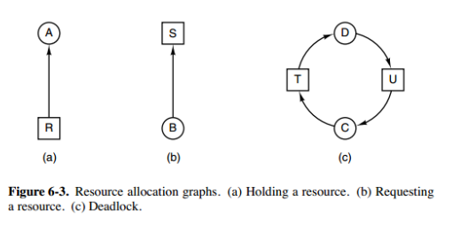
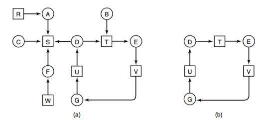
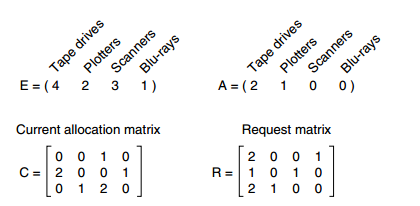

# 必要条件

* 互斥：每个资源要么已经分配给了一个进程，要么就是可用的。
* 占有和等待：已经得到了某个资源的进程可以再请求新的资源。
* 不可抢占：已经分配给一个进程的资源不能强制性地被抢占，它只能被占有它的进程显式地释放。
* 环路等待：有两个或者两个以上的进程组成一条环路，该环路中的每个进程都在等待下一个进程所占有的资源。
# 处理方法
## 鸵鸟策略
把头埋在沙子里，假装根本没发生问题。

因为解决死锁问题的代价很高，因此鸵鸟策略这种不采取任务措施的方案会获得更高的性能。

当发生死锁时不会对用户造成多大影响，或发生死锁的概率很低，可以采用鸵鸟策略。

大多数操作系统，包括 Unix，Linux 和 Windows，处理死锁问题的办法仅仅是忽略它。

## 死锁检测与死锁恢复
1. 每种类型一个资源的死锁检测

上图为资源分配图，其中方框表示资源，圆圈表示进程。资源指向进程表示该资源已经分配给该进程，进程指向资源表示进程请求获取该资源。

图 a 可以抽取出环，如图 b，它满足了环路等待条件，因此会发生死锁。

每种类型一个资源的死锁检测算法是通过检测有向图是否存在环来实现，从一个节点出发进行深度优先搜索，对访问过的节点进行标记，如果访问了已经标记的节点，就表示有向图存在环，也就是检测到死锁的发生。

2. 每种类型多个资源的死锁检测

上图中，有三个进程四个资源，每个数据代表的含义如下：

E 向量：资源总量
A 向量：资源剩余量
C 矩阵：每个进程所拥有的资源数量，每一行都代表一个进程拥有资源的数量
R 矩阵：每个进程请求的资源数量
进程 
𝑃
1
P 
1
​
  和 
𝑃
2
P 
2
​
  所请求的资源都得不到满足，只有进程 
𝑃
3
P 
3
​
  可以，让 
𝑃
3
P 
3
​
  执行，之后释放 
𝑃
3
P 
3
​
  拥有的资源，此时 A = (2 2 2 0)。
𝑃
2
P 
2
​
  可以执行，执行后释放 
𝑃
2
P 
2
​
  拥有的资源，A = (4 2 2 1) 。
𝑃
1
P 
1
​
  也可以执行。所有进程都可以顺利执行，没有死锁。

算法总结如下：

每个进程最开始时都不被标记，执行过程有可能被标记。当算法结束时，任何没有被标记的进程都是死锁进程。

寻找一个没有标记的进程 
𝑃
𝑖
P 
i
​
 ，它所请求的资源小于等于 A。
如果找到了这样一个进程，那么将 C 矩阵的第 i 行向量加到 A 中，标记该进程，并转回 1。
如果没有这样一个进程，算法终止。

3. 死锁恢复
* 利用抢占恢复
* 利用回滚恢复
* 通过杀死进程恢复

## 死锁预防
在程序运行之前预防发生死锁。
1. 破坏互斥条件
例如假脱机打印机技术允许若干个进程同时输出，唯一真正请求物理打印机的进程是打印机守护进程。
2. 破坏占有和等待条件
一种实现方式是规定所有进程在开始执行前请求所需要的全部资源
3. 破坏不可抢占条件
4. 破坏环路等待
给资源统一编号，进程只能按编号顺序来请求资源

## 死锁避免