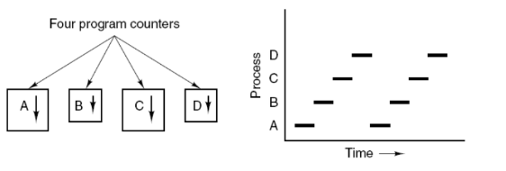
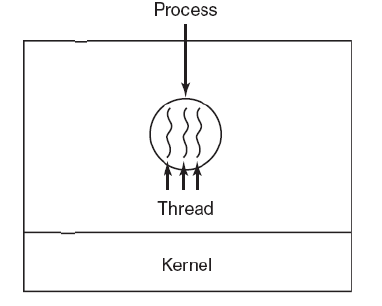
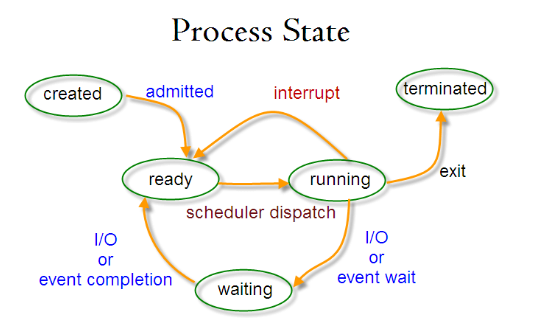
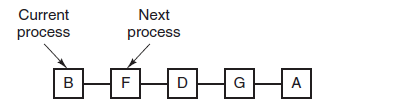
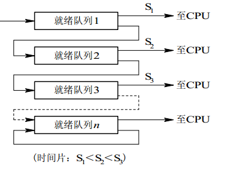

# 进程与线程
##  进程
进程是资源分配的基本单位。

进程控制块 (Process Control Block, PCB) 描述进程的基本信息和运行状态，所谓的创建进程和撤销进程，都是指对 PCB 的操作。

下图显示了 4 个程序创建了 4 个进程，这 4 个进程可以并发地执行。



## 线程
线程是独立调度的基本单位。

一个进程中可以有多个线程，它们共享进程资源。

QQ 和浏览器是两个进程，浏览器进程里面有很多线程，例如 HTTP 请求线程、事件响应线程、渲染线程等等，线程的并发执行使得在浏览器中点击一个新链接从而发起 HTTP 请求时，浏览器还可以响应用户的其它事件。



## 区别
Ⅰ 拥有资源

进程是资源分配的基本单位，但是线程不拥有资源，线程可以访问隶属进程的资源。

Ⅱ 调度

线程是独立调度的基本单位，在同一进程中，线程的切换不会引起进程切换，从一个进程中的线程切换到另一个进程中的线程时，会引起进程切换。

Ⅲ 系统开销

由于创建或撤销进程时，系统都要为之分配或回收资源，如内存空间、I/O 设备等，所付出的开销远大于创建或撤销线程时的开销。类似地，在进行进程切换时，涉及当前执行进程 CPU 环境的保存及新调度进程 CPU 环境的设置，而线程切换时只需保存和设置少量寄存器内容，开销很小。

Ⅳ 通信方面

线程间可以通过直接读写同一进程中的数据进行通信，但是进程通信需要借助 IPC。

# 进程状态切换


* 就绪状态（ready）：等待被调度
* 运行状态（running）
* 阻塞状态（waiting）：等待资源

应该注意以下内容：

* 只有就绪态和运行态可以相互转换，其它的都是单向转换。就绪状态的进程通过调度算法从而获得 CPU 时间，转为运行状态；而运行状态的进程，在分配给它的 CPU 时间片用完之后就会转为就绪状态，等待下一次调度。
* 阻塞状态是缺少需要的资源从而由运行状态转换而来，但是该资源不包括 CPU 时间，缺少 CPU 时间会从运行态转换为就绪态。

# 进程调度算法

## 批处理系统

批处理系统没有太多的用户操作，在该系统中，调度算法目标是保证吞吐量和周转时间（从提交到终止的时间）。
1. 先来先服务 first-come first-serverd（FCFS）
非抢占式的调度算法，按照请求的顺序进行调度。<br>
有利于长作业，但不利于短作业，因为短作业必须一直等待前面的长作业执行完毕才能执行，而长作业又需要执行很长时间，造成了短作业等待时间过长。

|进程 | 到达时间 | 执行时间|
|-|-|-|
|P1  | 0       | 24|
|P2  | 2       | 3|
|P3  | 4       | 3|

调度顺序：P1 → P2 → P3
平均等待时间 = (0 + 22 + 23) / 3 = 15

2. 短作业优先 shortest job first（SJF）
非抢占式的调度算法，按估计运行时间最短的顺序进行调度。<br>
长作业有可能会饿死，处于一直等待短作业执行完毕的状态。因为如果一直有短作业到来，那么长作业永远得不到调度。

进程 | 到达时间 | 执行时间
|-|-|-|
P1  | 0       | 6
P2  | 2       | 8
P3  | 4       | 4
调度顺序：P1 → P3 → P2
平均等待时间 = (0 + 6+4=10? 需重新计算)


3. 短剩余时间优先 shortest remaining time next（SRTN）
最短作业优先的抢占式版本，按剩余运行时间的顺序进行调度。 当一个新的作业到达时，其整个运行时间与当前进程的剩余时间作比较。如果新的进程需要的时间更少，则挂起当前进程，运行新的进程。否则新的进程等待。

## 交互式系统
交互式系统有大量的用户交互操作，在该系统中调度算法的目标是快速地进行响应。

1. 时间片轮转（RR，Round Robin）
将所有就绪进程按 FCFS 的原则排成一个队列，每次调度时，把 CPU 时间分配给队首进程，该进程可以执行一个时间片。当时间片用完时，由计时器发出时钟中断，调度程序便停止该进程的执行，并将它送往就绪队列的末尾，同时继续把 CPU 时间分配给队首的进程。<br>
时间片轮转算法的效率和时间片的大小有很大关系：
   * 因为进程切换都要保存进程的信息并且载入新进程的信息，如果时间片太小，会导致进程切换得太频繁，在进程切换上就会花过多时间。
   * 而如果时间片过长，那么实时性就不能得到保证。
   * 

2. 优先级调度（Priority Scheduling）<br>
为每个进程分配一个优先级，按优先级进行调度。

为了防止低优先级的进程永远等不到调度，可以随着时间的推移增加等待进程的优先级。

3. 多级反馈队列（MLFQ，Multi-Level Feedback Queue）
一个进程需要执行 100 个时间片，如果采用时间片轮转调度算法，那么需要交换 100 次。多级队列是为这种需要连续执行多个时间片的进程考虑，它设置了多个队列，每个队列时间片大小都不同，例如 1,2,4,8,..。进程在第一个队列没执行完，就会被移到下一个队列。这种方式下，之前的进程只需要交换 7 次。
每个队列优先权也不同，最上面的优先权最高。因此只有上一个队列没有进程在排队，才能调度当前队列上的进程。


# 进程同步
## 临界区
临界区（Critical Section）指程序中访问共享资源（如变量、文件、设备等）的代码段。为确保数据一致性，必须保证 同一时刻仅有一个线程 执行临界区内的代码。
## 同步与互斥
* 同步：多个进程因为合作产生的直接制约关系，使得进程有一定的先后执行关系。
* 互斥：确保在任意时刻，临界区仅被一个线程占用。其他试图访问的线程需等待当前线程退出临界区。

## 信号量
信号量（Semaphore）是一个整型变量，可以对其执行 down 和 up 操作，也就是常见的 P 和 V 操作。
* down : 如果信号量大于 0 ，执行 -1 操作；如果信号量等于 0，进程睡眠，等待信号量大于 0；
* up ：对信号量执行 +1 操作，以便唤醒睡眠的进程让其完成 down 操作。

down 和 up 操作需要被设计成原语，不可分割，通常的做法是在执行这些操作的时候屏蔽中断。

如果信号量的取值只能为 0 或者 1，那么就成为了 互斥量（Mutex） ，0 表示临界区已经加锁，1 表示临界区解锁。

``` C
typedef int semaphore;
semaphore mutex = 1;
void P1() {
    down(&mutex);
    // 临界区
    up(&mutex);
}

void P2() {
    down(&mutex);
    // 临界区
    up(&mutex);
}

作者：CyC2018
链接：https://leetcode.cn/leetbook/read/tech-interview-cookbook/oos0rr/
来源：力扣（LeetCode）
著作权归作者所有。商业转载请联系作者获得授权，非商业转载请注明出处。
```
## 使用信号量实现生产者-消费者问题
问题描述：使用一个缓冲区来保存物品，只有缓冲区没有满，生产者才可以放入物品；只有缓冲区不为空，消费者才可以拿走物品。

``` C
#include <stdio.h>
#include <pthread.h>
#include <semaphore.h>

#define N 5  // 缓冲区容量
#define NUM_PRODUCERS 2
#define NUM_CONSUMERS 2

int buffer[N];
int in = 0, out = 0;

sem_t empty, full, mutex;  // 信号量声明

// 生产者线程函数
void* producer(void* arg) {
    int item;
    while (1) {
        // 生产数据
        item = rand() % 100;  // 模拟数据生产

        sem_wait(&empty);       // 等待空位
        sem_wait(&mutex);       // 进入临界区，获取互斥锁

        // 将数据放入缓冲区
        buffer[in] = item;
        in = (in + 1) % N;
        printf("Producer %d produced %d (slot %d)\n", *((int*)arg), item, in);

        sem_post(&mutex);       // 退出临界区，释放互斥锁
        sem_post(&full);        // 增加已占用信号量
    }
    return NULL;
}

// 消费者线程函数
void* consumer(void* arg) {
    int item;
    while (1) {
        sem_wait(&full);        // 等待产品
        sem_wait(&mutex);       // 进入临界区，获取互斥锁

        // 从缓冲区取出数据
        item = buffer[out];
        out = (out + 1) % N;
        printf("Consumer %d consumed %d (slot %d)\n", *((int*)arg), item, out);

        sem_post(&mutex);       // 退出临界区，释放互斥锁
        sem_post(&empty);       // 增加空位信号量

        // 消费数据（如处理、打印等）
    }
    return NULL;
}

int main() {
    pthread_t prod_thread[NUM_PRODUCERS], cons_thread[NUM_CONSUMERS];
    int prod_ids[NUM_PRODUCERS], cons_ids[NUM_CONSUMERS];

    // 初始化信号量
    sem_init(&empty, 0, N);    // 初始空位为N
    sem_init(&full, 0, 0);     // 初始产品为0
    sem_init(&mutex, 0, 1);    // 互斥锁初始化为1

    // 创建生产者线程
    for (int i = 0; i < NUM_PRODUCERS; i++) {
        prod_ids[i] = i;
        pthread_create(&prod_thread[i], NULL, producer, &prod_ids[i]);
    }

    // 创建消费者线程
    for (int i = 0; i < NUM_CONSUMERS; i++) {
        cons_ids[i] = i;
        pthread_create(&cons_thread[i], NULL, consumer, &cons_ids[i]);
    }

    // 等待线程结束（理论上不会返回）
    for (int i = 0; i < NUM_PRODUCERS; i++) {
        pthread_join(prod_thread[i], NULL);
    }
    for (int i = 0; i < NUM_CONSUMERS; i++) {
        pthread_join(cons_thread[i], NULL);
    }

    // 销毁信号量
    sem_destroy(&empty);
    sem_destroy(&full);
    sem_destroy(&mutex);

    return 0;
}

```

## 管程
管程有一个重要特性：在一个时刻只能有一个进程使用管程。进程在无法继续执行的时候不能一直占用管程，否则其它进程永远不能使用管程。

管程引入了 条件变量 以及相关的操作：wait() 和 signal() 来实现同步操作。对条件变量执行 wait() 操作会导致调用进程阻塞，把管程让出来给另一个进程持有。signal() 操作用于唤醒被阻塞的进程。

# 经典同步问题
## 哲学家进餐问题
五个哲学家围着一张圆桌，每个哲学家面前放着食物。哲学家的生活有两种交替活动：吃饭以及思考。当一个哲学家吃饭时，需要先拿起自己左右两边的两根筷子，并且一次只能拿起一根筷子。

下面是一种错误的解法，如果所有哲学家同时拿起左手边的筷子，那么所有哲学家都在等待其它哲学家吃完并释放自己手中的筷子，导致死锁。
``` C
#define N 5

void philosopher(int i) {
    while(TRUE) {
        think();
        take(i);       // 拿起左边的筷子
        take((i+1)%N); // 拿起右边的筷子
        eat();
        put(i);
        put((i+1)%N);
    }
}

```
为了防止死锁的发生，可以设置两个条件：
* 必须同时拿起左右两根筷子；
* 只有在两个邻居都没有进餐的情况下才允许进餐。

``` C
#define N 5
#define LEFT (i + N - 1) % N // 左邻居
#define RIGHT (i + 1) % N    // 右邻居
#define THINKING 0
#define HUNGRY   1
#define EATING   2
typedef int semaphore;
int state[N];                // 跟踪每个哲学家的状态
semaphore mutex = 1;         // 临界区的互斥，临界区是 state 数组，对其修改需要互斥
semaphore s[N];              // 每个哲学家一个信号量

void philosopher(int i) {
    while(TRUE) {
        think(i);
        take_two(i);
        eat(i);
        put_two(i);
    }
}

void take_two(int i) {
    down(&mutex);
    state[i] = HUNGRY;
    check(i);
    up(&mutex);
    down(&s[i]); // 只有收到通知之后才可以开始吃，否则会一直等下去
}

void put_two(i) {
    down(&mutex);
    state[i] = THINKING;
    check(LEFT); // 尝试通知左右邻居，自己吃完了，你们可以开始吃了
    check(RIGHT);
    up(&mutex);
}

void eat(int i) {
    down(&mutex);
    state[i] = EATING;
    up(&mutex);
}

// 检查两个邻居是否都没有用餐，如果是的话，就 up(&s[i])，使得 down(&s[i]) 能够得到通知并继续执行
void check(i) {         
    if(state[i] == HUNGRY && state[LEFT] != EATING && state[RIGHT] !=EATING) {
        state[i] = EATING;
        up(&s[i]);
    }
}


```

## 读者-写者问题
允许多个进程同时对数据进行读操作，但是不允许读和写以及写和写操作同时发生。

一个整型变量 count 记录在对数据进行读操作的进程数量，一个互斥量 count_mutex 用于对 count 加锁，一个互斥量 data_mutex 用于对读写的数据加锁。

``` C
typedef int semaphore;
semaphore count_mutex = 1; // 初始情况1 允许操作
semaphore data_mutex = 1;
int count = 0; //记录在对数据进行读操作的进程数量

// reader 分为三个阶段：count++，read()，count--
void reader() {
    while(TRUE) {
      	//想要对count进行操作就要先上锁
      	down(&count_mutex);
      	count++;
      	//第一个读者要对数据加锁，避免写操作修改
      	if (count==1) down(&data_mutex);
      	up(&count_mutex);
      	
      	read();
      	
      	down(&count_mutex);
      	count--;
      	//如果此时没有读者了，那就允许写操作
      	if (count==0) up(&data_mutex);
      	up(&count_mutex);
    }
}

void writer() {
    while(TRUE) {
        down(&data_mutex); // 循环等待着写入
        write();
      	up(&data_mutex);
    }
}


```

# 进程通信
进程通信（Inter-Process Communication, IPC）是操作系统中允许多个进程共享数据、协调任务的核心机制。以下是常见 IPC 方法的分类、原理及典型应用场景：

## IPC 的核心目标
1.  数据共享：传递结构化或非结构化数据。
1.  资源控制：协调对硬件或软件资源（如文件、设备）的访问。
2.  任务协作：同步进程的执行顺序或状态变更。
3.  系统扩展性：解耦模块，支持分布式架构。

## 常见进程通信方法对比
