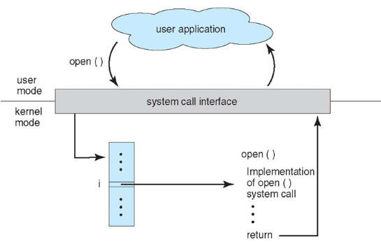
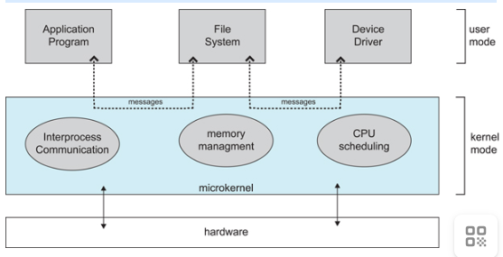

# 基本特征
操作系统都具有以下四个基本特征：
## 并发和并行（Concurrency）
* 定义：系统能够同时处理多个处于活动状态的程序或任务，这些程序在宏观上“同时运行”，在微观上通过 分时复用 CPU 交替执行。
* 实现机制：
    * 进程（Process）：独立执行的程序实例，拥有独立的资源分配。
    * 线程（Thread）：轻量级进程，共享同一进程资源，切换开销更低。
    * 调度算法：如时间片轮转（Round-Robin）、优先级调度等。
* 意义：提升系统整体效率与资源利用率，如浏览器可同时加载页面、播放音乐。

## 共享（Sharing）

* 定义：通过资源管理机制，允许多个并发程序或用户 安全共享 硬件与软件资源。
* 共享类型：
    * 互斥共享（如打印机）：资源一次仅被一个程序独占，需同步机制（如信号量）。
    * 并发共享（如内存、磁盘）：资源可被多程序同时访问，如多进程共享文件系统。
* 关键技术：
    * 虚拟文件系统（VFS）：统一管理不同存储设备。
    * 内存分页/分段：隔离程序地址空间，防止非法访问。

## 虚拟（Virtualization）
* 定义：将物理资源抽象为多个逻辑上的虚拟资源，使得每个用户或程序似乎拥有独占资源的假象。
* 典型场景：
    * 虚拟内存：利用磁盘空间扩展物理内存，使程序无需关注物理内存限制。
    * 虚拟机（VM）：通过 Hypervisor（如VMware、KVM）模拟多台独立计算机。
    * 虚拟CPU：多线程程序误认为独占 CPU，实际通过分时复用实现。
* 意义：突破硬件限制，提升资源利用率和灵活性。

## 异步（Asynchrony）

* 定义：多个并发程序执行过程的不可预知性。由于资源竞争和调度策略，程序执行 顺序、进度和结果 可能在多次运行中表现出差异，但最终结果需保证一致性。
* 影响与应对：
    * 不确定性：程序应设计为对执行顺序无依赖性。
    * 同步机制：通过锁、信号量确保共享数据一致性。
    * 事件驱动：如 JavaScript 通过事件循环处理异步 I/O。

# 基本功能

1. 进程管理
进程控制、进程同步、进程通信、死锁处理、处理机调度等。

2. 内存管理
内存分配、地址映射、内存保护与共享、虚拟内存等。

3. 文件管理
文件存储空间的管理、目录管理、文件读写管理和保护等。

4. 设备管理
完成用户的 I/O 请求，方便用户使用各种设备，并提高设备的利用率。
主要包括缓冲管理、设备分配、设备处理、虛拟设备等。

# 系统调用
系统调用（System Call）是用户程序与操作系统内核（Kernel）之间的关键接口，允许应用程序安全地访问硬件资源和内核服务。以下是系统调用的核心要点：
## 系统调用的作用

1. 资源访问控制：用户程序无法直接操作硬件（如磁盘、网络设备），需通过系统调用请求内核代为执行。
2. 权限隔离：防止用户程序越权访问敏感资源（如内存管理、进程调度）。
3. 抽象服务接口：统一封装底层硬件差异，简化应用开发（如文件读写无需关心磁盘类型）。

## 常见系统调用分类

# 宏内核和微内核
1. 宏内核
宏内核是将操作系统功能作为一个紧密结合的整体放到内核。
由于各模块共享信息，因此有很高的性能。

2. 微内核
由于操作系统不断复杂，因此将一部分操作系统功能移出内核，从而降低内核的复杂性。移出的部分根据分层的原则划分成若干服务，相互独立。
在微内核结构下，操作系统被划分成小的、定义良好的模块，只有微内核这一个模块运行在内核态，其余模块运行在用户态。
因为需要频繁地在用户态和核心态之间进行切换，所以会有一定的性能损失。

## 中断分类
* 外部中断&内部中断：来自cpu外部的中断，如硬件设备or外部设备发来的中断请求；来自cpu内部的中断，如程序异常，指令执行错误
* 同步中断&异步中断：同步是指令执行引起的中断，如非法错误，除0错误；异步指不受执行顺序控制的中断，如硬件的中断请求
* 可屏蔽中断&不可屏蔽中断：不可屏蔽中断是一旦发生中断请求，无论cpu是否忙碌，都必须立即响应请求，如硬件故障；可屏蔽中断是可以通过设置标志位来屏蔽的中断请求，等到必要时处理
* 软中断&硬中断：硬中断是硬件或外部设备发起的中断；软中断是软件或os发起的中断
