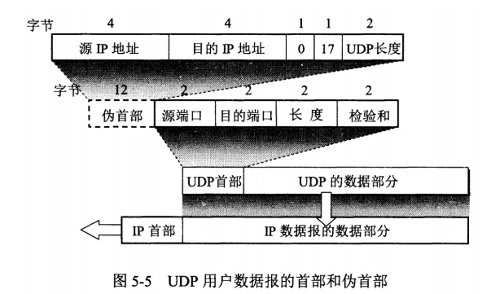
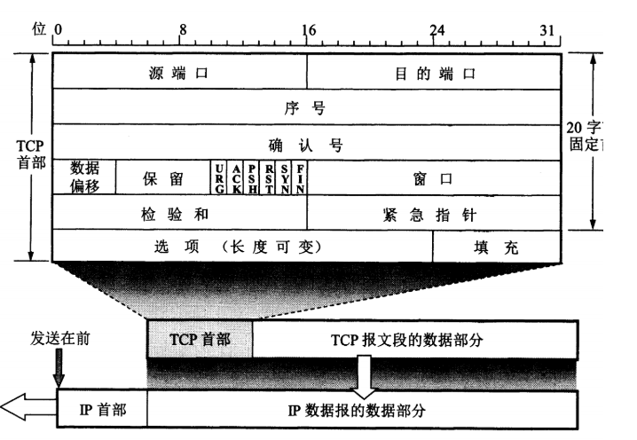
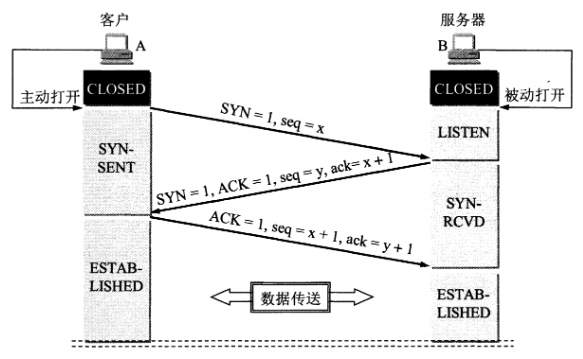
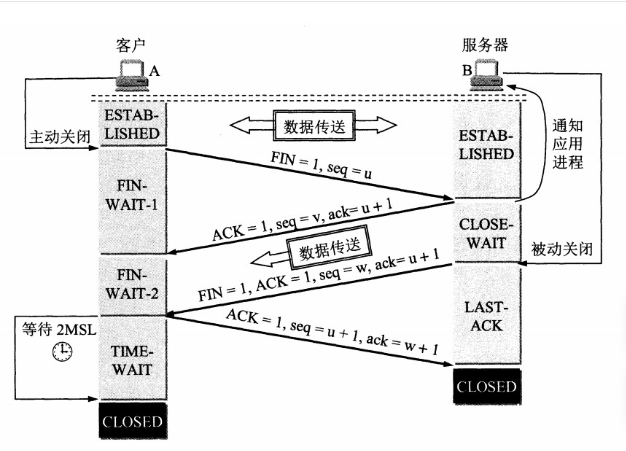
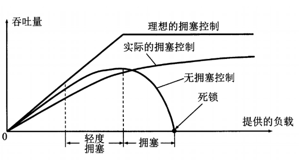
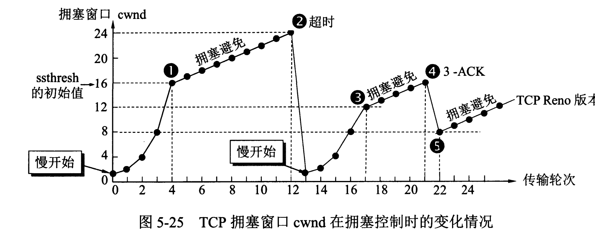
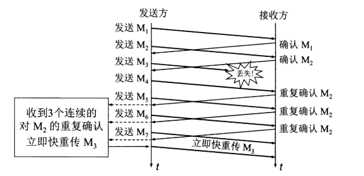

# 传输层 Transport Layer
## UDP and TCP
* 用户数据报协议 UDP（User Datagram Protocol）是无连接的，尽最大可能交付，没有拥塞控制，面向报文（对于应用程序传下来的报文不合并也不拆分，只是添加 UDP 首部），支持一对一、一对多、多对一和多对多的交互通信。
  * UDP首部
    * 
* 传输控制协议 TCP（Transmission Control Protocol）是面向连接的，提供可靠交付，有流量控制，拥塞控制，提供全双工通信[1]，面向字节流（把应用层传下来的报文看成字节流，把字节流组织成大小不等的数据块），每一条 TCP 连接只能是点对点的（一对一）。
  * TCP首部
    * 
    * 序号 ：用于对字节流进行编号，例如序号为 301，表示第一个字节的编号为 301，如果携带的数据长度为 100 字节，那么下一个报文段的序号应为 401。
    * 确认号 ：期望收到的下一个报文段的序号。例如 B 正确收到 A 发送来的一个报文段，序号为 501，携带的数据长度为 200 字节，因此 B 期望下一个报文段的序号为 701，B 发送给 A 的确认报文段中确认号就为 701。
    * 数据偏移 ：指的是数据部分距离报文段起始处的偏移量，实际上指的是首部的长度。
    * 确认 ACK ：当 ACK=1 时确认号字段有效，否则无效。TCP 规定，在连接建立后所有传送的报文段都必须把 ACK 置 1。
    * 同步 SYN ：在连接建立时用来同步序号。当 SYN=1，ACK=0 时表示这是一个连接请求报文段。若对方同意建立连接，则响应报文中 SYN=1，ACK=1。
    * 终止 FIN ：用来释放一个连接，当 FIN=1 时，表示此报文段的发送方的数据已发送完毕，并要求释放连接。
    * 窗口 ：窗口值作为接收方让发送方设置其发送窗口的依据。之所以要有这个限制，是因为接收方的数据缓存空间是有限的。
  * 三次握手
    * 
    * B LISTEN（监听）状态，等待客户端的连接请求
    * A -》B 发送连接请求报文，SYN=1，ACK=0，选择一个初始的seq（序号）x
    * B收到连接请求报文，如果同意连接，则发送连接确认报文，SYN=1，ACK=1，确认号为x+1，同时也选择一个初始的序号y
    * A收到B的连接确认报文后，还要向B发出确认，确认号为y+1，序号为x+1
    * B收到A的确认后，建立连接
  * 三次握手的原因
    * 第三次握手是为了防止失效的连接请求到达服务器，让服务器错误打开连接。
  * TCP的四次挥手
    *  
    *  以下描述不讨论序号和确认号，因为序号和确认号的规则比较简单。并且不讨论 ACK，因为 ACK 在连接建立之后都为 1。
    *  A发送连接释放报文，FIN=1
    *  B收到之后发出确认，此时TCP属于半关闭状态，B能向A发送数据，但是A不能向B发送数据
    *  当B不再需要连接的时候发送FIN=1
    *  A收到后发出确认，进入TIME-WAIT状态，等待2MSL（最大报文存活时间）后释放连接
    *  B收到A的确认后释放连接
  * 四次挥手的原因
    * 客户端发送了 FIN 连接释放报文之后，服务器收到了这个报文，就进入了 CLOSE-WAIT 状态。这个状态是为了让服务器端发送还未传送完毕的数据，传送完毕之后，服务器会发送 FIN 连接释放报文。
  * TIME_WAIT:客户端接收到服务器端的 FIN 报文后进入此状态，此时并不是直接进入 CLOSED 状态，还需要等待一个时间计时器设置的时间 2MSL。这么做有两个理由：
    * 确保最后一个确认报文能够到达。如果 B 没收到 A 发送来的确认报文，那么就会重新发送连接释放请求报文，A 等待一段时间就是为了处理这种情况的发生。
    * 等待一段时间是为了让本连接持续时间内所产生的所有报文都从网络中消失，使得下一个新的连接不会出现旧的连接请求报文。
  * TCP 可靠传输
    * TCP 使用超时重传来实现可靠传输：如果一个已经发送的报文段在超时时间内没有收到确认，那么就重传这个报文段。
    * 一个报文段从发送再到接收到确认所经过的时间称为往返时间 RTT，加权平均往返时间 RTTs 计算如下：
      * RTTs=(1−a)∗(RTTs)+a∗RTT
    * 其中，0 ≤ a ＜ 1，RTTs 随着 a 的增加更容易受到 RTT 的影响。
    * 超时时间 RTO 应该略大于 RTTs，TCP 使用的超时时间计算如下：
      * RTO=RTTs+4∗RTTd
    * 其中RTTd为偏差的加权平均值.
  * TCP滑动窗口
    * 基本概念
      * 窗口（Window）
        * 窗口是发送方和接收方之间协商的一个缓冲区大小，表示发送方可以连续发送的数据量。
        * 窗口大小由接收方的可用缓冲区空间决定。
        * 组成 
          * 发送窗口：
            * 发送方维护的一个窗口，表示可以发送的数据范围。
            * 包括已发送但未确认的数据和可以发送的新数据。
          * 接收窗口：
            * 接收方维护的一个窗口，表示可以接收的数据范围。
            * 接收方通过 TCP 报文中的窗口字段（Window Size）告知发送方其可用缓冲区大小。
      * 滑动（Sliding）
        * 窗口会根据数据的确认情况动态滑动，允许发送方继续发送新的数据。
      * 作用
        * 流量控制：防止发送方发送数据过快，导致接收方缓冲区溢出。
        * 可靠传输：确保数据按序到达接收方，丢失的数据可以重传。
    * 举例
      * 假设：
        * 发送方和接收方协商的初始窗口大小为4
        * 数据序列号（seq）从1开始
      * Step 1：发送数据
        * 发送方发送4个数据段
          * 数据段 1（seq=1）
          * 数据段 2（seq=2）
          * 数据段 3（seq=3）
          * 数据段 4（seq=4）
        * 发送窗口[1,2,3,4]
      * Step 2: 接受数据
        * 接收方收到数据段1和2，发送确认报文
          * ACK=3（表示期望接收 seq=3 的数据）
          * 窗口大小=2（接收方缓冲区剩余空间为 2）
        * 发送方滑动窗口，继续发送数据段 5 和 6：
          * 数据段 5（seq=5）
          * 数据段 6（seq=6）
        * 发送窗口：[3, 4, 5, 6]
      * Step 3：数据丢失
        * 假设数据段 3 丢失，接收方未收到。
        * 接收方收到数据段 4、5、6，但由于数据段 3 未收到，接收方仍然发送 ACK=3。
      * Step 4：重传数据
        * 发送方收到 ACK=3，发现数据段 3 未确认，重传数据段 3。
        * 发送窗口滑动到：[3, 4, 5, 6]
      * Step 5：确认所有数据
        * 接收方收到数据段 3，发送确认报文 ACK=7。
        * 发送方滑动窗口，继续发送新的数据。
      * 滑动窗口的优点
        * 高效性：
          * 允许发送方连续发送多个数据段，减少等待时间。
        * 可靠性：
          * 通过确认和重传机制，确保数据可靠传输。
        * 流量控制：
          * 动态调整窗口大小，防止接收方缓冲区溢出。
    * 总结
      * TCP 滑动窗口是一种高效的流量控制和可靠传输机制。它通过动态调整窗口大小，允许发送方连续发送数据，同时确保数据的可靠性和顺序性。滑动窗口的核心思想是“滑动”，即根据数据的确认情况动态调整发送窗口，从而实现高效的数据传输。
    * 通俗理解
      * 看这个场景, 老师说一段话, 学生来记. 
老师说"从前有个人, 她叫马冬梅. 她喜欢他, 而他却喜欢她." 
学生写道"从前有..". 
"老师你说的太快我跟不上" 
于是他们换了一种模式. 
老师说"从" 
学生写"从". 学生说"嗯" 
老师说"前" 
学生写"前".学生说"嗯" 
老师说"今天我还想早点下班呢..." 
于是他们换了一种模式. 
老师说"从前有个人" 
学生写"从前有个人". 学生说"嗯" 
老师说"她叫马冬梅". 
学生写"她叫马...梅".学生说"马什么梅?" 
老师说"她叫马冬梅". 
学生写"她叫马冬...". 学生说"马冬什么?" 
老师"....." 
学生说"有的时候状态好我能把5个字都记下来, 有的时候状态不好就记不下来.我状态不好的时候你能不能慢一点. "于是他们换了一种模式 
老师说"从前有个人" 
学生写"从前有个人". 学生说"嗯, 再来5个" 
老师说"她叫马冬梅" 
学生写"她叫马..梅". 学生说"啥?重来, 来2个" 
老师说"她叫" 
学生写"她叫". 学生说"嗯,再来3个" 
老师说"马冬梅". 
学生写"马冬梅". 学生说"嗯, 给我来10个" 
老师说"她喜欢他,而他却喜欢她"学生写... 
所以呢 
第一种模式简单粗暴, 发的只管发, 收的更不上. 
第二种模式稳定却低效, 每发一个, 必须等到确认才再次发送, 等待时间很多. 
第三种模式提高了效率, 分组进行发送, 但是分组的大小该怎么决定呢? 
第四中模式才是起到了流控的作用, 接收方认为状态好的时候, 让发送方每次多发一点. 接收方认为状态不好的时候(阻塞), 让发送方每次少发送一点. 
作者：安静的木小昊
链接：https://www.zhihu.com/question/32255109/answer/495373328
来源：知乎
  * TCP流量控制
    * 流量控制是为了控制发送方发送速率，保证接收方来得及接收
    * 接收方发送的确认报文中的窗口字段可以用来控制发送方窗口大小，从而影响发送方的发送速率。将窗口字段设置为 0，则发送方不能发送数据。
  * TCP 拥塞控制
    * 如果网络出现拥塞，分组将会丢失，此时发送方会继续重传，从而导致网络拥塞程度更高。因此当出现拥塞时，应当控制发送方的速率。这一点和流量控制很像，但是出发点不同。流量控制是为了让接收方能来得及接收，而拥塞控制是为了降低整个网络的拥塞程度。
    * 
    * TCP 主要通过四个算法来进行拥塞控制：慢开始、拥塞避免、快重传、快恢复。
    * 发送方需要维护一个叫做拥塞窗口（cwnd）的状态变量，注意拥塞窗口与发送方窗口的区别：拥塞窗口只是一个状态变量，实际决定发送方能发送多少数据的是发送方窗口。
    * 举例
      * 假设：
        * 接收方有足够大的接收缓存，因此不会发生流量控制；
        * 虽然 TCP 的窗口基于字节，但是这里设窗口的大小单位为报文段。
      * 
      * 慢开始与拥塞避免
        * 发送的最初执行慢开始，令 cwnd = 1，发送方只能发送 1 个报文段；当收到确认后，将 cwnd 加倍，因此之后发送方能够发送的报文段数量为：2、4、8 ...
        * *慢开始*每个轮次都将 cwnd 加倍，这样会让 cwnd 增长速度非常快，从而使得发送方发送的速度增长速度过快，网络拥塞的可能性也就更高。设置一个慢开始门限 ssthresh，当 cwnd >= ssthresh 时，进入*拥塞避免*，每个轮次只将 cwnd 加 1。
        * 如果超时，则令ssthresh = cwnd/2, 然后重新执行慢开始
      * 快重传与快恢复
        * 
        * 在接收方，要求每次接收到报文段都应该对最后一个已收到的有序报文段进行确认。例如已经接收到$M_1$ 和 $M_2$，此时接收到$M_4$，应当发送对$M_2$的确认。
        * 在发送方如果收到三个重复确认，那么可以知道下一个报文段丢失，此时执行*快重传*，立即重传下一个报文段。例如收到三个$M_2$，则$M_3$丢失，立即重传$M_3$
        * 这种情况只是丢失了个别报文段，不属于网络拥塞，因此执行*快恢复*， ssthresh=cwnd/2,cwnd=ssthresh, 因为cwnd=ssthresh，所以直接进入拥塞避免。
        * 慢开始和快恢复的快慢指的是cwnd的设定值而不是增长速率。

[1] 全双工（Full Duplex） 是一种通信模式，指的是通信双方可以同时进行数据的发送和接收。在全双工通信中，数据的传输是双向的，且两个方向的数据传输可以同时进行，互不干扰。
