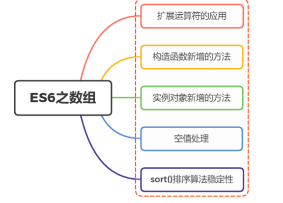
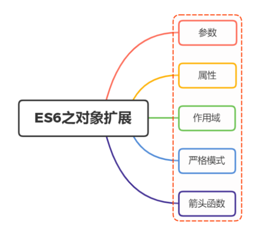
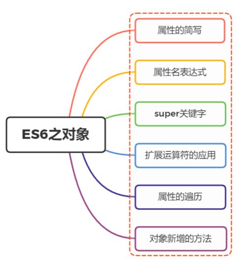
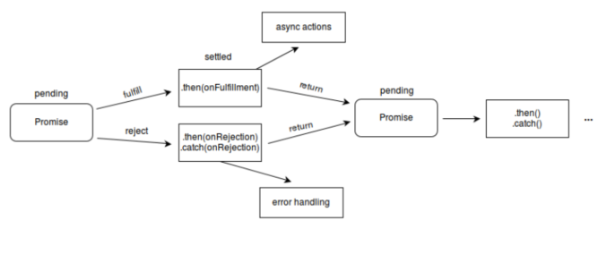
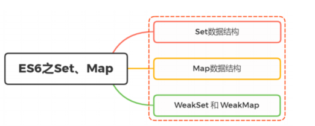

# 说说var、let、const之间的区别
* var
  * 变量提升
  * 全局变量
  * 顶层变量
  * 函数中是局部的
* let
  * 只在代码块有效
  * 无变量提升
  * 不允许在相同作用域中重复声明
  * 只要块级作⽤域内存在 let 命令，这个区域就不再受外部影响
  * 暂时性死区
* const
  * 声明⼀个只读的常量，⼀旦声明，常量的值就不能改变
  * ⼀旦声明变量，就必须⽴即初始化，不能留到以后赋值
  * 如果之前⽤ var 或 let 声明过变量，再⽤ const 声明同样会报错
  * const 实际上保证的并不是变量的值不得改动，⽽是变量指向的那个内存地址所保存的数据不得改动 对于简单类型的数据，值就保存在变量指向的那个内存地址，因此等同于常量 对于复杂类型的数据，变量指向的内存地址，保存的只是⼀个指向实际数据的指针， const 只能保证。这个指针是固定的，并不能确保改变量的结构不变
  * 其它情况， const 与 let ⼀致

# ES6中数组新增了哪些扩展？


## . 扩展运算符的应⽤
ES6通过扩展元素符 ... ，好⽐ rest 参数的逆运算，将⼀个数组转为⽤逗号分隔的参数序列
``` javascript
console.log(...[1, 2, 3])
// 1 2 3
console.log(1, ...[2, 3, 4], 5)
// 1 2 3 4 5
[...document.querySelectorAll('div')]
// [<div>, <div>, <div>]
```

主要⽤于函数调⽤的时候，将⼀个数组变为参数序列

``` javascript
function push(array, ...items) {
 array.push(...items);
}
function add(x, y) {
 return x + y;
}
const numbers = [4, 38];
add(...numbers) // 42
```

能够更简单实现数组复制

``` jsavscript
const a1 = [1, 2];
const [...a2] = a1;
// [1,2]
```

数组的合并
```
const arr1 = ['a', 'b'];
const arr2 = ['c'];
const arr3 = ['d', 'e'];
[...arr1, ...arr2, ...arr3]
// [ 'a', 'b', 'c', 'd', 'e' ]
```
注意：通过扩展运算符实现的是浅拷⻉，修改了引⽤指向的值，会同步反映到新数组

## 构造函数新增的⽅法
关于构造函数，数组新增的⽅法有如下：
* Array.from()
  * 将两类对象转为真正的数组：类似数组的对象和可遍历 （iterable） 的对象（包括 ES6 新增的数据结构 Set 和 Map ）

``` javascript
let arrayLike = {
 '0': 'a',
 '1': 'b',
 '2': 'c',
 length: 3
};
let arr2 = Array.from(arrayLike); // ['a', 'b', 'c']
Array.from([1, 2, 3], (x) => x * x)
// [1, 4, 9]
```
* Array.of()
  * ⽤于将⼀组值，转换为数组
``` javascript
Array.of(3, 11, 8) // [3,11,8]
Array() // []
Array(3) // [, , ,]
Array(3, 11, 8) // [3, 11, 8]
```

*  实例对象新增的⽅法
    *  copyWithin()
       *  将指定位置的成员复制到其他位置（会覆盖原有成员），然后返回当前数组
    * find()、findIndex()
      * find() ⽤于找出第⼀个符合条件的数组成员
      * findIndex 返回第⼀个符合条件的数组成员的位置，如果所有成员都不符合条件，则返回 -1
    * fill()
      * 使⽤给定值，填充⼀个数组
    * entries()，keys()，values()
      * keys() 是对键名的遍历、 values() 是对键值的遍历， entries() 是对键值对的遍历
    * includes()
      * ⽤于判断数组是否包含给定的值
    * flat()，flatMap()
      * 将数组扁平化处理，返回⼀个新数组，对原数据没有影响
* 数组的空位
  * ES6 则是明确将空位转为 undefined ，包括 Array.from 、扩展运算符、 copyWithin() 、 fill() 、 entries() 、 keys() 、 values() 、 find() 和 findIndex()
* 排序稳定性
  * 将 sort() 默认设置为稳定的排序算法

# 函数新增了哪些扩展？


## 参数
ES6 允许为函数的参数设置默认值
## 属性
* 函数的length属性
  * length 将返回没有指定默认值的参数个数
  * rest 参数也不会计⼊ length 属性
  * 如果设置了默认值的参数不是尾参数，那么 length 属性也不再计⼊后⾯的参数
* name属性
  * 返回该函数的函数名
  * 如果将⼀个具名函数赋值给⼀个变量，则 name 属性都返回这个具名函数原本的名字
  * Function 构造函数返回的函数实例， name 属性的值为 anonymous
  * bind 返回的函数， name 属性值会加上 bound 前缀
## 作用域
⼀旦设置了参数的默认值，函数进⾏声明初始化时，参数会形成⼀个单独的作⽤域
等到初始化结束，这个作⽤域就会消失。这种语法⾏为，在不设置参数默认值时，是不会出现的
下⾯例⼦中， y=x 会形成⼀个单独作⽤域， x 没有被定义，所以指向全局变量 x
``` javascript
let x = 1;
function f(y = x) {
 // 等同于 let y = x 
 let x = 2;
 console.log(y);
}
f() // 1
```
## 严格模式
只要函数参数使⽤了默认值、解构赋值、或者扩展运算符，那么函数内部就不能显式设定为严格模式，否则会报错

## 箭头函数
使⽤“箭头”（ => ）定义函数

如果箭头函数不需要参数或需要多个参数，就使⽤⼀个圆括号代表参数部分

如果箭头函数的代码块部分多于⼀条语句，就要使⽤⼤括号将它们括起来，并且使⽤ return 语句返回

如果返回对象，需要加括号将对象包裹
* 函数体内的 this 对象，就是定义时所在的对象，⽽不是使⽤时所在的对象
* 不可以当作构造函数，也就是说，不可以使⽤ new 命令，否则会抛出⼀个错误
* 不可以使⽤ arguments 对象，该对象在函数体内不存在。如果要⽤，可以⽤ rest 参数代替
* 不可以使⽤ yield 命令，因此箭头函数不能⽤作 Generator 函数

# 对象新增了哪些扩展？


## 属性的简写
ES6中，当对象键名与对应值名相等的时候，可以进⾏简写
``` javascript
const baz = {foo:foo}
// 等同于
const baz = {foo}
```
⽅法也能够进⾏简写

``` javascript
const o = {
 method() {
 return "Hello!";
 }
};
// 等同于
const o = {
 method: function() {
 return "Hello!";
 }
}
```
在函数内作为返回值，也会变得⽅便很多
注意：简写的对象⽅法不能⽤作构造函数，否则会报错

## 属性名表达式
ES6 允许字⾯量定义对象时，将表达式放在括号内
``` javascript
let lastWord = 'last word';
const a = {
 'first word': 'hello',
 [lastWord]: 'world'
};
a['first word'] // "hello"
a[lastWord] // "world"
a['last word'] // "world"
```

表达式还可以⽤于定义⽅法名

``` javascript
let obj = {
 ['h' + 'ello']() {
 return 'hi';
 }
};
obj.hello() // hi
```
注意，属性名表达式与简洁表示法，不能同时使⽤，会报错

注意，属性名表达式如果是⼀个对象，默认情况下会⾃动将对象转为字符串 [object Object]

## super关键字
this 关键字总是指向函数所在的当前对象，ES6 ⼜新增了另⼀个类似的关键字 super ，指向当前对象的原型对象

## 扩展运算符的应⽤
在解构赋值中，未被读取的可遍历的属性，分配到指定的对象上⾯
``` javascript
let { x, y, ...z } = { x: 1, y: 2, a: 3, b: 4 };
x // 1
y // 2
z // { a: 3, b: 4 }
```
解构赋值是浅拷⻉

## 属性的遍历
ES6 ⼀共有 5 种⽅法可以遍历对象的属性。
* for...in：循环遍历对象⾃身的和继承的可枚举属性（不含 Symbol 属性）
* Object.keys(obj)：返回⼀个数组，包括对象⾃身的（不含继承的）所有可枚举属性（不含Symbol 属性）的键名
* Object.getOwnPropertyNames(obj)：回⼀个数组，包含对象⾃身的所有属性（不含 Symbol 属性，但是包括不可枚举属性）的键名
* Object.getOwnPropertySymbols(obj)：返回⼀个数组，包含对象⾃身的所有 Symbol 属性的键名
* Reflect.ownKeys(obj)：返回⼀个数组，包含对象⾃身的（不含继承的）所有键名，不管键名是
* Symbol 或字符串，也不管是否可枚举

上述遍历，都遵守同样的属性遍历的次序规则：
* ⾸先遍历所有数值键，按照数值升序排列
* 其次遍历所有字符串键，按照加⼊时间升序排列
* 最后遍历所有 Symbol 键，按照加⼊时间升序排

``` javascript
Reflect.ownKeys({ [Symbol()]:0, b:0, 10:0, 2:0, a:0 })
// ['2', '10', 'b', 'a', Symbol()]
```
## 对象新增的⽅法
关于对象新增的⽅法，分别有以下：
* Object.is()
  * 严格判断两个值是否相等，与严格⽐较运算符（===）的⾏为基本⼀致，不同之处只有两个：⼀是 +0 不等于 -0 ，⼆是 NaN 等于⾃身
``` javascript
+0 === -0 //true
NaN === NaN // false
Object.is(+0, -0) // false
Object.is(NaN, NaN) // true
```
* Object.assign()
  * Object.assign() ⽅法⽤于对象的合并，将源对象 source 的所有可枚举属性，复制到⽬标对象target
  * Object.assign() ⽅法的第⼀个参数是⽬标对象，后⾯的参数都是源对象
* Object.getOwnPropertyDescriptors()
  * 返回指定对象所有⾃身属性（⾮继承属性）的描述对象
* Object.setPrototypeOf()，Object.getPrototypeOf()
  * Object.setPrototypeOf ⽅法⽤来设置⼀个对象的原型对象
  * ⽤于读取⼀个对象的原型对象
* Object.keys()，Object.values()，Object.entries()
  * 返回⾃身的（不含继承的）所有可遍历（enumerable）属性的键名的数组
  * 返回⾃身的（不含继承的）所有可遍历（enumerable）属性的键对应值的数组
  * 返回⼀个对象⾃身的（不含继承的）所有可遍历（enumerable）属性的键值对的数组
* Object.fromEntries()
  * ⽤于将⼀个键值对数组转为对象
# 你是怎么理解ES6中 Promise的？使⽤场景？
Promise ，译为承诺，是异步编程的⼀种解决⽅案，⽐传统的解决⽅案（回调函数）更加合理和更加强⼤
在以往我们如果处理多层异步操作，我们往往会像下⾯那样编写我们的代码

```
doSomething(function(result) {
 doSomethingElse(result, function(newResult) {
 doThirdThing(newResult, function(finalResult) {
 console.log('得到最终结果: ' + finalResult);
 }, failureCallback);
 }, failureCallback);
}, failureCallback);
```

现在通过 Promise 的改写上⾯的代码

``` javascript
doSomething().then(function(result) {
 return doSomethingElse(result);
})
.then(function(newResult) {
 return doThirdThing(newResult);
})
.then(function(finalResult) {
 console.log('得到最终结果: ' + finalResult);
})
.catch(failureCallback);
```

瞬间感受到 promise 解决异步操作的优点：
* 链式操作减低了编码难度
* 代码可读性明显增强

## 状态
promise 对象仅有三种状态
* pending （进⾏中）
* fulfilled （已成功）
* rejected （已失败）

## 特点
* 对象的状态不受外界影响，只有异步操作的结果，可以决定当前是哪⼀种状态
* ⼀旦状态改变（从 pending 变为 fulfilled 和从 pending 变为 rejected ），就不会再变，任何时候都可以得到这个结果

## 流程



## ⽤法
Promise 对象是⼀个构造函数，⽤来⽣成 Promise 实例
```
const promise = new Promise(function(resolve, reject) {});
```

Promise 构造函数接受⼀个函数作为参数，该函数的两个参数分别是 resolve 和 reject
* resolve 函数的作⽤是，将 Promise 对象的状态从“未完成”变为“成功”
* reject 函数的作⽤是，将 Promise 对象的状态从“未完成”变为“失败”

### Promise 构建出来的实例存在以下⽅法：
* then()
  * then 是实例状态发⽣改变时的回调函数，第⼀个参数是 resolved 状态的回调函数，第⼆个参数是 rejected 状态的回调函数
  * then ⽅法返回的是⼀个新的 Promise 实例，也就是 promise 能链式书写的原因
``` javascript
getJSON("/posts.json").then(function(json) {
 return json.post;
}).then(function(post) {
 // ...
});
```
* catch()
  * catch() ⽅法是 .then(null, rejection) 或 .then(undefined, rejection) 的别名，⽤于指定发⽣错误时的回调函数
``` 
getJSON('/posts.json').then(function(posts) {
 // ...
}).catch(function(error) {
 // 处理 getJSON 和 前⼀个回调函数运⾏时发⽣的错误
 console.log('发⽣错误！', error);
});
```
Promise 对象的错误具有“冒泡”性质，会⼀直向后传递，直到被捕获为⽌
```
getJSON('/post/1.json').then(function(post) {
 return getJSON(post.commentURL);
}).then(function(comments) {
 // some code
}).catch(function(error) {
 // 处理前⾯三个Promise产⽣的错误
});
```

⼀般来说，使⽤ catch ⽅法代替 then() 第⼆个参数
Promise 对象抛出的错误不会传递到外层代码，即不会有任何反应
* finally()
  * finally() ⽅法⽤于指定不管 Promise 对象最后状态如何，都会执⾏的操作

### 构造函数⽅法
* all()
* race()
* allSettled()
* resolve()
* reject()
* try()

# 你是怎么理解ES6中Module的？使⽤场景？

模块，（Module），是能够单独命名并独⽴地完成⼀定功能的程序语句的集合（即程序代码和数据结构的集合体）。
两个基本的特征：外部特征和内部特征
* 外部特征是指模块跟外部环境联系的接⼝（即其他模块或程序调⽤该模块的⽅式，包括有输⼊输出参数、引⽤的全局变量）和模块的功能
* 内部特征是指模块的内部环境具有的特点（即该模块的局部数据和程序代码）

## 为什么需要模块化
* 代码抽象
* 代码封装
* 代码复⽤
* 依赖管理

### AMD 
Asynchronous ModuleDefinition （AMD），异步模块定义，采⽤异步⽅式加载模块。所有依赖
模块的语句，都定义在⼀个回调函数中，等到模块加载完成之后，这个回调函数才会运⾏
require.js
``` javascript
/** main.js ⼊⼝⽂件/主模块 **/
// ⾸先⽤config()指定各模块路径和引⽤名
require.config({
 baseUrl: "js/lib",
 paths: {
 "jquery": "jquery.min", //实际路径为js/lib/jquery.min.js
 "underscore": "underscore.min",
 }
});
// 执⾏基本操作
require(["jquery","underscore"],function($,_){
 // some code here
});
```
### CommonJs
CommonJS 是⼀套 Javascript 模块规范，⽤于服务端

## 使⽤
ES6 模块内部⾃动采⽤了严格模式，这⾥就不展开严格模式的限制，毕竟这是 ES5 之前就已经规定好模块功能主要由两个命令构成：
* export ：⽤于规定模块的对外接⼝
  * ⼀个模块就是⼀个独⽴的⽂件，该⽂件内部的所有变量，外部⽆法获取。如果你希望外部能够读取模块内部的某个变量，就必须使⽤ export 关键字输出该变量
* import ：⽤于输⼊其他模块提供的功能
  * 使⽤ export 命令定义了模块的对外接⼝以后，其他 JS ⽂件就可以通过 import 命令加载这个模块
  * 同样如果想要输⼊变量起别名，通过 as 关键字
### 动态加载
允许您仅在需要时动态加载模块，⽽不必预先加载所有模块，这存在明显的性能优势
这个新功能允许您将 import() 作为函数调⽤，将其作为参数传递给模块的路径。 它返回⼀个 promise ，它⽤⼀个模块对象来实现，让你可以访问该对象的导出
## 使⽤场景
如今， ES6 模块化已经深⼊我们⽇常项⽬开发中，像 vue 、 react 项⽬搭建项⽬，组件化开发处处可⻅，其也是依赖模块化实现

```
<template>
 <div class="App">
 组件化开发 ---- 模块化
 </div>
</template>
<script>
export default {
 name: 'HelloWorld',
 props: {
 msg: String
 }
}
</script>
```

# . 你是怎么理解ES6中 Generator的？使⽤场景？

Generator 函数是 ES6 提供的⼀种异步编程解决⽅案，语法⾏为与传统函数完全不同

执⾏ Generator 函数会返回⼀个遍历器对象，可以依次遍历 Generator 函数内部的每⼀个状态形式上， Generator 函数是⼀个普通函数，但是有两个特征：
* function 关键字与函数名之间有⼀个星号
* 函数体内部使⽤ yield 表达式，定义不同的内部状态

```
function* helloWorldGenerator() {
 yield 'hello';
 yield 'world';
 return 'ending';
}
```

## 区别
* 通过上述代码进⾏分析，将 promise 、 Generator 、 async/await 进⾏⽐较：
* promise 和 async/await 是专⻔⽤于处理异步操作的
* Generator 并不是为异步⽽设计出来的，它还有其他功能（对象迭代、控制输出、部署 Interator 接⼝...）
* promise 编写代码相⽐ Generator 、 async 更为复杂化，且可读性也稍差
* Generator 、 async 需要与 promise 对象搭配处理异步情况
* async 实质是 Generator 的语法糖，相当于会⾃动执⾏ Generator 函数
* async 使⽤上更为简洁，将异步代码以同步的形式进⾏编写，是处理异步编程的最终⽅案

# 你是怎么理解ES6中 Decorator 的？使⽤场景？
Decorator，即装饰器，从名字上很容易让我们联想到装饰者模式
简单来讲，装饰者模式就是⼀种在不改变原类和使⽤继承的情况下，动态地扩展对象功能的设计理论。
ES6 中 Decorator 功能亦如此，其本质也不是什么⾼⼤上的结构，就是⼀个普通的函数，⽤于扩展类属性和类⽅法
这⾥定义⼀个⼠兵，这时候他什么装备都没有
```javascript
class soldier{
}
```
定义⼀个得到 AK 装备的函数，即装饰器
``` javascript
function strong(target){
 target.AK = true
}
```
使⽤该装饰器对⼠兵进⾏增强
``` javascript
@strong
class soldier{
}
```
这时候⼠兵就有武器了
``` javascript
soldier.AK // true
```
上述代码虽然简单，但也能够清晰看到了使⽤ Decorator 两⼤优点
* 代码可读性变强了，装饰器命名相当于⼀个注释
* 在不改变原有代码情况下，对原来功能进⾏扩展

## ⽤法
Docorator 修饰对象为下⾯两种：
* 类的装饰
  * 当对类本身进⾏装饰的时候，能够接受⼀个参数，即类本身
``` javascript
@decorator
class A {}
// 等同于
class A {}
A = decorator(A) || A;
```
如果想要传递参数，可以在装饰器外层再封装⼀层函数
``` javascript
function testable(isTestable) {
 return function(target) {
 target.isTestable = isTestable;
 }
}
@testable(true)
class MyTestableClass {}
MyTestableClass.isTestable // true
@testable(false)
class MyClass {}
MyClass.isTestable // false
```
* 类属性的装饰
当对类属性进⾏装饰的时候，能够接受三个参数：
* 类的原型对象
* 需要装饰的属性名
* 装饰属性名的描述对象

⾸先定义⼀个 readonly 装饰器
``` javascript
function readonly(target, name, descriptor){
 descriptor.writable = false; // 将可写属性设为false
 return descriptor;
}
```
使⽤ readonly 装饰类的 name ⽅法
``` javascript
class Person {
 @readonly
 name() { return `${this.first} ${this.last}` }
}
```
相当于以下调⽤
```
readonly(Person.prototype, 'name', descriptor);
```

```javascript
function LogAccess(target: any, propertyKey: string) {
  let value = target[propertyKey];
  Object.defineProperty(target, propertyKey, {
    get: () => {
      console.log(`读取属性 ${propertyKey}: ${value}`);
      return value;
    },
    set: (newValue) => {
      console.log(`设置属性 ${propertyKey}: ${newValue}`);
      value = newValue;
    },
    enumerable: true,
    configurable: true
  });
}

class Book {
  @LogAccess
  title: string = "默认标题";
}

const book = new Book();
book.title = "JavaScript 高级编程"; // 控制台输出：设置属性 title...
console.log(book.title); // 控制台输出：读取属性 title...

```
如果⼀个⽅法有多个装饰器，就像洋葱⼀样，先从外到内进⼊，再由内到外执⾏
```
function dec(id){
 console.log('evaluated', id);
 return (target, property, descriptor) =>console.log('executed', id);
}
class Example {
 @dec(1)
 @dec(2)
 method(){}
}
// evaluated 1
// evaluated 2
// executed 2
// executed 1
```
外层装饰器 @dec(1) 先进⼊，但是内层装饰器 @dec(2) 先执⾏

## 注意
装饰器不能⽤于修饰函数，因为函数存在变量声明情况

# 你是怎么理解ES6新增Set、Map两种数据结构的？


如果要⽤⼀句来描述，我们可以说
Set 是⼀种叫做集合的数据结构， Map 是⼀种叫做字典的数据结构
## Set
Set 是 es6 新增的数据结构，类似于数组，但是成员的值都是唯⼀的，没有重复的值，我们⼀般称为集合

Set 本身是⼀个构造函数，⽤来⽣成 Set 数据结构
`const s = new Set();`
### 增删改查
* add()
* delete()
* has()
* clear()
### 遍历
* keys()：返回键名的遍历器
* values()：返回键值的遍历器
* entries()：返回键值对的遍历器
* forEach()：使⽤回调函数遍历每个成员

## Map
Map 类型是键值对的有序列表，⽽键和值都可以是任意类型
Map 本身是⼀个构造函数，⽤来⽣成 Map 数据结构
```
const m = new Map()
```
### 增删改查
* size 属性
* set()
* get()
* has()
* delete()
* clear()
### 遍历

* keys()：返回键名的遍历器
* values()：返回键值的遍历器
* entries()：返回所有成员的遍历器
* forEach()：遍历 Map 的所有成员

## WeakSet
```const ws = new WeakSet();```
WeakSet 可以接受⼀个具有 Iterable 接⼝的对象作为参数
```
const a = [[1, 2], [3, 4]];
const ws = new WeakSet(a);
// WeakSet {[1, 2], [3, 4]}
```

在 API 中 WeakSet 与 Set 有两个区别：
* 没有遍历操作的 API
* 没有 size 属性

WeakSet 只能成员只能是引⽤类型，⽽不能是其他类型的值
``` javascript
let ws=new WeakSet();
// 成员不是引⽤类型
let weakSet=new WeakSet([2,3]);
console.log(weakSet) // 报错
// 成员为引⽤类型
let obj1={name:1}
let obj2={name:1}
let ws=new WeakSet([obj1,obj2]);
console.log(ws) //WeakSet {{…}, {…}}
```

## WeakMap
WeakMap 结构与 Map 结构类似，也是⽤于⽣成键值对的集合
在 API 中 WeakMap 与 Map 有两个区别：
* 没有遍历操作的 API
* 没有 clear 清空⽅法
WeakMap 只接受对象作为键名（ null 除外），不接受其他类型的值作为键名

# 你是怎么理解ES6中Proxy的？使⽤场景
定义： ⽤于定义基本操作的⾃定义⾏为
本质： 修改的是程序默认形为，就形同于在编程语⾔层⾯上做修改，属于元编程 (meta programmin
g)
元编程（Metaprogramming，⼜译超编程，是指某类计算机程序的编写，这类计算机程序编写或者操纵
其它程序（或者⾃身）作为它们的数据，或者在运⾏时完成部分本应在编译时完成的⼯作
⼀段代码来理解
``` bash
#!/bin/bash
# metaprogram
echo '#!/bin/bash' >program
for ((I=1; I<=1024; I++)) do
 echo "echo $I" >>program
done
chmod +x program
```
这段程序每执⾏⼀次能帮我们⽣成⼀个名为 program 的⽂件，⽂件内容为1024⾏ echo ，如果我们⼿动来写1024⾏代码，效率显然低效
元编程优点：与⼿⼯编写全部代码相⽐，程序员可以获得更⾼的⼯作效率，或者给与程序更⼤的灵活度去处理新的情形⽽⽆需重新编译
Proxy 亦是如此，⽤于创建⼀个对象的代理，从⽽实现基本操作的拦截和⾃定义（如属性查找、赋值、枚举、函数调⽤等）

`var proxy = new Proxy(target, handler)`

* target 表示所要拦截的⽬标对象（任何类型的对象，包括原⽣数组，函数，甚⾄另⼀个代理））
* handler 通常以函数作为属性的对象，各属性中的函数分别定义了在执⾏各种操作时代理 p 的⾏为