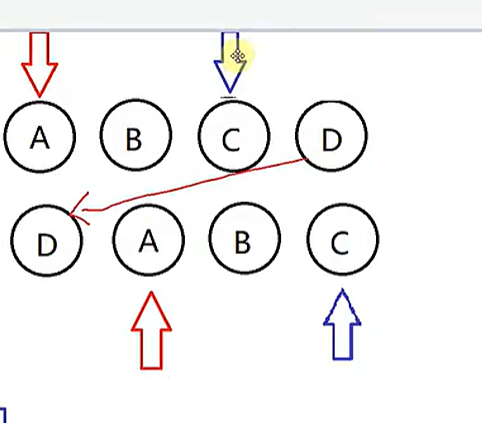

- [1.谈谈你对vue的理解](#1谈谈你对vue的理解)
  - [1.1 声明式框架](#11-声明式框架)
  - [1.2 MVVM](#12-mvvm)
  - [1.3 虚拟dom](#13-虚拟dom)
  - [1.4 区分编译时（打包）和运行（浏览器）时](#14-区分编译时打包和运行浏览器时)
  - [1.5 组件化](#15-组件化)
- [2谈谈你对SPA的理解](#2谈谈你对spa的理解)
  - [解决方案](#解决方案)
- [3 为什么要使用虚拟DOM](#3-为什么要使用虚拟dom)
  - [3.1](#31)
  - [1.2 vdom如何生成的](#12-vdom如何生成的)
  - [Vdom如何做diff](#vdom如何做diff)
- [谈一谈对VUE组件化的理解](#谈一谈对vue组件化的理解)
- [既然Vue通过数据劫持可以精准探测数据变化，威慑呢么还要虚拟DOM进行diff检测差异](#既然vue通过数据劫持可以精准探测数据变化威慑呢么还要虚拟dom进行diff检测差异)
- [请说一下对响应式数据的理解](#请说一下对响应式数据的理解)
  - [1.1 如何实现响应式数据](#11-如何实现响应式数据)
    - [1.1.1](#111)
      - [Object.defineProperty()](#objectdefineproperty)
      - [Proxy](#proxy)
      - [Reflect](#reflect)
- [VUE中如何进行依赖收集](#vue中如何进行依赖收集)
  - [1.1 依赖收集的流程](#11-依赖收集的流程)
    - [Dep类](#dep类)
      - [举例](#举例)
      - [watcher类](#watcher类)
      - [VUE类](#vue类)
- [Vue.set方法是如何实现的](#vueset方法是如何实现的)
  - [核心实现原理](#核心实现原理)
    - [1.响应式系统的局限性](#1响应式系统的局限性)
    - [2.Vue.set 的核心逻辑](#2vueset-的核心逻辑)
- [v-show和v-if](#v-show和v-if)
  - [实现方式](#实现方式)
  - [性能影响](#性能影响)
  - [生命周期](#生命周期)
  - [优先级](#优先级)
- [computed 和 watch区别](#computed-和-watch区别)
    - [总结](#总结)
- [Vue3中 ref 与 reactive 区别](#vue3中-ref-与-reactive-区别)
  - [ref](#ref)
  - [reactive](#reactive)
- [watch 和 watchEffect的区别](#watch-和-watcheffect的区别)
  - [watch](#watch)
- [如何将template转换成render函数](#如何将template转换成render函数)
- [new Vue（）这个过程中究竟做了些什么？](#new-vue这个过程中究竟做了些什么)
- [Vue.observable 有了解过吗？说说看](#vueobservable-有了解过吗说说看)
- [v-if和v-for哪个优先级更高](#v-if和v-for哪个优先级更高)
- [生命周期有哪些](#生命周期有哪些)
- [Vue 中 diff算法原理](#vue-中-diff算法原理)
  - [1.1 Diff概念](#11-diff概念)
  - [1.2Diff 比较流程](#12diff-比较流程)
- [请说明Vue中key的作用和原理，谈谈你对它的理解](#请说明vue中key的作用和原理谈谈你对它的理解)
  - [核心作用](#核心作用)
  - [实现原理](#实现原理)
  - [最佳实践与注意事项](#最佳实践与注意事项)
- [Vue.use](#vueuse)
  - [use的概念](#use的概念)
  - [插件的功能](#插件的功能)
  - [实现原理](#实现原理-1)
- [Vue.extend方法的作用](#vueextend方法的作用)
- [Vue组件data 为什么必须是函数](#vue组件data-为什么必须是函数)
- [函数组件的优势](#函数组件的优势)
- [Vue中的过滤器了解吗](#vue中的过滤器了解吗)
- [v-once 的概念](#v-once-的概念)
- [Vue。mixin](#vuemixin)
- [vue 中的slot](#vue-中的slot)
  - [一、Slot 的实现原理](#一slot-的实现原理)
  - [二、何时使用 Slot](#二何时使用-slot)
- [什么是双向绑定，实现原理是什么](#什么是双向绑定实现原理是什么)
  - [双向绑定的概念](#双向绑定的概念)
  - [表单元素中的v-model](#表单元素中的v-model)
  - [核心原理](#核心原理)
- [Vue中。sync修饰符的作用](#vue中sync修饰符的作用)
  - [实现双向数据绑定](#实现双向数据绑定)
- [Vue中递归组件的理解](#vue中递归组件的理解)
  - [递归组件的定义与核心原理](#递归组件的定义与核心原理)
- [组件中写name选项有哪些好处及作用](#组件中写name选项有哪些好处及作用)
- [nextTick](#nexttick)
  - [定义与作用](#定义与作用)
- [实现原理](#实现原理-2)
- [使用场景](#使用场景)
- [keep-alive在什么时候使用](#keep-alive在什么时候使用)
  - [概念](#概念)
  - [使用场景](#使用场景-1)
  - [使用时的注意事项](#使用时的注意事项)
- [Vue 中使用了哪些设计模式](#vue-中使用了哪些设计模式)
- [$emit 和 $on 要怎么用](#emit-和-on-要怎么用)
  - [$emit](#emit)
  - [$on 监听自定义事件](#on-监听自定义事件)
  - [高级场景](#高级场景)
- [Vue中的应能优化有哪些](#vue中的应能优化有哪些)
- [单页应用首屏加载速度慢的怎么解决](#单页应用首屏加载速度慢的怎么解决)
- [Vue项目中是如何解决跨域问题的呢](#vue项目中是如何解决跨域问题的呢)
- [vue中有封装过axios吗？主要是封装哪方面的](#vue中有封装过axios吗主要是封装哪方面的)
- [vue要做权限管理该怎么做，如果控制到按钮级别的权限要怎么做](#vue要做权限管理该怎么做如果控制到按钮级别的权限要怎么做)
- [Vue中异步组件的作用及原理](#vue中异步组件的作用及原理)
  - [概念](#概念-1)
- [Vue-Router有集中钩子函数，具体是什么以及执行流程是什么](#vue-router有集中钩子函数具体是什么以及执行流程是什么)
- [Vue-Router有三种模式 hash、history、abstract](#vue-router有三种模式-hashhistoryabstract)
- [Vuex](#vuex)
- [如何监听vuex中数据的变化](#如何监听vuex中数据的变化)
- [Vuex刷新后丢失如何解决](#vuex刷新后丢失如何解决)
- [VUE2和VUE3 的区别是什么？Vue3有哪些优点](#vue2和vue3-的区别是什么vue3有哪些优点)
# 1.谈谈你对vue的理解
官方：Vue是一套用于构建用户界面的渐进式框架，Vue的核心库只关注视图层

## 1.1 声明式框架
命令式和声明式的区别
* JQ都是命令式的，命令式框架重要特点就是关注过程
* 声明式更关注结果
```javascript
#### 
let numbers = [1,2,3,4,5]
let total = 0
for(let i = 0; i<numbers.length; i++){
    total += numbers[i]
}
console.log(total)
##############
let total12 = numbers.reduce(function(memo,current){
    return memo + current
},0)
```
## 1.2 MVVM 
Model-View-ViewModel

1. 将模型（Model）转化成视图（View），即将后端传递的数据转化成所看到的页面，实现的方式是：数据绑定。
2. 将视图（View）转化成模型（Model），即将所看到的页面转化成后端的数据，实现的方式是：DOM 事件监听。当这两个方向的数据转换都实现时，我们称之为数据的双向绑定。
Model-View-Controller


backbone+underscore+jquery
MVVM 与 MVC 最大的区别就是：MVVM 实现了 View 和 Model 的自动同步，也就是当 Model 的属性改变时，我们不用再自己手动操作 Dom 元素来改变 View 的显示，而是改变属性后该属性对应 View 层显示会自动改变（双向绑定）。
## 1.3 虚拟dom
传统更新页面，拼接一个完整的字符串innerHTML全部重新渲染，添加虚拟dom后可以比较新旧虚拟节点，找到变化在进行更新。虚拟dom就是一个对象用来描述真实dom
## 1.4 区分编译时（打包）和运行（浏览器）时
* Vue的渲染核心就是调用渲染（render）方法将虚拟dom渲染成真实dom
* 专门写个编译时可以将模板编译成虚拟dom
## 1.5 组件化
实现高内聚、低耦合、单项数据流
* 组件化开发能大幅提高应用开发效率、测试性、复用性等
* 降低更新范围，值重新渲染变化的组件
# 2谈谈你对SPA的理解
* SPA（single page application）默认情况下VUE和react都只有一个html，并且提供一个挂载点，最终打包后会再此页面中引入对应的资源。切换页面时通过监听路由的变化，渲染对应的页面。CSR Client side Rendering。不好实现SEO搜索引擎优化
* MPA（multi-page application）多页面应用，多个html页面。每个页面必须重复加载、js、css等相关资源。（服务端返回完整的html，同时数据也可以再后端进行获取一并返回模板引擎）。多页应用跳转需要整页资源刷新。SSR Server Side Rendering。首次渲染速度较慢.
## 解决方案
* 静态页面预渲染（static Site Generation）SSG，在构建时生成完整的html页面。（在打包的时候，现将页面放到浏览器中运行一下，将HTML保存起来），仅适合静态页面网站，变化率不高的网站
* SSR+CSR，首屏采用服务端渲染方式，后续交互采用客户端渲染方式。NuxtJS
# 3 为什么要使用虚拟DOM
## 3.1
* virtual DOM 就是用金属对象来描述真实DOM，是对真实DOM的抽象，由于直接操作DOM性能低但是js层的操作效率高， 可以将DOM操作转化成对象操作，最终通过diff算法对比差异进行更新DOM
* 不依赖真实平台环境从而可以实现跨平台
## 1.2 vdom如何生成的
* 在vue中尝尝回味组件编写模板 - template
* 模板会被编译器编译为渲染函数 -render
* 挂在过程中会调用render函数，返回的对象就是虚拟dom
* 在后续的patch过程中进一步转化为真实dom
## Vdom如何做diff
* 挂在过程结束后，会记录vdom - oldvnode
* 当样影视数据发生变化事，将会引起组件重新render，此时就会生成新的vdom - newVnode
* 使用old和new做diff
# 谈一谈对VUE组件化的理解
**核心组成：模板、属性、事件、插槽、生命周期**
组件化的好处：高内聚、可复用、可组合
* 组件化开发能大幅提高应用开发效率、测试性、复用性等
* 降低更新范围，值重新渲染变化的组件
  补充：
  * Vue中的每个组件都有一个渲染函数watcher、effect
  * 数据室响应式的、数据变化后汇之星watcher或者effect
  * 组件要合理的划分、如果不拆分组件，那更新的时候整个页面都要重新更新
  * 如果过分的拆组件会导致watcher、effect产生过多也会遭成性能浪费
# 既然Vue通过数据劫持可以精准探测数据变化，威慑呢么还要虚拟DOM进行diff检测差异
Vue内部设计原因导致的，vue设计的是每个组件一个water，没有采用一个属性对应一个watcher。这样会导致大量的watcher的产生而且浪费内存，如果粒度过低也无法精准检测变化。所以才用diff算法+组件级watcher
# 请说一下对响应式数据的理解
## 1.1 如何实现响应式数据
数组和对象类型当值变化是如何劫持到。对象内部通过defineReactive方法(定义响应式)，使用Object.defineProperty 将属性进行劫持（只会劫持已经存在的属性），数组则是通过重写数组方法来实现。多层对象是通过递归来实现劫持。Vue3 则采用proxy
### 1.1.1
基本实现原理

1. 属性拦截：通过Object.defineProperty(obj,prop,desctiptor)的 get和set描述符，拦截属性的读取和修改操作。当访问改属性时，触发自定义逻辑（如依赖收集和视图更新）
2. 递归劫持嵌套对象：
对于嵌套对象属性，需递归调用劫持逻辑。例如，若属性值为对象，则对该子对象再次调用 observe() 方法，确保深层属性也能被监听
3. 数组的特殊处理：Object.defineProperty 无法直接监听数组索引变化（如 arr[0] = 1），因此需通过重写数组原型方法（如 push、pop 等），在调用这些方法时手动触发更新

#### Object.defineProperty()
```javascript
// 对对象的每个属性调用 defineReactive 函数：
function observe(obj) {
  if (typeof obj !== 'object' || obj === null) return;
  Object.keys(obj).forEach(key => {
    defineReactive(obj, key, obj[key]);
  });
}
// 定义劫持逻辑
function defineReactive(obj, key, val) {
  observe(val); // 递归处理嵌套对象
  // Object.defineProperty()是JavaScript提供的一个核心方法，允许为对象的属性定义属性描述符。当使用get和set作为描述符时，它们会覆盖默认的属性访问行为
  Object.defineProperty(obj, key, {
    get() {
      // get方法：当读取属性时，JavaScript引擎会自动调用此函数，返回其返回值作为属性值
      console.log('读取属性:', key);
      return val;
    },
    set(newVal) {
      // set方法：当修改属性时，引擎会调用此函数，并将新值作为参数传入，开发者可在其中处理赋值逻辑
      if (newVal === val) return;
      console.log('更新属性:', key, '新值:', newVal);
      val = newVal;
      observe(newVal); // 新值为对象时继续劫持
      updateView(); // 触发视图更新
    }
  });
}
// 劫持数组方法以触发更新：
const arrayProto = Array.prototype;
const arrayMethods = Object.create(arrayProto);
['push', 'pop', 'shift'].forEach(method => {
  arrayMethods[method] = function(...args) {
    const result = arrayProto[method].apply(this, args);
    updateView(); // 调用原生方法后触发更新
    return result;
  };
});

// 将数组的原型指向重写后的对象
if (Array.isArray(target)) {
  target.__proto__ = arrayMethods;
}

// 实例
let data = { name: '小明', info: { age: 20 }, likes: ['编程'] };
observe(data);

data.name = '小红'; // 触发 set → 输出 "更新属性: name"
data.info.age = 25; // 触发嵌套对象的 set → 输出 "更新属性: age"
data.likes.push('运动'); // 触发重写的数组方法 → 输出 "视图更新"
data.newProp = '测试'; // 无响应（需手动处理）
```


#### Proxy
* ES6新增的元变成特性，用于创建一个对象的代理，拦截并自定义对象的基本操作。
* 拦截13种对象操作（如读写属性、删除属性、方法调用等）
* 兼容性：ES6+，不支持IE11及更低版本
  
```javascript
const proxy = new Proxy(target,{
  get(target,prop,value){
    /*拦截属性读取 */
  }，
  set(){
    /*拦截属性读取*/
  }
  // 其他拦截器：deleteProperty，has，ownKeys等
})

// 典型用途
const data = {count:0};

const proxy = new Proxy(data,{
  get(target,prop){
    console.log(`读取 ${prop}`);
    return Reflect.get(target,prop);
  },
  set(target,prop,value){
    return Reflect.set(target, prop,value)
  }
})
```
#### Reflect
Reflect 的方法与 Object 的某些方法功能相似，但行为更规范。Reflect提供了一套统一的对象操作接口，如属性获取、属性设置、函数调用等。在Vue响应式原理中，这有助于保持代码的规范性和可维护性，使得在处理对象的各种操作时，有一个标准的方式来进行操作和拦截。

# VUE中如何进行依赖收集

## 1.1 依赖收集的流程
* 每个属性都拥有自己的dep属性，存放他所以来的watcher，当属性变化后会通知自己对应的watcher区就更新
* 默认在初始化的时候会调用render函数，此时会触发属性依赖收集 dep.depend
* 当属性发生修改是会触发watcher更新dep.notify（）
* 
### Dep类
Dep 是依赖收集的核心，它的主要作用是管理所有的 Watcher。Dep 类中有一个静态属性 target，它指向当前正在计算的 Watcher，保证了同一时间全局只有一个 Watcher 被计算。Dep 类中还有一个 subs 属性，它是一个 Watcher 的数组，用来存储所有依赖这个 Dep 的 Watcher。

1. 静态属性 target
Dep 类中有一个静态属性 target。这个属性的作用是指向当前正在计算的 Watcher，它的存在保证了在同一时间内全局只有一个 Watcher 被计算。你可以把它想象成一个焦点，告诉系统当前需要关注哪个 Watcher。
2. subs 属性
另一个属性是 subs，它是一个存储 Watcher 的数组。这意味着 Dep 类实际上就是对 Watcher 的管理者。当数据发生变化时，Dep 就会通知所有依赖于它的 Watcher 进行更新，而这些 Watcher 则会负责相应的视图更新。
3. 方法：addSub 和 removeSub
addSub 方法用于将 Watcher 添加到 subs 数组中，而 removeSub 方法则是用来从 subs 数组中移除对应的 Watcher。
4. 方法：depend 和 notify
* depend 方法的作用是在计算属性或者渲染过程中建立依赖关系。如果当前存在正在计算的 Watcher（即 Dep.target 存在），那么就会将当前的 Dep 与该 Watcher 建立关联。
* notify 方法则是在数据发生变化时通知所有依赖这个 Dep 的 Watcher 执行更新操作。它遍历 subs 数组中的所有 Watcher，并逐一触发它们的更新方法。


#### 举例
假设有一个用户界面，其中包含一个数字输入框和一个显示框。输入框中的值会影响显示框中的内容。我们希望在输入框的值改变时，显示框能够自动更新。

```javascript
class Dep {
  constructor() {
    this.subs = []; // 存储所有依赖这个Dep的Watcher
  }

  depend() {
    if (Dep.target) {
      Dep.target.addDep(this); // 将当前Dep与正在计算的Watcher关联起来
    }
  }

  notify() {
    this.subs.forEach(watcher => {
      watcher.update(); // 通知所有依赖这个Dep的Watcher进行更新
    });
  }
}

Dep.target = null; // 全局的当前正在计算的Watcher

class Watcher {
  constructor() {
    Dep.target = this;
  }

  addDep(dep) {
    dep.subs.push(this); // 将当前Watcher加入到Dep的subs数组中
  }

  update() {
    // 执行更新操作
  }
}

// 示例用法
let dep = new Dep();
let watcher = new Watcher();
dep.depend(); // 将当前Dep与正在计算的Watcher关联起来
dep.notify(); // 通知所有依赖这个Dep的Watcher进行更新

```

* Dep类和Watcher类是数据响应式系统的核心，理解其原理对于理解Vue等前端框架的工作原理非常重要。
* 在实际项目中，可以根据具体需求对Dep类和Watcher类进行定制和扩展，以满足不同的业务场景需求。

#### watcher类

Watcher 是一个用来计算表达式的类。在 Watcher 的构造函数中，它会执行表达式，这个表达式可能会触发数据的 getter，从而进行依赖收集。Watcher 类中还有一个 addDep 方法，它会将当前的 Watcher 添加到 Dep 的 subs 数组中。

```javascript
class Watcher {
  getter;
  ...
  // Watcher 类有一个构造函数，它接受两个参数：vm 和 expression。在构造函数中，将传入的 expression 赋值给 getter 属性，并立即调用 get 方法。
  constructor (vm, expression){
    ...
    this.getter = expression;
    this.get();
  }
  get () {
    // get 方法是 Watcher 类中最关键的方法之一。当 Watcher 被创建时，会立即调用 get 方法。
    // 在 get 方法内部，会将当前的 Watcher 推入一个全局的位置（通过 pushTarget 函数），然后执行 expression，这个 expression 可能是一个函数或者计算属性的表达式。
    pushTarget(this);
    // 在执行过程中，会触发对应数据的 getter，从而建立起依赖关系，并且触发了依赖收集过程。
    value = this.getter.call(vm, vm)
    ...
    return value
  }
  addDep (dep){
        ...
    // addDep 方法用于将当前的 Watcher 添加到指定的 Dep 实例中，建立起 Watcher 和 Dep 之间的关联。
    // 这样，在数据变化时，Dep 就能够通知到相应的 Watcher 进行更新操作。
    dep.addSub(this)
  }
  ...
}
function pushTarget (_target) {
  Dep.target = _target
}

```

#### VUE类
Vue 类是 Vue 的入口，它的主要作用是初始化 Vue 应用。在 Vue 类的初始化过程中，会对组件的 data 进行初始化，将普通的 JavaScript 对象变成响应式对象。在这个过程中，会进行依赖收集。

依赖收集的过程如下：
1. 首先，Vue 会对组件的 data 进行初始化，将普通的 JavaScript 对象变成响应式对象。
2. 然后，Vue 会实例化一个 Watcher，并执行 Watcher 的 get 方法。
3. 在 get 方法中，Watcher 会执行表达式，这个表达式可能会触发数据的 getter，从而进行依赖收集。
4. 在 getter 中，会调用 Dep.target.addDep(this)，将当前的 Watcher 添加到数据的 Dep 的 subs 数组中。
5. 这样，当数据发生变化时，Dep 就可以通过 subs 数组，找到所有依赖这个数据的 Watcher，并通知它们数据发生了变化。

# Vue.set方法是如何实现的
## 核心实现原理
### 1.响应式系统的局限性
Vue 2.x 的响应式基于 Object.defineProperty，初始化时仅对已存在的对象属性进行劫持。若直接通过 obj.newProp = value 添加新属性，Vue 无法检测到变化，因为新属性未被劫持
### 2.Vue.set 的核心逻辑
Vue.set 的源码实现主要分为以下步骤
* 数组处理：若目标是数组且索引合法，调用重写的 splice 方法（触发视图更新）
* 对象已有属性：若属性已存在，直接赋值（响应式系统会自动触发更新）
* 非响应式对象：若目标对象未被 Vue 观测（无 __ob__ 属性），直接赋值返回
* 响应式对象新增属性：
  1. 通过 defineReactive 将新属性转换为响应式（利用 Object.defineProperty 劫持 getter/setter）
  2. 手动触发依赖更新：调用 ob.dep.notify()，通知所有依赖该对象的 Watcher 重新渲染视图

``` javascript
export function set(target,key,val){
  // 是开发环境target没定义或者是基础类型则报错
  if (__DEV__ && (isUndef(target) || isPrimitive(target))) {
    warn(
      `Cannot set reactive property on undefined, null, or primitive value: ${target}`
    )
  }
  
  if (isReadonly(target)) {
    __DEV__ && warn(`Set operation on key "${key}" failed: target is readonly.`)
    return
  }
  const ob = (target as any).__ob__
  // 如果是数组 Vue.set(array,1,100); 调用重写的splice方法（这样可以更新视图）
  if (isArray(target) && isValidArrayIndex(key)) {
    target.length = Math.max(target.length, key)
    target.splice(key, 1, val)
    // when mocking for SSR, array methods are not hijacked
    if (ob && !ob.shallow && ob.mock) {
      observe(val, false, true)
    }
    return val
  }
  // 如果是对象本身的属性则直接添加
  if (key in target && !(key in Object.prototype)) {
    target[key] = val
    return val
  }
  // 如果是Vue实例 或者 跟数据data时报错，
  if ((target as any)._isVue || (ob && ob.vmCount)) {
    __DEV__ &&
      warn(
        'Avoid adding reactive properties to a Vue instance or its root $data ' +
          'at runtime - declare it upfront in the data option.'
      )
    return val
  }
  // 如果不是响应式的也不需要将其定义成响应式
  if (!ob) {
    target[key] = val
    return val
  }
  // 将属性定义成响应式
  defineReactive(ob.value, key, val, undefined, ob.shallow, ob.mock)
  if (__DEV__) {
    ob.dep.notify({
      type: TriggerOpTypes.ADD,
      target: target,
      key,
      newValue: val,
      oldValue: undefined
    })
  } else {
    ob.dep.notify()
  }
  return val
}
```

# v-show和v-if
## 实现方式
* v-if：通过动态添加或移除DOM元素实现条件渲染。当条件为false时，元素会被完全销毁，包括其内部的事件监听器和子组件；条件为true时重新创建
* v-show：通过切换CSS的display属性（none或block）控制元素的显示与隐藏，元素始终存在于DOM中
## 性能影响
* v-if：切换时涉及DOM的销毁与重建，性能开销较大，适合条件变化不频繁的场景
* v-show：仅修改CSS属性，切换性能更优，但初始渲染时无论条件如何都会生成DOM，适合频繁切换的场景
## 生命周期
* v-if：条件变化时会触发组件的生命周期钩子（如created、destroyed）
* v-show：仅切换样式，不涉及生命周期变化
## 优先级
* Vue 2.x：v-for的优先级高于v-if，但两者通常不建议同时使用（需通过计算属性优化）
* Vue 3.x：v-if的优先级高于v-for，若同时使用可能导致逻辑错误，需显式分离指令
* 需注意：v-show和v-if本身并无直接优先级冲突，因为它们通常不会同时作用于同一元素。若需同时控制条件渲染和显示隐藏，应通过逻辑设计拆分功能。
# computed 和 watch区别
使用computed 和 watch 的好处
Vue 中的 computed 和 watch 都是用来观察数据变化的，但它们的用途和特点略有不同。

computed 是一个计算属性，它根据已有的数据计算出一个新的值，并将这个值缓存起来，只有当依赖的数据发生变化时，才会重新计算。computed 的好处有：
* 简洁方便：computed 计算属性的定义方式和普通属性一样，不需要额外的方法调用。
* 自动缓存：computed 的计算结果会被缓存起来，只有当依赖的数据发生变化时，才会重新计算，减少了重复计算的开销。 
* 响应式：computed 的计算结果是响应式的，当依赖的数据发生变化时，会自动更新计算结果，并触发相关的视图更新。
```javascript
new Vue({
  data: {
    firstName: 'John',
    lastName: 'Doe'
  },
  computed: {
    // 每个计算属性内部维护一个dirty属性 dirty：true
    // 当取值的时候dirty为true，为true就执行用户的方法，拿到值缓存起来this.value 并且dirty= false
    // 当再次曲直的时候dirty为false，直接返回this.value
    fullName: function() {
      return this.firstName + ' ' + this.lastName;
    }
  }，
  mounted(){
    this.firstname = 'x'; // cishi dirty值变为true，并且出发更行，页面重新渲染重新获取最新计算属性的值
  }
});
//在上面的代码中，我们定义了一个computed属性fullName，它根据firstName和lastName的值计算出一个完整的姓名。每当firstName或lastName的值发生变化时，fullName会自动更新。

// 在VUE3 中使用的是effect
state = reactive({firstname:'1',lastname:'2'})
const fullname = computed(()=>{
  return state.firstname  + state.lastname
  // 依赖值变化之后，会通知计算属性effect，更新dirty，并且起算属性会触发自己收集渲染的effect执行
})
<template>
  <div>
    v3
    <!--这个计属性会收集当前组件渲染产生的effect-->
    {{fullname}}
  </div>
<template>
```

watch 是一个观察者，它可以监听一个数据的变化，并在数据变化时执行相应的回调函数。watch 的好处有：
* 灵活性：watch 可以监听任意数据的变化，不限于计算属性的依赖关系。
* 异步操作：watch 可以执行异步操作，比如发送网络请求或者执行复杂的计算。
* 更深入的监听：watch 可以监听对象或数组的变化，并通过深度监听选项来实现。

```javascript
new Vue({
  data: {
    firstName: 'John',
    lastName: 'Doe',
    fullName: ''
  },
  watch: {
    firstName: function(newVal, oldVal) {
      this.fullName = newVal + ' ' + this.lastName;
    },
    lastName: function(newVal, oldVal) {
      this.fullName = this.firstName + ' ' + newVal;
    }
  }
});
// 在上面的代码中，我们定义了两个watch属性，分别监听firstName和lastName的变化。每当firstName或lastName的值发生变化时，相应的处理函数会被调用，并更新fullName的值。
```
### 总结
* computed是基于它们的依赖进行缓存的，只有当依赖发生变化时，计算属性才会重新计算；而watch则是在属性变化时立即执行相应的操作。
* computed适用于那些需要根据其他属性计算出一个新值的场景；而watch适用于那些需要在属性变化时执行异步或开销较大的操作的场景。
* computed可以像属性一样直接访问，而不需要调用函数；而watch则需要定义处理函数，并在函数中执行相应的操作

# Vue3中 ref 与 reactive 区别
## ref
用途: ref 通常用于创建一个响应式的基本类型数据（如 string、number、boolean 等），但它也可以用于对象或数组.
返回值: ref 返回一个带有 .value 属性的对象，访问或修改数据需要通过 .value 进行.底层采用的是Object.defineProperty（）
 使用场景: 适合处理单个值或需要明确访问 .value 的场景。
```javascript

import { ref } from 'vue';

const count = ref(0) // 创建一个响应式的数字
console.log(count.value) // 访问值
count.value++ // 修改值
```

## reactive
用途: reactive 用于创建一个响应式的对象或数组
返回值: reactive 直接返回一个响应式代理对象，无需通过 .value 访问
使用场景: 适合处理复杂对象或嵌套数据结构
```javascript

import { reactive } from 'vue';

const state = reactive({
  count: 0,
  name: 'Vue'
})
console.log(state.count) // 直接访问属性
state.count++ // 直接修改属性
```

# watch 和 watchEffect的区别
## watch
watch 是一个函数，用于监听一个或多个响应式数据源的变化，并在数据源变化时执行相应的回调函数。
特点：
* 精准监听：可以精确地监听某个响应式数据的变化，比如一个响应式变量或者一个对象的属性。
* 惰性执行：只有在监听的数据源发生变化时才会执行回调函数。

# 如何将template转换成render函数
Vue中含有模板编译功能，他的主要作用是将用户编写的template编译为js中可执行的render函数
* 将template模板转换成ast抽象语法树-parserHTML
  * 词法分析：将模板拆解为基本标记（tokens），如标签名、属性、文本插值等。
    * ```html
      <template>
        <div class="container">
          <p>{{ message }}</p>
          <button @click="handleClick">Click me</button>
        </div>
      </template>
      ```
    * 被拆解为标记：
      * <template>
      * <div class="container">
      * <p>{{ message }}</p>
      * <button @click="handleClick">Click me</button>
      * </div>
      * </template>
  * 语法分析：根据标记构建树状结构的 AST。每个节点描述元素类型、属性、子节点等信息。例如：
  * ```javascript
    {
      type: 1, // Element type
      tag: 'div',
      attrsList: [
        { name: 'class', value: 'container' }
      ],
      attrsMap: {
        class: 'container'
      },
      children: [
        {
          type: 1,
          tag: 'p',
          children: [
            {
              type: 2, // Text interpolation
              expression: 'message',
              text: '{{ message }}'
            }
          ]
        },
        {
          type: 1,
          tag: 'button',
          attrsList: [
            { name: 'click', value: 'handleClick' }
          ],
          attrsMap: {
            click: 'handleClick'
          },
          children: [
            {
              type: 3, // Text node
              text: 'Click me'
            }
          ]
        }
      ]
    }

    ```
* 对静态语法做静态标记，`markUp diff`来做优化的静态节点跳过diff操作
  * 静态节点标记：编译器标记 AST 中的静态节点，这些节点不会随着数据变化而变化。静态标记的作用是避免不必要的重新渲染，提高性能。
    * ```json   
      {
        type: 1,
        tag: 'div',
        static: true, // 静态标记
        ...
      }
      ```
  * 静态树提升：将静态子树提取到组件外部，避免每次更新时都重新渲染静态部分。这有助于减少渲染的开销。
* 重新生成代码 - codeGen
  * 转换 AST 为渲染函数：将优化后的 AST 转换为 JavaScript 渲染函数。渲染函数利用虚拟 DOM API（如 _c、_v、_s 等）创建虚拟 DOM。
  * 渲染函数示例：
  * ``` javascript
      function render() {
        with (this) {
          return _c('div', { class: 'container' }, [
            _c('p', [], [_v(_s(message))]),
            _c('button', { on: { click: handleClick } },  [_v    ('Click me')])
          ])
        }
      }
    ```
  * _c(tag, data, children)：创建虚拟 DOM 节点。tag 是元素标签名，data 是属性对象，children 是子节点。
  * _v(text)：创建文本节点。
  * _s(value)：处理插值表达式，将数据转换为字符串。
* 编译过程中的辅助功能
  * 处理指令
    * 指令解析：编译器将 Vue 特有的指令（如 v-if、v-for、@click）转化为渲染函数中的逻辑。例如，v-if 会生成条件渲染逻辑。
  * 处理事件和插值
    * 事件绑定：编译器将模板中的事件绑定（如 @click="handleClick"）转化为渲染函数中的事件处理代码。
    * 插值处理：编译器将模板中的插值表达式（如 {{ message }}）转化为渲染函数中的文本节点。

# new Vue（）这个过程中究竟做了些什么？
* 实例化 Vue：通过 new Vue() 创建一个 Vue 的根实例。
* 初始化选项：在实例化过程中，Vue 会对传入的选项进行解析和合并，包括 data、computed、methods、watch 等选项。同时也初始化了provide 和 inject 方法。内部会对数据进行劫持，对象采用defineProperty数组采用方法重写
* 编译模板：再看一下用户是否传入了el属性和template或者render。render的优先级更高，如果指定了 template 选项，Vue 将会调用编译器将模板编译成渲染函数。如果没有指定 template，就会将挂载元素的内容作为模板。
* Vue进行更新的时候采用虚拟DOM方式进行diff算法更新

# Vue.observable 有了解过吗？说说看
在非父子组件通信时，可以使用eventBus或者使用状态管理工具，但是功能不复杂的时候我们可以考虑用Vue。observable
# v-if和v-for哪个优先级更高
v-for 和 v-if 避免在同一个标签中使用。如果遇到需要同时使用时可以考虑携程计算属性的方式
```html
<!--应当避免-->
<li v-for="l in arr" v-if="exists"></li>
```
* 在vue2中，先解析v-for再解析v-if,会导致性能浪费哦
* 在vue3中，先解析v-if在解析v-for
# 生命周期有哪些
|钩子函数|触发时机|典型用途|
|-------|--------|--------|
|beforeCreate|实例刚创建，数据观测/事件配置前|插件初始化、非响应式变量定义|
|created|实例已创建，完成数据观测/方法计算/事件监听，但 DOM 未生成（VUE3用组合式API的时候没有这个钩子）|异步请求、数据初始化、访问 this 响应式数据（但无法操作 DOM）|
|beforeMount|挂载开始前，首次调用 render 函数生成虚拟 DOM|极少使用，可用于服务端渲染（SSR）|
|mounted|实例已挂载到 DOM，可访问 $el 和子组件|操作 DOM、初始化第三方库（如图表库）、访问 refs|
|beforeUpdate|数据变化导致虚拟 DOM 重新渲染前|获取更新前的 DOM 状态（如滚动位置）|
|updated|虚拟 DOM 重新渲染并打补丁后	|依赖更新后 DOM 的操作（如调整布局），但需避免修改数据以防循环更新|
|beforeDestory|实例销毁前，仍完整可用|清理定时器、取消事件监听、销毁非 Vue 资源（如 WebSocket 连接）|
|destory|实例销毁后，所有子实例和事件监听器被移除|最终清理（如移除全局事件）|
|beforeUnmount|实例销毁前，仍完整可用|实例卸载前清理资源|
|unmounted|实例销毁后，所有子实例和事件监听器被移除|最终清理（如移除全局事件）|
# Vue 中 diff算法原理
## 1.1 Diff概念
vue基于虚拟DOM做更新。diff的核心就是比较两个虚拟节点的差异。Vue的diff算法是评级比较，不考虑跨级比较的情况。内部采用深度递归的方式+双指针的方式进行比较
## 1.2Diff 比较流程
1. 先比较是否相同节点 key tag（比如一个是新的是div，老的是p，那就销毁p新建div
2. 相同节点比较属性，并复用老节点（将老的虚拟dom复用给新的虚拟节点DOM）
3. 比较儿子节点，考虑老节点和新节点儿子的情况
   1. 老的没儿子，现在有儿子。直接插入新儿子
   2. 老的有儿子，新的没儿子。删除老儿子节点
   3. 老的儿子是文本，新的儿子是文本，直接更新文本节点
   4. 老的是列表，新的是列表，updateChildren
4. 优化比较： 
   1. 头头、
   2. 尾尾、
   3. 尾头、
   4. 头尾 
5. 对比查找进行复用
6. vue3中使用了最长递增子序列来实现diff优化
# 请说明Vue中key的作用和原理，谈谈你对它的理解
## 核心作用
1. 唯一标识与追踪元素身份：key为虚拟DOM中的每个节点提供唯一标识，帮助Vue在数据变化时精准追踪元素身份。例如，在列表渲染（v-for）时，每个元素的key确保Vue能区分新旧节点，避免混淆。
2. 优化渲染性能： 通过key，Vue的Diff算法可以快速定位新旧虚拟DOM的差异，跳过未变化的节点，仅更新需要修改的部分。使用Map数据结构基于key匹配节点的时间复杂度为O(1)，远优于遍历查找的O(n)。
3. 避免就地复用的副作用：当未设置key时，Vue默认采用“就地复用”策略，可能导致元素状态错误保留（如输入框内容未重置）或DOM更新效率低下。例如，逆序操作列表时，索引作为key会导致逐条更新而非整体替换，降低性能。
## 实现原理
1. 虚拟DOM的Diff算法
   1. 首尾交叉对比：Vue先尝试比较新旧虚拟DOM的首尾节点，若匹配则复用真实DOM。
   2. Key匹配机制：若首尾对比失败，则通过key匹配新旧节点。若找到相同key且内容变化，则更新真实DOM；若未找到，则创建新节点并插入。
2. 复用与销毁逻辑
   1. 当key存在且匹配时，复用原有节点并更新属性；若key不存在于新虚拟DOM中，则销毁对应节点。
   2. 动态生成的key（如+new Date()）会导致每次更新都重新渲染组件，破坏复用机制。
## 最佳实践与注意事项
1. 使用唯一且稳定的值
   1. 优先选择数据的唯一标识（如id、手机号等），而非数组索引。索引在逆序操作时会失效，导致性能问题或状态错误。
   2. 稳定值指不随数据顺序变化的属性，避免因数据重组导致key变化。
2. 适用场景
   1. 列表渲染：必须为v-for设置key，尤其涉及动态增删或排序时。
   2. 组件切换：在动态组件（<component :is="...">）中使用key强制销毁旧组件实例，避免状态残留。
   3. 条件渲染：当v-if与v-for共存时，key帮助Vue正确识别节点优先级。
3. 避免的陷阱
   1. 随机值作为key：如Math.random()会导致每次渲染生成新节点，浪费性能。
   2. 索引作为key：仅在静态列表展示时可接受，动态操作时易引发问题。

# Vue.use
Vue.use 是 Vue.js 框架中的一个全局方法，主要用于安装插件以扩展 Vue 的功能。以下是其核心作用、原理及使用场景的详细说明：
## use的概念
安装Vue.js插件。如果插件式一个对象，必须提供install方法。如果插件式一个函数，他会被作为install方法。install方法调用时，会降Vue作为参数传入，这样插件中就不在需要依赖Vue了。
## 插件的功能
* 添加全局指令，全局过滤器、全局组件。
* 通过全局混入来添加一些组件选项
* 添加Vue实例方法，通过把他们添加到Vue。prototype上实现
## 实现原理
```Typescript
// use方法
export function initUse(Vue: GlobalAPI) {
  // 首先先判断插件plugin是否是对象或者函数：
  Vue.use = function (plugin: Function | any) {
    const installedPlugins =
      this._installedPlugins || (this._installedPlugins = [])
    // 判断vue是否已经注册过这个插件,如果已经注册过，跳出方法
    if (installedPlugins.indexOf(plugin) > -1) {
      return this
    }

    // additional parameters
    // 取vue.use参数,toArray() 方法代码在下一个代码块
    const args = toArray(arguments, 1)
    args.unshift(this)
    // 判断插件是否有install方法，如果有就执行install()方法。没有就直接把plugin当Install执行。
    if (isFunction(plugin.install)) {
      plugin.install.apply(plugin, args)
    } else if (isFunction(plugin)) {
      plugin.apply(null, args)
    }
    installedPlugins.push(plugin)
    return this
  }
}
// 插件方法
let plugin1 = {
  install(_Vue, ... args){
    console.log(_Vue, ... args)
  }
}
```
# Vue.extend方法的作用
Vue.extend 是 Vue.js 提供的全局 API，主要用于创建可复用的组件构造器，其核心作用是通过继承 Vue 的基础功能来扩展或定制组件。以下是其具体作用和原理的详细解析：
源码：
```Typescript
export function initExtend(Vue: GlobalAPI) {
  /**
   * Each instance constructor, including Vue, has a unique
   * cid. This enables us to create wrapped "child
   * constructors" for prototypal inheritance and cache them.
   */
  Vue.cid = 0
  let cid = 1

  /**
   * Class inheritance
   */
  Vue.extend = function (extendOptions: any): typeof Component {
    extendOptions = extendOptions || {}
    const Super = this
    const SuperId = Super.cid
    const cachedCtors = extendOptions._Ctor || (extendOptions._Ctor = {})
    if (cachedCtors[SuperId]) {
      return cachedCtors[SuperId]
    }

    const name =
      getComponentName(extendOptions) || getComponentName(Super.options)
    if (__DEV__ && name) {
      validateComponentName(name)
    }

    const Sub = function VueComponent(this: any, options: any) {
      this._init(options)
    } as unknown as typeof Component
    Sub.prototype = Object.create(Super.prototype)
    Sub.prototype.constructor = Sub
    Sub.cid = cid++
    Sub.options = mergeOptions(Super.options, extendOptions)
    Sub['super'] = Super

    // For props and computed properties, we define the proxy getters on
    // the Vue instances at extension time, on the extended prototype. This
    // avoids Object.defineProperty calls for each instance created.
    if (Sub.options.props) {
      initProps(Sub)
    }
    if (Sub.options.computed) {
      initComputed(Sub)
    }

    // allow further extension/mixin/plugin usage
    Sub.extend = Super.extend
    Sub.mixin = Super.mixin
    Sub.use = Super.use

    // create asset registers, so extended classes
    // can have their private assets too.
    ASSET_TYPES.forEach(function (type) {
      Sub[type] = Super[type]
    })
    // enable recursive self-lookup
    if (name) {
      Sub.options.components[name] = Sub
    }

    // keep a reference to the super options at extension time.
    // later at instantiation we can check if Super's options have
    // been updated.
    Sub.superOptions = Super.options
    Sub.extendOptions = extendOptions
    Sub.sealedOptions = extend({}, Sub.options)

    // cache constructor
    cachedCtors[SuperId] = Sub
    return Sub
  }
}
```
1. Vue.extend 接收一个包含组件选项的对象（如 template、data、methods 等），返回一个新的组件构造函数。这个构造函数可以多次实例化，实现组件的复用。
    ``` javascript
    const MyComponent = Vue.extend({
      template: '<div>{{ message }}</div>',
      data() { return { message: 'Hello, World!' }; }
    });
    new MyComponent().$mount('#app'); // 挂载实例

    ```
2. 实现组件继承与扩展
   * 继承父组件功能：生成的子类构造函数会继承 Vue 的所有特性（如响应式数据、生命周期钩子等），并允许扩展新的选项或覆盖父类选项。
   * 扩展场景：适用于基础组件的二次封装（如全局弹窗、表单控件），通过添加或修改选项（如 props、methods）实现定制化。
   * ``` javascript
      const BaseComponent = Vue.extend({ /* 基础选项 */ });
      const ExtendedComponent = BaseComponent.extend({
        data() { return { newProp: '扩展属性' }; }
      });

     ```

# Vue组件data 为什么必须是函数

* 跟实例对象 data 可以是对象也可以是函数“单例”，不会产生数据污染情况
* 组件实例对象data必须为函数，目的是为了防止多个组件实例对象之间公用一个data，产生数据污染，所以需要通过工厂函数返回全新的data作为组件的数据源
```typescript

function Vue(){
  
}

Vue.extend = function(options){
    function Sub(){
      this.data = this.constructor.options.data;
    }
    Sub.options = options;
    return Sub
}
// 数据污染
let Child = Vue.extend({
  data:{name:"xxx"}
})

let child1= new Child()
let child2 = new Child();
console.log(child1.data.name);
child1.data.name = 'jw'
console.log(child2.data.name);
// 数据独立
Vue.extend = function(options){
    function Sub(){
      this.data = this.constructor.options.data();
    }
    Sub.options = options;
    return Sub
}
let ChildFunction = Vue.extend({
  data(){
    return {name:"xxx"}
  }
})
  

let child1= new ChildFunction()
let child2 = new ChildFunction();
console.log(child1.data.name);
child1.data.name = 'jw'
console.log(child2.data.name);
```

# 函数组件的优势
函数式组件的特性： 无状态、无生命周期、无this。但是性能高。正常组件是一个类继承了Vue，函数这是组件就是普通函数，没有new的过程，最终就是将返回的虚拟dom，变成了真是dom的对应组件

函数式组件不会被记录在组件的父子关系中，在Vue3中因为所有组件都不用new了，所以在性能上没有了优势

```typescript
Vue.component('functional-component', {
  functional: true,
  props: { message: String },
  render: function (h, context) {
    return h('div', 'Hello ' + context.props.message);
  }
});


```
``` html
<functional-component message="World"></functional-component>
```

# Vue中的过滤器了解吗
过滤器的实质不改变原始数据，只是对数据进行加工处理后返回过滤后的数据在进行调用处理，可以理解为纯函数
Vue 3.x：官方移除了过滤器功能，推荐使用计算属性（computed）或方法（methods）替代。
```javascript
Vue.filter('uppercase', function(value) {
  if (!value) return '';
  return value.toString().toUpperCase();
});
<span>{{ message | uppercase }}</span>
```
# v-once 的概念
是Vue内置指令，只渲染元素和组件一次，随后的重新渲染，元素/组件及其所有的子节点将被视为静态内容并跳过。这可以用于优化更新性能
# Vue。mixin
Vue.mixin 是 Vue.js 中用于全局混入功能的 API，其核心目标是通过合并逻辑实现代码复用和功能扩展。以下是其使用场景和原理的详细分析：
一、使用场景
Vue.mixin 主要用于以下场景：

1. 全局功能扩展

  * 默认属性/方法：例如全局设置 Axios 拦截器、日期/金额格式化方法等。
  * 公共生命周期钩子：为所有组件添加统一的初始化逻辑（如 beforeCreate 中加载用户信息）或埋点日志记录。
  * 错误处理与日志：全局注入错误捕获逻辑，避免在每个组件中重复编写。
2. 代码复用与逻辑抽象

  * 跨组件共享逻辑：如表单验证方法、数据请求封装等，通过混入避免重复代码。
  * 样式与主题管理：统一配置主题变量或组件样式，通过混入实现多组件共享。
  * 复杂逻辑拆分：将大型组件的功能模块（如表格分页、弹窗控制）抽离为独立混入对象，提升代码可读性。
3. 功能增强与扩展

  * 添加新特性：例如为组件注入 loading 状态管理或第三方工具集成（如地图组件）。
数据混合：在多个组件中共享数据模型（如用户信息、权限列表）。
4. 代码组织优化

  * 逻辑分离：将业务逻辑与 UI 组件解耦，例如抽离数据获取逻辑到混入中。
  * 减少代码冗余：在大型项目中统一管理通用功能，降低维护成本。

# vue 中的slot
Vue 中的 slot（插槽） 是一种内容分发机制，允许父组件向子组件传递动态内容，从而实现组件结构的灵活性和复用性。以下是其实现原理及使用场景的详细解析：
## 一、Slot 的实现原理
1. 编译阶段：Vue 在编译模板时，会将 <slot> 标签转化为虚拟 DOM 的占位符。子组件的渲染函数会记录插槽的位置和名称，父组件传递的内容则会被编译为独立的代码块，并存储在子组件的 $slots 属性中。
   1. 默认插槽：父组件未命名的内容会被存储在 $slots.default 中。
   2. 具名插槽：通过 name 属性标识，内容存储在 $slots[name] 中。
2. 渲染阶段
   1. 子组件执行渲染函数时，遇到 <slot> 占位符会从 $slots 中提取对应的内容进行替换。若父组件未提供内容，则显示 <slot> 内的默认内容。
3. 作用域插槽（slot-scope）
   1. 作用域插槽通过函数形式实现。子组件将数据绑定到 <slot> 的属性上，父组件通过 v-slot 接收数据。其本质是子组件将数据作为参数传递给父组件定义的插槽函数，动态生成内容。
## 二、何时使用 Slot
1. 组件复用与动态内容传递
   1. 场景：需要为组件预留可变区域，例如通用按钮、卡片、模态框等。父组件可以插入不同的文本、图标或复杂结构。
   2. ```javascript
      <!-- 子组件：MyButton -->
      <template>
        <button class="btn">
          <slot>默认按钮</slot> <!-- 默认内容 -->
        </button>
      </template>

      <!-- 父组件使用 -->
      <MyButton>提交</MyButton> <!-- 显示“提交” -->
      <MyButton><i class="icon-save"/> 保存</MyButton> <!-- 插入图标和文本 -->

      ```
2. 灵活布局控制
   1. 场景：组件需要支持多区域内容分发，例如布局组件（头部、主体、底部分离）。
   2. 示例：
      ``` javascript
          <!-- 子组件：Layout -->
          <template>
            <div class="layout">
              <header><slot name="header"/></header>
              <main><slot/></main>
              <footer><slot name="footer"/></footer>
            </div>
          </template>

          <!-- 父组件填充具名插槽 -->
          <Layout>
            <template v-slot:header><h1>标题</h1></template>
            <p>主体内容</p>
            <template v-slot:footer><p>页脚</p></template>
          </Layout>

      ```
3. 数据驱动的动态内容（作用域插槽）Slot-Scope 
   1. 场景：子组件需要向父组件传递数据，例如列表项渲染、表单控件等。在 Vue 3 中，slot-scope 被废弃，取而代之的是新的 v-slot 指令。尽管如此，理解 slot-scope 的工作原理依然是非常重要的，因为它能够帮助我们更好地理解 Vue 的插槽机制。
   2. 示例
      ```javascript
      <!-- MyList.vue -->
      <template>
        <ul>
          <slot v-for="item in items" :item="item">{{ item }}</slot>
        </ul>
      </template>

      <script>
      export default {
        props: {
          items: {
            type: Array,
            required: true
          }
        }
      }
      </script>
      
      <!-- ParentComponent.vue vue2用的-->
      <template>
        <MyList :items="myItems">
          <template slot-scope="slotProps">
            <li>{{ slotProps.item }}</li>
          </template>
        </MyList>
      </template>

      <script>
      export default {
        data() {
          return {
            myItems: ['item1', 'item2', 'item3']
          }
        }
      }
      </script>

      <!-- ParentComponent.vue Vue3用-->
      <template>
        <MyList :items="myItems">
          <template v-slot:default="slotProps">
            <li>{{ slotProps.item }}</li>
          </template>
        </MyList>
      </template>
      ```
4. 实战应用
``` javascript
<!-- MyTable.vue -->
<template>
  <table>
    <thead>
      <tr>
        <th v-for="column in columns" :key="column.key">
          <slot name="header" :column="column">{{ column.title }}</slot>
        </th>
      </tr>
    </thead>
    <tbody>
      <tr v-for="row in data" :key="row.id">
        <td v-for="column in columns" :key="column.key">
          <slot name="cell" :column="column" :row="row">{{ row[column.key] }}</slot>
        </td>
      </tr>
    </tbody>
  </table>
</template>

<script>
export default {
  props: {
    columns: {
      type: Array,
      required: true
    },
    data: {
      type: Array,
      required: true
    }
  }
}
</script>
```

``` javascript
<!-- ParentComponent.vue -->
<template>
  <MyTable :columns="columns" :data="tableData">
    <template v-slot:header="{ column }">
      <span>{{ column.title }}</span>
    </template>
    <template v-slot:cell="{ column, row }">
      <span v-if="column.key === 'actions'">
        <button @click="editRow(row)">Edit</button>
        <button @click="deleteRow(row)">Delete</button>
      </span>
      <span v-else>
        {{ row[column.key] }}
      </span>
    </template>
  </MyTable>
</template>

<script>
export default {
  data() {
    return {
      columns: [
        { key: 'name', title: 'Name' },
        { key: 'age', title: 'Age' },
        { key: 'actions', title: 'Actions' }
      ],
      tableData: [
        { id: 1, name: 'Alice', age: 25 },
        { id: 2, name: 'Bob', age: 30 }
      ]
    }
  },
  methods: {
    editRow(row) {
      console.log('Edit', row);
    },
    deleteRow(row) {
      console.log('Delete', row);
    }
  }
}
</script>
```
# 什么是双向绑定，实现原理是什么

## 双向绑定的概念
双向绑定是一种前端开发中的机制，允许数据模型（Model）与视图（View）之间自动同步更新。当数据变化时，视图随之更新；反之，用户通过视图（如表单输入）修改数据时，模型也会同步变化。其核心原理结合了数据监听、依赖管理和视图更新机制。v-model是value+input的语法糖
## 表单元素中的v-model
内部会根据标签的不同解析出不同的语法，并且有额外的逻辑
* 文本框=value+input
* 选择框=check+change
## 核心原理
1.  数据劫持（Data Hijacking）使用 Object.defineProperty() 方法为数据对象的属性添加 getter 和 setter，拦截属性的访问和修改。在 Vue 3.x 中，改用 Proxy 实现，解决了 Object.defineProperty 无法监听数组和动态新增属性的问题。
2.  发布-订阅模式（Publish-Subscribe Pattern）

# Vue中。sync修饰符的作用
在 Vue.js 中，.sync 修饰符是一个用于简化父子组件之间双向数据绑定的语法糖。它的核心作用是允许子组件直接修改父组件传递的 prop 值，而无需父组件显式监听事件并手动更新数据。以下是其核心作用和使用场景的详细解析：
## 实现双向数据绑定
父组件通过 .sync 修饰符将数据传递给子组件，子组件通过触发 update:propName 事件修改父组件的数据，支持多个 prop,从而实现双向同步。例如：
```javascript
<!-- 父组件 -->
<child-component :title.sync="parentTitle" />
<!-- 子组件 -->
<input :value="title" @input="$emit('update:title', $event.target.value)" />

```

在 Vue 3 中，.sync 修饰符已被废弃，改用 v-model 的参数形式实现类似功能，例如：
```javascript
<!-- 父组件 -->
<child-component v-model:title="parentTitle" />

<!-- 子组件 -->
// 在Vue.js中，$event是一个特殊变量，用于在事件处理函数中访问原生DOM事件对象或自定义事件参数。
<input :value="title" @input="$emit('update:title', $event.target.value)" />

```
# Vue中递归组件的理解
在Vue中，递归组件是一种通过组件自身调用自身来处理嵌套数据结构的特殊设计模式。
## 递归组件的定义与核心原理
1. 基本概念：递归组件是在组件模板中直接或间接调用自身的Vue组件，通过递归渲染实现多层嵌套结构的动态生成。其核心在于通过name属性注册组件名称，并在模板中通过该名称引用自身
2. 实现原理
   1. 自我调用：组件通过v-if或v-for指令在模板中动态引用自身，形成递归链
   2. 通过props逐层传递子级数据（如children数组），实现层级展开
   3. 必须设置递归终止条件（如子节点为空、层级限制），否则会导致无限循环和栈溢出

# 组件中写name选项有哪些好处及作用
1. 增加name 选项会在components属性汇总增加组件本身，实现组假的递归调用
2. 可以表示组件的具体名称方便调试和查找对应组件
   ```javascript
    <template>
      <div>
        <tree-node v-for="child in children" :key="child.id" />
      </div>
    </template>
    <script>
    export default {
      name: 'TreeNode', // 必须定义name以实现递归
      props: ['children']
    }
    </script>
    ```
3. $children.filter(item=>ite,.$options.name=='xxx')

# Vue常用额修饰符有哪些有什么应用场景
* 表单修饰符
  * lazy
    * 作用：将输入框的input事件转为change事件（失焦后更新数据）
    * 场景：减少实时更新的性能消耗。
    * ```javascript
      <input v-model.lazy="message">
      ``` 
  * trim
    * 作用：自动去除输入内容的首尾空格
    * 场景：用户名、密码等输入字段的格式处理。
  * number
    * 作用：将输入值转为数字类型
    * 场景：年龄、价格等数值输入字段。
* 事件修饰符
  * stop
    * 作用：阻止事件冒泡
    * 场景：点击子元素时阻止触发父元素的事件。
    * ```javascript
      <div @click="parentClick">
        <button @click.stop="childClick">点击不冒泡</button>
      </div>

      ```
  * .prevent
    * 作用：阻止默认行为（如表单提交、链接跳转）
    * 场景：表单提交时自定义验证逻辑。
    * ```javascript
        <form @submit.prevent="handleSubmit">...</form>

      ```
  * .self
    * 作用：仅当事件由元素自身触发时执行（忽略子元素冒泡）
    * 场景：点击父元素区域时触发逻辑，但点击子元素时不触发
    * ```javascript
        <div @click.self="handleSelfClick">...</div>
      ```
  * .once
    * 作用：事件仅触发一次
    * 场景：防止重复提交按钮或一次性初始化操作。
    * ```javascript
        <button @click.once="initData">初始化</button>

      ```
  * .capture
    * 作用：在捕获阶段处理事件（默认是冒泡阶段）
    * 场景：需要优先处理外层事件时使用。
  * .passive
    * 作用：不阻止默认行为，提升滚动性能
    * 场景：移动端滚动事件优化
* 按键修饰符
  * .enter、.tab、.esc等
    * 作用：监听特定按键事件

    * 场景：回车提交表单、ESC关闭弹窗。
    * ```javascript
        <input @keyup.enter="submit">
      ```
  * .exact
    * 作用：精确匹配按键组合

    * 场景：仅当按下指定按键时触发（如仅Ctrl+点击）。
* 鼠标修饰符
  * .exact
    * 作用：监听鼠标左、右、中键点击

    * 场景：右键菜单、中键特殊操作。
* 组件修饰符
  * .sync
    * 作用：实现父子组件的双向绑定

    * 场景：简化父子组件数据同步逻辑。

    * ```javascript
        <!-- 父组件 -->
        <Child :title.sync="parentTitle" />
        <!-- 子组件通过 this.$emit('update:title', newValue) 更新         -->

      ``` 

# 自定义指令
除了 Vue 内置的一系列指令 (比如 v-model 或 v-show) 之外，Vue 还允许你注册自定义的指令 (Custom Directives)。
一个自定义指令由一个包含类似组件生命周期钩子的对象来定义。钩子函数会接收到指令所绑定元素作为其参数。下面是一个自定义指令的例子，当 Vue 将元素插入到 DOM 中后，该指令会将一个 class 添加到元素中：
```javascript
<script setup>
// 在模板中启用 v-highlight
const vHighlight = {
  mounted: (el) => {
    el.classList.add('is-highlight')
  }
}
</script>

<template>
  <p v-highlight>This sentence is important!</p>
</template>
```

在 `<script setup>` 中，任何以 v 开头的驼峰式命名的变量都可以当作自定义指令使用。在上述例子中，vHighlight 可以在模板中以 v-highlight 的形式使用。

# nextTick
Vue.js 中的 nextTick 是一个用于在 DOM 更新后执行异步回调 的核心 API。它的核心作用是确保在数据变化后，能够安全地操作更新后的 DOM 或执行依赖最新 DOM 状态的操作。

## 定义与作用
1. nextTick 会将回调函数推迟到 下一次 DOM 更新循环之后 执行。Vue 的数据驱动更新是异步的，当数据变化时，DOM 不会立即更新，而是通过队列机制批量处理。nextTick 确保回调在 DOM 更新完成后触发。
2. 解决异步更新问题：直接操作 DOM 时，可能因 DOM 未更新而获取旧状态。例如，修改数据后立即获取元素尺寸或触发动画，使用 nextTick 可保证操作基于最新 DOM
3. 优化性能：Vue 通过异步更新合并多次数据变更，减少重复渲染。nextTick 进一步将回调加入微任务队列，避免阻塞主线程，提升性能。

# 实现原理
1. 基于事件循环机制: Vue 利用 JavaScript 的微任务（如 Promise、MutationObserver）或宏任务（如 setTimeout）实现异步队列。nextTick 将回调推入队列，在 DOM 更新后执行
2. 更新队列处理: 
   1. 数据变化触发虚拟 DOM 的差异计算（Diff）。
   2. 将 DOM 更新任务和 nextTick 回调加入同一队列。
   3. 当前执行栈清空后，依次执行队列中的任务

# 使用场景
1. 操作更新后的 DOM 例如获取元素尺寸、滚动位置，或触发第三方库（如图表库）的初始化：
```javascript
this.message = '更新后的内容';
this.$nextTick( => {
  const width = this.$refs.element.offsetWidth; // 获取最新宽度
});

```
2. 触发动画或过渡效果: 确保动画在 DOM 渲染完成后执行：
```javascript
this.isVisible = true;
this.$nextTick( => {
  this.$refs.modal.startAnimation(); // 启动动画
});

```
3. 处理异步操作依赖: 在 AJAX 请求或定时器回调中更新数据后，确保后续操作基于最新 DOM：
```javascript
fetchData().then( => {
  this.data = response.data;
  this.$nextTick( => this.initComponent()); // 依赖更新后的 DOM
});

```

Vue3 独立导入函数：import { nextTick } from 'vue'，且仅返回 Promise，需用 .then() 或 await

# keep-alive在什么时候使用
## 概念
keep-alive 是 vue 中干的内置组件，能在组件切换过程会缓存组件的实例，而不是销毁他们。在组件再次重新激活时可以通过缓存的实力达到之前的dom进行渲染，无需重新生成结点。
## 使用场景
1. 路由切换缓存<br>
当用户频繁在页面间前进/后退时（如电商详情页返回列表页），通过包裹`<router-view>`可保留滚动位置、表单数据等状态
```html
<keep-alive>
  <router-view v-if="$route.meta.keepAlive"></router-view>
</keep-alive>
```
2. Tab页签切换<br>
多标签页系统中（如后台管理系统），切换Tab时保留子组件状态，避免重复请求接口或重置数据
```html
<keep-alive>
  <component :is="currentTabComponent"></component>
</keep-alive>
```
3. 表单内容保留<br>用户填写表单后跳转其他页面，返回时需保留已输入内容，避免数据丢失。此时可缓存表单组件实例。
4. 数据密集型页面<br>对加载耗时较长或计算复杂的页面（如大数据看板、图表分析页），缓存可减少重复渲染开销
5. 动态组件复用<br> 使用`<component :is>`切换动态组件时，若需复用实例而非重建，可通过keep-alive提升性能
## 使用时的注意事项
1. 控制缓存范围
   1. 通过include/exclude指定需缓存的组件名（支持字符串、正则、数组）
   2. 使用max限制最大缓存实例数，避免内存泄漏
```html
<keep-alive :include="['Home', 'About']" :max="5">
  <router-view></router-view>
</keep-alive>
```
2. 生命周期管理<br>
   1. 被缓存的组件会触发activated（激活时）和deactivated（停用时）钩子，可用于恢复滚动位置、暂停定时器等操作
3. 路由元信息控制
   1. 结合vue-router的meta字段动态决定是否缓存：
```javascript
// 路由配置
{
  path: '/detail',
  component: Detail,
  meta: { keepAlive: true }
}

```

# Vue 中使用了哪些设计模式
1. 观察者模式（Observer Pattern）
   1. 功能：实现响应式数据绑定，通过 Object.defineProperty 或 Proxy 劫持数据变化，触发依赖更新
   2. 应用场景：数据变更时自动更新视图（如 data 属性变化驱动 DOM 更新）
   3. 实现：依赖收集（Dep 类）和通知机制（Watcher）
2. 组件化模式（Component Pattern）
   1. 功能：将 UI 拆分为独立、可复用的组件，每个组件管理自身状态与逻辑
   2. 应用场景：构建复杂界面（如按钮、表单等 UI 元素封装）
   3. 特点：通过 props 传递数据、$emit 触发事件，实现父子通信
3. MVVM 模式（Model-View-ViewModel）
   1. 功能：解耦视图（View）与数据逻辑（Model），ViewModel 负责双向数据绑定
   2. 应用场景：自动同步视图与数据（如 v-model 指令实现表单输入绑定）
4. 单向数据流（Unidirectional Data Flow）
   1. 功能：数据从父组件通过 props 流向子组件，子组件通过事件通知父组件更新
   2. 优势：保证状态可预测性，避免数据混乱（如结合 Vuex 管理全局状态）
5. 发布-订阅模式（Pub-Sub）
   1. 功能：通过事件总线（Event Bus）实现跨组件通信，如 $emit 和 $on 方法
   2. 应用场景：非父子组件间通信（如兄弟组件交互）
6. 工厂模式（Factory Pattern）
   1. 功能：统一创建组件实例，隐藏实例化细节（如 Vue.component 注册全局组件）
7. 策略模式（Strategy Pattern）
   1. 功能：封装不同算法（如指令系统 v-if 和 v-for 的差异处理）
   2. 应用场景：灵活扩展功能（如自定义指令逻辑）
8. 单例模式（Singleton Pattern）
   1. 功能：确保全局唯一实例（如 Vuex Store 管理单一状态树）
9.  适配器模式（Adapter Pattern）
   1.  功能：统一不同平台的渲染逻辑（如虚拟 DOM 适配浏览器或移动端）

# $emit 和 $on 要怎么用
## $emit
* 作用：在子组件中触发自定义事件，并传递参数给父组件。
* 语法：this.$emit('事件名', 参数1, 参数2, ...)
* 父组件通过 @事件名 监听子组件触发的事件
* 事件名需完全一致（推荐使用短横线命名，如 message-sent）
``` javascript
<!-- 子组件 ChildComponent.vue -->
<template>
  <button @click="sendMessage">发送消息</button>
</template>
<script>
export default {
  methods: {
    sendMessage() {
      this.$emit('message-sent', 'Hello Parent!', 123); // 触发事件并传参
    }
  }
}
</script>
<!-- 父组件 ParentComponent.vue -->
<template>
  <ChildComponent @message-sent="handleMessage" />
</template>
<script>
import ChildComponent from './ChildComponent.vue';
export default {
  components: { ChildComponent },
  methods: {
    handleMessage(msg, num) {
      console.log(msg, num); // 输出：Hello Parent! 123
    }
  }
}
</script>
```
## $on 监听自定义事件
* 作用：在父组件或事件总线中监听事件，并执行回调函数。
* 语法：this.$on('事件名', 回调函数)
* 示例（通过事件总线实现跨组件通信）：
```javascript
// 创建事件总线（event-bus.js）
import Vue from 'vue';
export const EventBus = new Vue();

<!-- 组件A（触发事件） -->
<script>
import { EventBus } from './event-bus';
export default {
  methods: {
    triggerEvent() {
      EventBus.$emit('global-event', '数据');
    }
  }
}
</script>
<!-- 组件B（监听事件） -->
<script>
import { EventBus } from './event-bus';
export default {
  created() {
    EventBus.$on('global-event', (data) => {
      console.log(data); // 输出：数据
    });
  },
  beforeDestroy() {
    EventBus.$off('global-event'); // 清理监听，避免内存泄漏
  }
}
</script>
```

## 高级场景
与 v-model 结合实现双向绑定
```javascript
<!-- 子组件 -->
<template>
  <input :value="value" @input="$emit('input', $event.target.value)">
</template>
<script>
export default {
  props: ['value']
}
</script>

<!-- 父组件 -->
<template>
  <ChildComponent v-model="parentData" />
</template>
// 说明：v-model 默认监听 input 事件并更新 value 属性
```
在 Vue 3 中，推荐使用 defineEmits 声明事件以增强类型安全：
```javascript
<!-- 子组件（Vue 3） -->
<script setup>
const emit = defineEmits(['message-sent']);
const sendMessage = () => {
  emit('message-sent', 'Hello from Vue 3');
};
</script>

```

# Vue中的应能优化有哪些
* 数据层级不宜过深，合理设置响应式数据
* 通过Object.freeze()的方法冻结属性
* 使用数据室缓存只的结果不频繁读取
* 合理设置key属性
* v-show和v-if的选取
* 控制组件粒度-》Vue采用组件级更新
* 采用函数式组件-》函数式组件开销低
* 采用异步组件-》借助webpack分包的能力
* 使用keep-alive缓存组件v-once
* 分页、虚拟滚动。时间分片等策略

# 单页应用首屏加载速度慢的怎么解决
* 使用路由懒加载、异步组件，实现组件拆分，减少入口文件体积大小
* 抽离公共代码，采用splitChunks进行代码分割
* 组件加载采用按需加载的方式
* 静态资源缓存，采用http缓存（强制缓存，对比缓存）、使用localStorage实现缓存资源
* 图片资源的压缩，雪碧图、对小图片进行base64减少http请求
* 打包时开启gzip压缩处理 compression-webpack-plugin插件
* 静态资源采用CDN提速。终极的手段
* 使用SSR对首屏做服务端渲染

# Vue项目中是如何解决跨域问题的呢
跨域是浏览器同源策略导致的，这个是浏览器行为（协议、主机名、端口的不同都会导致跨域问题）。服务端和服务端之间通信时没有跨域问题的。跨域的实现方案有很多
* CORS（Cross-Origin Resource Sharing, 跨域资源共享）由服务端设置，语序制定的客户端访问服务器
* 构建工具中设置反向代理、使用Nginx做反向代理
* 使用Websocet进行通信
* 搭建BFF层解决跨域问题

# vue中有封装过axios吗？主要是封装哪方面的
* 设置请求超时时间
* 故居项目管井设置请求路径
* 设置请求拦截，自动添加token
* 设置响应拦截，对相应的状态码或数据进行格式化
* 增添请求队列，实现loading效果
* 尾货取消请求token，在页面切换时通过导航守卫可取消上个页面中正在发送的请求

``` typescript
import axios from 'axios';
import type { AxiosInstance, InternalAxiosRequestConfig, AxiosResponse } from 'axios';

// 定义 API 响应的泛型接口
// interface ApiResponse<T> {
//   code: number;
//   message: string;
//   data: T;
// }

// 创建 axios 实例
const instance: AxiosInstance = axios.create({
  baseURL: 'http://127.0.0.1:5000',
  timeout: 5000,
  headers: { 'Content-Type': 'application/json' },
});

// 请求拦截器
instance.interceptors.request.use(
  (config: InternalAxiosRequestConfig) => {
    const token = localStorage.getItem('token');
    if (token) {
      config.headers = config.headers || {};
      config.headers.Authorization = `Bearer ${token}`;
    }
    return config;
  },
  (error) => {
    return Promise.reject(error);
  }
);

// 响应拦截器
instance.interceptors.response.use(
  (response: AxiosResponse) => {
    return response;  // 返回完整的 AxiosResponse 对象
  },
  (error) => {
    return Promise.reject(error);
  }
);


// 封装 GET 请求
export const get = async <T>(url: string, params?: any): Promise<T> => {
  try {
    const response = await instance.get<T>(url, { params });
    return response.data; // 修改为返回完整的 response，而不是 response.data
  } catch (error) {
    return Promise.reject(error);
  }
};

// 封装 POST 请求
export const post = async <T>(url: string, data?: any): Promise<T> => {
  try {
    const response = await instance.post<T>(url, data);
    return response.data; // 这里返回的也是 response.data
  } catch (error) {
    return Promise.reject(error);
  }
};

export default instance;

```
# vue要做权限管理该怎么做，如果控制到按钮级别的权限要怎么做
* 登录鉴权： token获取用户权限
* 访问权限：通过路由守卫判断是否有权限
* 页面权限：前端配置的路由分为两部分“通用路由配置”和“需要权限的路由配置”。在权限路由中增加访问权限（meta）。用户登录后可得到对应的权限列表，通过权限列表筛查出对应符合的路由信息通过addR偶特殊方法，动态添加路由。
* 按钮权限：按钮权限一般采用自定义指令实现，当用户登录时后端会返回对应的按钮权限，在按钮上使用此指令，指令内部会判断用户是否由此按钮权限，没有则移除按钮

# Vue中异步组件的作用及原理
## 概念
Vue允许你以一个工厂函数的方式定义你的组件，这个工厂函数会一步解析你的组件定义。推荐的做法是将异步组件和webpack的code-splitting功能一起配合使用

# Vue-Router有集中钩子函数，具体是什么以及执行流程是什么
* 导航被触发
* 在失活的组件里调用beforeRouteLeave守卫
* 调用全局的beforeEach守卫
* 在重用的组件里调用beforeRouteUpedate守卫
* 在路由配置里调用beforeEnter
* 解析一步路由组件
* 再被激活的组件里调用beforeRouteEnter
* 调用全局的beforeResolve手误诶
* 道榜被确认
* 调用全局的afterEach钩子
* 触发dom更新
* 调用beforeRouteEnter守卫中床给next的回调函数，创建好的组件实例会作为回调函数的参数传入

# Vue-Router有三种模式 hash、history、abstract
*   hash：hash+popState/hashChange兼容性好但是不够美观，hash服务端无法获取，不利于seo
* history模式：historyApi+popState，刷新会出现404-》CLI webpack history-fallback

# Vuex
1. Vuex 是一个专为 Vue.js 应用程序开发的状态管理模式 + 库。它采用集中式存储管理应用的所有组件的状态，并以相应的规则保证状态以一种可预测的方式发生变化。
2. 什么是状态管理模式
   1. 状态，驱动应用的数据源；
   2. 视图，以声明方式将状态映射到视图；
   3. 操作，响应在视图上的用户输入导致的状态变化。
   4. 
3. 核心概念
   1. State
      1. Vuex 使用单一状态树——是的，用一个对象就包含了全部的应用层级状态。至此它便作为一个“唯一数据源 (SSOT)”而存在。这也意味着，每个应用将仅仅包含一个 store 实例。单一状态树让我们能够直接地定位任一特定的状态片段，在调试的过程中也能轻易地取得整个当前应用状态的快照。
      2. 当一个组件需要获取多个状态的时候，将这些状态都声明为计算属性会有些重复和冗余。为了解决这个问题，我们可以使用 mapState 辅助函数帮助我们生成计算属性
   2. Getter
      1. Getter 接受 state 作为其第一个参数
      2. Getter 会暴露为 store.getters 对象，你可以以属性的形式访问这些值：
      3. Getter 也可以接受其他 getter 作为第二个参数：
   3. Mutation
      1. 更改 Vuex 的 store 中的状态的唯一方法是提交 mutation。Vuex 中的 mutation 非常类似于事件：每个 mutation 都有一个字符串的事件类型 (type)和一个回调函数 (handler)。这个回调函数就是我们实际进行状态更改的地方，并且它会接受 state 作为第一个参数：
      2. 你不能直接调用一个 mutation 处理函数。这个选项更像是事件注册：“当触发一个类型为 increment 的 mutation 时，调用此函数。”要唤醒一个 mutation 处理函数，你需要以相应的 type 调用 store.commit 方法
   4. Action
      1. Action 类似于 mutation，不同在于：
         1. Action 提交的是 mutation，而不是直接变更状态。
         2. Action 可以包含任意异步操作。
         3. Action 通过 store.dispatch 方法触发：
   5. Module
      1. 由于使用单一状态树，应用的所有状态会集中到一个比较大的对象。当应用变得非常复杂时，store 对象就有可能变得相当臃肿。
      2. 为了解决以上问题，Vuex 允许我们将 store 分割成模块（module）。每个模块拥有自己的 state、mutation、action、getter、甚至是嵌套子模块——从上至下进行同样方式的分割：
```javascript
const moduleA = {
  state: () => ({ ... }),
  mutations: { ... },
  actions: { ... },
  getters: { ... }
}

const moduleB = {
  state: () => ({ ... }),
  mutations: { ... },
  actions: { ... }
}

const store = createStore({
  modules: {
    a: moduleA,
    b: moduleB
  }
})

store.state.a // -> moduleA 的状态
store.state.b // -> moduleB 的状态
```

# 如何监听vuex中数据的变化
* 通过watch来检空vuex中状态的变化
* 通过store。subscribe监控状态变化

# Vuex刷新后丢失如何解决
* 重新获取
* 使用localStorage或者sessionStorage


# VUE2和VUE3 的区别是什么？Vue3有哪些优点


