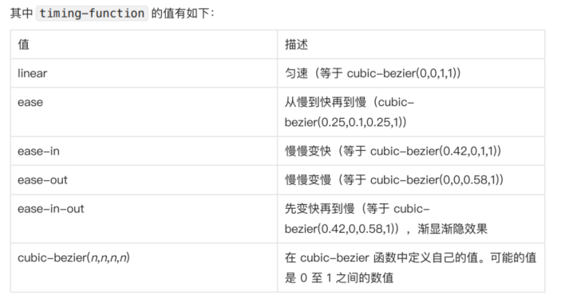
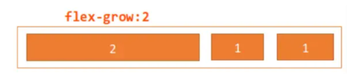

# css的display属性
CSS 的 display 属性用于控制元素的显示类型及布局方式，直接影响元素的盒模型行为和子元素的排列。以下是其核心知识点及常见用法：
## 常用属性值及作用

# css 的 position属性
position 属性决定了元素在文档中的定位方式，是 CSS 布局的核心概念之一。掌握不同的定位方式对于创建复杂的网页布局至关重要。


# BFC
BFC （Block Formatting Context），即块级格式化上下⽂，它是⻚⾯中的⼀块渲染区域，并且有⼀套属于⾃⼰的渲染规则：
* 内部的盒⼦会在垂直⽅向上⼀个接⼀个的放置
* 对于同⼀个BFC的俩个相邻的盒⼦的margin会发⽣重叠，与⽅向⽆关。
* 每个元素的左外边距与包含块的左边界相接触（从左到右），即使浮动元素也是如此
* BFC的区域不会与float的元素区域重叠
* 计算BFC的⾼度时，浮动⼦元素也参与计算
* BFC就是⻚⾯上的⼀个隔离的独⽴容器，容器⾥⾯的⼦元素不会影响到外⾯的元素，反之亦然
BFC ⽬的是形成⼀个相对于外界完全独⽴的空间，让内部的⼦元素不会影响到外部的元素

## 触发条件
触发 BFC 的条件包含不限于：
* 根元素，即HTML元素
* 浮动元素：float值为left、right
* overflow值不为 visible，为 auto、scroll、hidden
* display的值为inline-block、inltable-cell、table-caption、table、inline-table、flex、inline-flex、grid、inline-grid
* position的值为absolute或fixed

## 应⽤场景

### 防⽌margin重叠（塌陷）
```javascript
<style>
 p {
 color: #f55;
 background: #fcc;
 width: 200px;
 line-height: 100px;
 text-align:center;
 margin: 100px;
 }
</style>
<body>
 <p>Haha</p >
 <p>Hehe</p >
</body>
```

两个 p 元素之间的距离为 100px ，发⽣了 margin 重叠（塌陷），以最⼤的为准，如果第⼀个P的margin 为80的话，两个P之间的距离还是100，以最⼤的为准。前⾯讲到，同⼀个 BFC 的俩个相邻的盒⼦的 margin 会发⽣重叠

可以在 p 外⾯包裹⼀层容器，并触发这个容器⽣成⼀个 BFC ，那么两个 p 就不属于同⼀个 BFC ，则不会出现 margin 重叠

``` javascript
<style>
 .wrap {
 overflow: hidden;// 新的BFC
 }
 p {
 color: #f55;
 background: #fcc;
 width: 200px;
 line-height: 100px;
 text-align:center;
 margin: 100px;
 }
</style>
<body>
 <p>Haha</p >
 <div class="wrap">
 <p>Hehe</p >
 </div>
</body>
```


### 清除内部浮动
``` javascript
<style>
 .par {
 border: 5px solid #fcc;
 width: 300px;
 }
 .child {
 border: 5px solid #f66;
 width:100px;
 height: 100px;
 float: left;
 }
</style>
<body>
 <div class="par">
 <div class="child"></div>
 <div class="child"></div>
 </div>
</body>
```

⽽ BFC 在计算⾼度时，浮动元素也会参与，所以我们可以触发 .par 元素⽣成 BFC ，则内部浮动元
素计算⾼度时候也会计算

``` javascript
.par {
 overflow: hidden;
}
```


### ⾃适应多栏布局
``` javascript
<style>
 body {
 width: 300px;
 position: relative;
 }
 .aside {
 width: 100px;
 height: 150px;
 float: left;
 background: #f66;
 }
 .main {
 height: 200px;
 background: #fcc;
 }
</style>
<body>
 <div class="aside"></div>
 <div class="main"></div>
</body>
```


前⾯讲到，每个元素的左外边距与包含块的左边界相接触
因此，虽然 .aside 为浮动元素，但是 main 的左边依然会与包含块的左边相接触
⽽ BFC 的区域不会与浮动盒⼦重叠
所以我们可以通过触发 main ⽣成 BFC ，以此适应两栏布局

```javascript
.main {
 overflow: hidden;
}
```
这时候，新的 BFC 不会与浮动的 .aside 元素重叠。因此会根据包含块的宽度，和 .aside 的宽度，⾃动变窄


# 什么是响应式设计
## 是什么
响应式⽹站设计（Responsive Web design）是⼀种⽹络⻚⾯设计布局，⻚⾯的设计与开发应当根据⽤户⾏为以及设备环境(系统平台、屏幕尺⼨、屏幕定向等)进⾏相应的响应和调整


## 实现⽅式
响应式设计的基本原理是通过媒体查询检测不同的设备屏幕尺⼨做处理，为了处理移动端，⻚⾯头部必
须有 meta 声明 viewport
``` javascript
<meta name="viewport" content="width=device-width, initial-scale=1, maximum-scale=1, user-scalable=no”>
```
属性对应如下：
* width=device-width: 是⾃适应⼿机屏幕的尺⼨宽度
* maximum-scale:是缩放⽐例的最⼤值
* inital-scale:是缩放的初始化
* user-scalable:是⽤户的可以缩放的操作
实现响应式布局的⽅式有如下：
* 媒体查询
  * CSS3 中的增加了更多的媒体查询，就像 if 条件表达式⼀样，我们可以设置不同类型的媒体条件，并根据对应的条件，给相应符合条件的媒体调⽤相对应的样式表使⽤ @Media 查询，可以针对不同的媒体类型定义不同的样式，如：`@media screen and (max-width: 1920px) { ... }` 。当视⼝在375px - 600px之间，设置特定字体⼤⼩18px ```@media screen (min-width: 375px) and (max-width: 600px) {
 body {
 font-size: 18px;
 }
}```
* 百分⽐
  * ⽐如当浏览器的宽度或者⾼度发⽣变化时，通过百分⽐单位，可以使得浏览器中的组件的宽和⾼随着浏览器的变化⽽变化，从⽽实现响应式的效果.height 、 width 属性的百分⽐依托于⽗标签的宽⾼，但是其他盒⼦属性则不完全依赖⽗元素：
    * ⼦元素的top/left和bottom/right如果设置百分⽐，则相对于直接⾮static定位(默认定位)的⽗元素的⾼度/宽度
    * ⼦元素的padding如果设置百分⽐，不论是垂直⽅向或者是⽔平⽅向，都相对于直接⽗亲元素的width，⽽与⽗元素的height⽆关。
    * ⼦元素的margin如果设置成百分⽐，不论是垂直⽅向还是⽔平⽅向，都相对于直接⽗元素的width
    * border-radius不⼀样，如果设置border-radius为百分⽐，则是相对于⾃身的宽度<br>
     可以看到每个属性都使⽤百分⽐，会照成布局的复杂度，所以不建议使⽤百分⽐来实现响应式
* vw/vh
  * vw 表示相对于视图窗⼝的宽度， vh 表示相对于视图窗⼝⾼度。 任意层级元素，在使⽤ vw 单位的情况下， 1vw 都等于视图宽度的百分之⼀
* rem
  * 在以前也讲到， rem 是相对于根元素 html 的 font-size 属性，默认情况下浏览器字体⼤⼩为 16px ，此时 1rem = 16px
  * 可以利⽤前⾯提到的媒体查询，针对不同设备分辨率改变 font-size 的值，如下：
  * ```
    @media screen and (max-width: 414px) {
     html {
     font-size: 18px
     }
    }
    @media screen and (max-width: 375px) {
     html {
     font-size: 16px
     }
    }
    @media screen and (max-width: 320px) {
     html {
     font-size: 12px
     }
    }
    ```

### meta标签
Meta标签是HTML文档中的一种特殊标签，位于<head>部分，用于定义网页的元数据（metadata）。这些数据不会直接显示在页面上，但为浏览器、搜索引擎和其他网络服务提供关键信息，影响网页的解析、显示和SEO优化。
1. 定义网页字符编码 ``` <meta charset="UTF-8">```
2. 控制视口（Viewport）` <meta name="viewport" content="width=device-width, initial-scale=1.0">`
3. SEO优化 `<meta name="description" content="...">`
4. 控制网页行为 `<meta http-equiv="refresh" content="5;url=https://example.com">`
5. 社交媒体分享优化 `<meta property="og:title" content="我的网页标题">`

# 相对定位和绝对定位
在 CSS 中，**相对定位（Relative Positioning）和绝对定位（Absolute Positioning）**是两种常用的布局方式，它们的核心区别在于 定位基准不同 和 对文档流的影响不同。以下是详细对比与使用场景分析：


# 元素水平垂直居中
在开发中经常遇到这个问题，即让某个元素的内容在⽔平和垂直⽅向上都居中，内容不仅限于⽂字，可
能是图⽚或其他元素
居中是⼀个⾮常基础但⼜是⾮常重要的应⽤场景，实现居中的⽅法存在很多，可以将这些⽅法分成两个
⼤类：
* 居中元素（⼦元素）的宽⾼已知
* 居中元素宽⾼未知

|特性|相对定位（position: relative）|绝对定位（position: absolute）|
|-|-|-|
|定位基准|相对于元素自身在文档流中的原始位置偏移。|相对于最近的已定位祖先元素（position 非 static）。若无，则相对于初始包含块（通常是视口或 <body>）。|
|文档流影响|元素仍占据原始位置的空间，不影响其他元素布局。|元素脱离文档流，原空间被其他元素占据。|
|偏移属性|使用 top、right、bottom、left 进行偏移。|同上，但偏移量基于定位基准。|
|层叠控制|可通过 z-index 控制层叠顺序。|同上，且层叠优先级通常更高（脱离文档流的元素默认在上层）。|
|典型应用场景|微调元素位置、作为绝对定位子元素的定位基准。|创建浮动元素（如弹窗、下拉菜单）、覆盖其他内容。|

## 代码示例与解析
### 相对定位示例
```html
<div class="parent">
    <div class="box relative-box">相对定位元素</div>
    <div class="box">普通元素</div>
</div>
<style>
    .parent {
        border: 2px solid #333;
        padding: 20px;
    }

    .box {
        background: #f0f0f0;
        margin: 10px;
        padding: 10px;
    }

    .relative-box {
        position: relative;
        top: 20px;
        /* 向下偏移20px */
        left: 30px;
        /* 向右偏移30px */
        background: #ffcccc;
    }
</style>
```

* 相对定位元素偏移后，原位置仍保留（普通元素不会填补其原位置）。
* 视觉上元素移动到新位置，但布局空间未释放。
### 绝对定位
```
<div class="parent">
    <div class="box absolute-box">绝对定位元素</div>
    <div class="box">普通元素</div>
</div>

<style>
    .parent {
        position: relative;
        /* 父元素设为定位基准 */
        border: 2px solid #333;
        padding: 20px;
    }

    .absolute-box {
        position: absolute;
        top: 20px;
        right: 30px;
        background: #ccffcc;
    }
</style>
```

* 绝对定位元素相对于父元素 .parent 定位。
* 原位置被普通元素占据，脱离文档流。
## 使用场景与最佳实践
1. 相对定位适用场景
  * 微调元素位置：如调整图标与文字的对齐。
  * 作为定位基准：为子元素的绝对定位提供参考（父元素设置 position: relative）。
  * 不影响布局的偏移：需要保留元素原空间时（如悬停效果）。
2. 绝对定位适用场景
  * 浮动元素：如模态框、下拉菜单、提示框。
  * 覆盖其他内容：如角标、遮罩层。
  * 精准定位：结合父级相对定位，实现组件内元素的精确布局。
3. 组合使用技巧
  * 父相对，子绝对：确保子元素基于父容器定位，避免意外偏移。
  ``` html
  .parent {
    position: relative; /* 定位基准 */
  }
  .child {
    position: absolute;
    top: 0;
    left: 0;
  }

  ```
  * 响应式定位：结合百分比或 calc() 实现动态定位。
  ``` html
  .tooltip {
    position: absolute;
    left: calc(50% - 100px); /* 水平居中（假设宽度200px） */
  }

  ```
## 常见问题与解决方案
1. 绝对定位元素超出父容器
   1. 问题：子元素定位导致部分内容被父容器裁剪（overflow: hidden）。
   2. 解决：调整父容器尺寸或使用 overflow: visible（谨慎使用）。
2. 定位基准错误
   1. 问题：绝对定位元素未按预期父级定位。
   2. 解决：检查最近的已定位祖先元素，确保其 position 非 static。
3. 层叠顺序冲突
   1. 问题：多个定位元素重叠时显示顺序错误。
   2. 解决：使用 z-index 控制层叠优先级（值越大越靠前）。


## 实现⽅式
* 利⽤定位+margin:auto
``` html
<style>
 .father{
 width:500px;
 height:300px;
 border:1px solid #0a3b98;
 position: relative;
 }
 .son{
 width:100px;
 height:40px;
 background: #f0a238;
 position: absolute;
 top:0;
 left:0;
 right:0;
 bottom:0;
 margin:auto;
 }
</style>
<div class="father">
 <div class="son"></div>
</div>
```
⽗级设置为相对定位，⼦级绝对定位 ，并且四个定位属性的值都设置了0，那么这时候如果⼦级没有设置宽⾼，则会被拉开到和⽗级⼀样宽⾼
这⾥⼦元素设置了宽⾼，所以宽⾼会按照我们的设置来显示，但是实际上⼦级的虚拟占位已经撑满了整个⽗级，这时候再给它⼀个 margin：auto 它就可以上下左右都居中了
* 利⽤定位+margin:负值
  * 绝⼤多数情况下，设置⽗元素为相对定位， ⼦元素移动⾃身50%实现⽔平垂直居中
``` html
<style>
    .father {
        position: relative;
        width: 200px;
        height: 200px;
        background: skyblue;
    }

    .son {
        position: absolute;
        top: 50%;
        left: 50%;
        margin-left: -50px;
        margin-top: -50px;
        width: 100px;
        height: 100px;
        background: red;
    }
</style>
<div class="father">
    <div class="son"></div>
</div>
```

  * 初始位置为⽅块1的位置
  * 当设置left、top为50%的时候，内部⼦元素为⽅块2的位置
  * 设置margin为负数时，使内部⼦元素到⽅块3的位置，即中间位置
  * 这种⽅案不要求⽗元素的⾼度，也就是即使⽗元素的⾼度变化了，仍然可以保持在⽗元素的垂直居中位置，⽔平⽅向上是⼀样的操作.但是该⽅案需要知道⼦元素⾃身的宽⾼，但是我们可以通过下⾯ transform 属性进⾏移动
* 利⽤定位+transform
```html
<style>
    .father {
        position: relative;
        width: 200px;
        height: 200px;
        background: skyblue;
    }

    .son {
        position: absolute;
        top: 50%;
        left: 50%;
        transform: translate(-50%, -50%);
        width: 100px;
        height: 100px;
        background: red;
    }
</style>
<div class="father">
    <div class="son"></div>
</div>
```
  * translate(-50%, -50%) 将会将元素位移⾃⼰宽度和⾼度的-50%
  * 这种⽅法其实和最上⾯被否定掉的margin负值⽤法⼀样，可以说是 margin 负值的替代⽅案，并不需要知道⾃身元素的宽⾼
* table布局
``` html
<style>
    .father {
        display: table-cell;
        width: 200px;
        height: 200px;
        background: skyblue;
        vertical-align: middle;
        text-align: center;
    }

    .son {
        display: inline-block;
        width: 100px;
        height: 100px;
        background: red;
    }
</style>
<div class="father">
    <div class="son"></div>
</div>
```
* flex布局
``` html
<style>
    .father {
        display: flex;
        justify-content: center;
        align-items: center;
        width: 200px;
        height: 200px;
        background: skyblue;
    }

    .son {
        width: 100px;
        height: 100px;
        background: red;
    }
</style>
<div class="father">
    <div class="son"></div>
</div>
```
  * css3 中了 flex 布局，可以⾮常简单实现垂直⽔平居中
  * 这⾥可以简单看看 flex 布局的关键属性作⽤：
    * display: flex时，表示该容器内部的元素将按照flex进⾏布局
    * align-items: center表示这些元素将相对于本容器⽔平居中
    * justify-content: center也是同样的道理垂直居中
* grid布局
``` html
<style>
    .father {
        display: grid;
        align-items: center;
        justify-content: center;
        width: 200px;
        height: 200px;
        background: skyblue;
    }

    .son {
        width: 10px;
        height: 10px;
        border: 1px solid red
    }
</style>
<div class="father">
    <div class="son"></div>
</div>
```
## 内联元素居中布局
⽔平居中
* ⾏内元素可设置：text-align: center
* flex布局设置⽗元素：display: flex; justify-content: center
垂直居中
* 单⾏⽂本⽗元素确认⾼度：height === line-height
* 多⾏⽂本⽗元素确认⾼度：display: table-cell; vertical-align: middle
## 块级元素居中布局

⽔平居中
* 定宽: margin: 0 auto
* 绝对定位+left:50%+margin:负⾃身⼀半
垂直居中
* position: absolute设置left、top、margin-left、margin-top(定⾼)
* display: table-cell
* transform: translate(x, y)
* flex(不定⾼，不定宽)
* grid(不定⾼，不定宽)，兼容性相对⽐较差


# 两栏布局
两栏布局⾮常常⻅，往往是以⼀个定宽栏和⼀个⾃适应的栏并排展示存在
实现思路也⾮常的简单：
* 使⽤ float 左浮左边栏
* 右边模块使⽤ margin-left 撑出内容块做内容展示
* 为⽗级元素添加BFC，防⽌下⽅元素⻜到上⽅内容
``` html
<style>
    .box {
        overflow: hidden;

    }

    .left {
        float: left;
        width: 200px;
        background-color: gray;
        height: 400px;
    }

    .right {
        margin-left: 210px;
        background-color: lightgray;
        height: 200px;
    }
</style>
<div class="box">
    <div class="left">左边</div>
    <div class="right">右边</div>
</div>
```


## flex
``` html
<style>
    .box {
        display: flex;
        width: 100%;
    }

    .left {
        width: 100px;
        height: 400px;
        background-color: gray;
    }

    .right {
        flex: 1;
        background-color: lightgray;
        height: 200px;
    }
</style>
<div class="box">
    <div class="left">左边</div>
    <div class="right">右边</div>
</div>
```
flex 可以说是最好的⽅案了，代码少，使⽤简单
注意的是， flex 容器的⼀个默认属性值: align-items: stretch;
这个属性导致了列等⾼的效果。 为了让两个盒⼦⾼度⾃动，需要设置: align-items: flex-start

### align-items
align-items 是 CSS 中用于 控制 Flex 或 Grid 容器内子元素在交叉轴（Cross Axis）上对齐方式 的属性。它的作用取决于容器类型（Flex 或 Grid），以下是详细解析


# 三栏布局
实现三栏布局中间⾃适应的布局⽅式有：
* 两边使⽤ float，中间使⽤ margin
``` html
<style>
    .wrap {
        background: #eee;
        overflow: hidden;
        < !-- ⽣成BFC，计算⾼度时考虑浮动的元素 -->padding: 20px;
        height: 200px;
    }

    .left {
        width: 200px;
        height: 200px;
        float: left;
        background: coral;
    }

    .right {
        width: 120px;
        height: 200px;
        float: right;
        background: lightblue;
    }

    .middle {
        margin-left: 220px;
        height: 200px;
        background: lightpink;
        margin-right: 140px;
    }
</style>
<div class="wrap">
    <div class="left">左侧</div>
    <div class="right">右侧</div>
    <div class="middle">中间</div>
</div>
```
    * 两边固定宽度，中间宽度⾃适应。
    * 利⽤中间元素的margin值控制两边的间距
    * 宽度⼩于左右部分宽度之和时，右侧部分会被挤下去
    * 主体内容是最后加载的。
    * 右边在主体内容之前，如果是响应式设计，不能简单的换⾏展示
* 两边使⽤ absolute，中间使⽤ margin
  * 基于绝对定位的三栏布局：注意绝对定位的元素脱离⽂档流，相对于最近的已经定位的祖先元素进⾏定位。⽆需考虑HTML中结构的顺序
``` html
<style>
    .container {
        position: relative;
    }

    .left,
    .right,
    .main {
        height: 200px;
        line-height: 200px;
        text-align: center;
    }

    .left {
        position: absolute;
        top: 0;
        left: 0;
        width: 100px;
        background: green;
    }

    .right {
        position: absolute;
        top: 0;
        right: 0;
        width: 100px;
        background: green;
    }

    .main {
        margin: 0 110px;
        background: black;
        color: white;
    }
</style>
<div class="container">
    <div class="left">左边固定宽度</div>
    <div class="right">右边固定宽度</div>
    <div class="main">中间⾃适应</div>
</div>
```
    * 左右两边使⽤绝对定位，固定在两侧。
    * 中间占满⼀⾏，但通过 margin和左右两边留出10px的间隔
* 两边使⽤ float 和负 margin
```html
<style>
    .left,
    .right,
    .main {
        height: 200px;
        line-height: 200px;
        text-align: center;
    }

    .main-wrapper {
        float: left;
        width: 100%;
    }

    .main {
        margin: 0 110px;
        background: black;
        color: white;
    }

    .left,
    .right {
        float: left;
        width: 100px;
        margin-left: -100%;
        background: green;
    }

    .right {
        margin-left: -100px;
        /* 同⾃身宽度 */
    }
</style>
<div class="main-wrapper">
    <div class="main">中间⾃适应</div>
</div>
<div class="left">左边固定宽度</div>
<div class="right">右边固定宽度</div>
```
    * 中间使⽤了双层标签，外层是浮动的，以便左中右能在同⼀⾏展示
    * 左边通过使⽤负 margin-left:-100%，相当于中间的宽度，所以向上偏移到左侧
    * 右边通过使⽤负 margin-left:-100px，相当于⾃身宽度，所以向上偏移到最右侧
    * 增加了 .main-wrapper ⼀层，结构变复杂
    * 使⽤负 margin，调试也相对麻烦
* display: table 实现
  
\<table\> 标签⽤于展示⾏列数据，不适合⽤于布局。但是可以使⽤ display: table 来实现布局
的效果

```html
<style>
    .container {
        height: 200px;
        line-height: 200px;
        text-align: center;
        display: table;
        table-layout: fixed;
        width: 100%;
    }

    .left,
    .right,
    .main {
        display: table-cell;
    }

    .left,
    .right {
        width: 100px;
        background: green;
    }

    .main {
        background: black;
        color: white;
        width: 100%;
    }
</style>
<div class="container">
    <div class="left">左边固定宽度</div>
    <div class="main">中间⾃适应</div>
    <div class="right">右边固定宽度</div>
</div>
```

    * 层通过 display: table设置为表格，设置 table-layout: fixed`表示列宽⾃身宽度决定，⽽不是⾃动计算。
    * 内层的左中右通过 display: table-cell设置为表格单元。
    * 左右设置固定宽度，中间设置 width: 100% 填充剩下的宽度

* flex实现
  * 利⽤ flex 弹性布局，可以简单实现中间⾃适应
``` html
<style type="text/css">
    .wrap {
        display: flex;
        justify-content: space-between;
    }

    .left,
    .right,
    .middle {
        height: 100px;
    }

    .left {
        width: 200px;
        background: coral;
    }

    .right {
        width: 120px;
        background: lightblue;
    }

    .middle {
        background: #555;
        width: 100%;
        margin: 0 20px;
    }
</style>
<div class="wrap">
    <div class="left">左侧</div>
    <div class="middle">中间</div>
    <div class="right">右侧</div>
</div>

```
    * 仅需将容器设置为 display:flex; ，
    * 盒内元素两端对其，将中间元素设置为 100% 宽度，或者设为 flex:1 ，即可填充空⽩
    * 盒内元素的⾼度撑开容器的⾼度
    * 结构简单直观
    * 可以结合 flex的其他功能实现更多效果，例如使⽤ order属性调整显示顺序，让主体内容优先加载，但展示在中间
* grid⽹格布局
``` html
<style>
    .wrap {
        display: grid;
        width: 100%;
        grid-template-columns: 300px auto 300px;
    }

    .left,
    .right,
    .middle {
        height: 100px;
    }

    .left {
        background: coral;
    }

    .right {
        background: lightblue;
    }

    .middle {
        background: #555;
    }
</style>
<div class="wrap">
    <div class="left">左侧</div>
    <div class="middle">中间</div>
    <div class="right">右侧</div>
</div>
```


# css选择器有哪些？优先级？哪些属性可以继承？

关于 css 属性选择器常⽤的有：
* id选择器（#box），选择id为box的元素
* 类选择器（.one），选择类名为one的所有元素
* 标签选择器（div），选择标签为div的所有元素
* 后代选择器（#box div），选择id为box元素内部所有的div元素
* ⼦选择器（.one>one_1），选择⽗元素为.one的所有.one_1的元素
* 相邻同胞选择器（.one+.two），选择紧接在.one之后的所有.two元素
* 群组选择器（div,p），选择div、p的所有元素
* 伪类选择器
```css
:link ：选择未被访问的链接
:visited：选取已被访问的链接
:active：选择活动链接
:hover ：⿏标指针浮动在上⾯的元素
:focus ：选择具有焦点的
:first-child：⽗元素的⾸个⼦元素
:first-of-type 表示⼀组同级元素中其类型的第⼀个元素
:last-of-type 表示⼀组同级元素中其类型的最后⼀个元素
:only-of-type 表示没有同类型兄弟元素的元素
:only-child 表示没有任何兄弟的元素
:nth-child(n) 根据元素在⼀组同级中的位置匹配元素
:nth-last-of-type(n) 匹配给定类型的元素，基于它们在⼀组兄弟元素中的位置，从末尾开始计
数
:last-child 表示⼀组兄弟元素中的最后⼀个元素
:root 设置HTML⽂档
:empty 指定空的元素
:enabled 选择可⽤元素
:disabled 选择被禁⽤元素
:checked 选择选中的元素
:not(selector) 选择与 <selector> 不匹配的所有元素
```
* 伪元素选择器
``` css
:first-letter ：⽤于选取指定选择器的⾸字⺟
:first-line ：选取指定选择器的⾸⾏
:before : 选择器在被选元素的内容前⾯插⼊内容
:after : 选择器在被选元素的内容后⾯插⼊内容
```
* 属性选择器
``` css
[attribute] 选择带有attribute属性的元素
[attribute=value] 选择所有使⽤attribute=value的元素
[attribute~=value] 选择attribute属性包含value的元素
[attribute|=value]：选择attribute属性以value开头的元素
[attribute*=value]：选择attribute属性值包含value的所有元素
[attribute^=value]：选择attribute属性开头为value的所有元素
[attribute$=value]：选择attribute属性结尾为value的所有元素
```
* 层次选择器（p~ul），选择前⾯有p元素的每个ul元素

## css选择器优先级
内联 > ID选择器 > 类选择器 > 标签选择器
到具体的计算层⾯，优先级是由 A 、B、C、D 的值来决定的，其中它们的值计算规则如下：
* 如果存在内联样式，那么 A = 1, 否则 A = 0 
* B的值等于 ID选择器出现的次数
* C的值等于 类选择器 和 属性选择器 和 伪类 出现的总次数
* D 的值等于 标签选择器 和 伪元素 出现的总次数

```css
#nav-global > ul > li > a.nav-link
```
套⽤上⾯的算法，依次求出 A B C D 的值：
* 因为没有内联样式 ，所以 A = 0 
* ID选择器总共出现了1次， B = 1 
* 类选择器出现了1次， 属性选择器出现了0次，伪类选择器出现0次，所以 C = (1 + 0 + 0) = 1
* 标签选择器出现了3次， 伪元素出现了0次，所以 D = (3 + 0) = 3

上⾯算出的 A 、 B 、 C 、 D 可以简记作： (0, 1, 1, 3)
知道了优先级是如何计算之后，就来看看⽐较规则：
* 从左往右依次进⾏⽐较 ，较⼤者优先级更⾼
* 如果相等，则继续往右移动⼀位进⾏⽐较
* 如果4位全部相等，则后⾯的会覆盖前⾯的

## 继承属性
在 css 中，继承是指的是给⽗元素设置⼀些属性，后代元素会⾃动拥有这些属性
关于继承属性，可以分成：

* 字体系列属性
``` css
font:组合字体
font-family:规定元素的字体系列
font-weight:设置字体的粗细
font-size:设置字体的尺⼨
font-style:定义字体的⻛格
font-variant:偏⼤或偏⼩的字体
```
* ⽂本系列属性
``` css
text-indent：⽂本缩进
text-align：⽂本⽔平对刘
line-height：⾏⾼
word-spacing：增加或减少单词间的空⽩
letter-spacing：增加或减少字符间的空⽩
text-transform：控制⽂本⼤⼩写
direction：规定⽂本的书写⽅向
color：⽂本颜⾊
```
* 元素可⻅性
``` css
visibility
```
* 表格布局属性
``` css
caption-side：定位表格标题位置
border-collapse：合并表格边框
border-spacing：设置相邻单元格的边框间的距离
empty-cells：单元格的边框的出现与消失
table-layout：表格的宽度由什么决定
```
* 列表属性
``` css
list-style-type：⽂字前⾯的⼩点点样式
list-style-position：⼩点点位置
list-style：以上的属性可通过这属性集合
```
* 引⽤
``` css
quotes：设置嵌套引⽤的引号类型
```
* 光标属性
``` css
cursor：箭头可以变成需要的形状
```

# css中，有哪些⽅式可以隐藏⻚⾯元素？区别?

通过 css 实现隐藏元素⽅法有如下：
* display:none
* visibility:hidden
* opacity:0
* 设置height、width模型属性为0
* position:absolute
* clip-path


# 如何实现单⾏／多⾏⽂本溢出的省略样式？

## 单⾏⽂本溢出省略
理解也很简单，即⽂本在⼀⾏内显示，超出部分以省略号的形式展现
实现⽅式也很简单，涉及的 css 属性有：
* text-overflow：规定当⽂本溢出时，显示省略符号来代表被修剪的⽂本
* white-space：设置⽂字在⼀⾏显示，不能换⾏
* overflow：⽂字⻓度超出限定宽度，则隐藏超出的内容

overflow 设为 hidden ，普通情况⽤在块级元素的外层隐藏内部溢出元素，或者配合下⾯两个属性
实现⽂本溢出省略

white-space:nowrap ，作⽤是设置⽂本不换⾏，是 overflow:hidden 和 text-overflow：
ellipsis ⽣效的基础

text-overflow 属性值有如下：
* clip：当对象内⽂本溢出部分裁切掉
* ellipsis：当对象内⽂本溢出时显示省略标记（...）

text-overflow 只有在设置了 overflow:hidden 和 white-space:nowrap 才能够⽣效的

## 多⾏⽂本溢出省略
多⾏⽂本溢出的时候，我们可以分为两种情况：
* 基于⾼度截断
  * 伪元素 + 定位
``` html
<style>
    .demo {
        position: relative;
        line-height: 20px;
        height: 40px;
        overflow: hidden;
    }

    .demo::after {
        content: "...";
        position: absolute;
        bottom: 0;
        right: 0;
        padding: 0 20px 0 10px;
    }
</style>

<body>
    <div class='demo'>这是⼀段很⻓的⽂本aaaaaaaaaaaaaaaaaaaaaaaaaaaaaaaaaaaaaaaaaaaaaaaaaaaaaaaaaaaaaaaaaaaaaaaaaaaaaaaaaaaaaaaaaaaaaaaaaaaaaaaaaaaaaaaaaaaaaaaaaaaaaaaaaaaaaaaaaaaaaaaaaaaaaaaaaaaaaaaaaaaaaaaaaaaaaaaaaaaaaaaaaaaaaaaaaaaaaaaaaaaaaaaaaaaaaaaaaaaaaaaaaaaaaaaaaaaaaaaaaaaaaaaaaaaaaaaaaaaaaaaaaaaaaaaaaaaaaaaaaaaaaaaaaaaaaaaaaaaaaaaaaaaaaaaaaaaaaaaaaaaaaaaaaaaaaaaaaa</div>
</body>
```
* 基于⾏数截断
  * webkit-line-clamp: 2：⽤来限制在⼀个块元素显示的⽂本的⾏数，为了实现该效果，它需要组合其他的WebKit属性）
  * display: -webkit-box：和1结合使⽤，将对象作为弹性伸缩盒⼦模型显示
  * -webkit-box-orient: vertical：和1结合使⽤ ，设置或检索伸缩盒对象的⼦元素的排列⽅式
  * overflow: hidden：⽂本溢出限定的宽度就隐藏内容
  * text-overflow: ellipsis：多⾏⽂本的情况下，⽤省略号“…”隐藏溢出范围的⽂本

``` html
<style>
    p {
        width: 400px;
        border-radius: 1px solid red;
        -webkit-line-clamp: 2;
        display: -webkit-box;
        -webkit-box-orient: vertical;
        overflow: hidden;
        text-overflow: ellipsis;
    }
</style>
<p>
    这是⼀些⽂本这是⼀些⽂本这是⼀些⽂本这是⼀些⽂本这是⼀些⽂本
    这是⼀些⽂本这是⼀些⽂本这是⼀些⽂本这是⼀些⽂本这是⼀些⽂本
</p>
```

可以看到，上述使⽤了 webkit 的 CSS 属性扩展，所以兼容浏览器范围是 PC 端的 webkit 内核的浏览器，由于移动端⼤多数是使⽤ webkit ，所以移动端常⽤该形式

需要注意的是，如果⽂本为⼀段很⻓的英⽂或者数字，则需要添加 word-wrap: break-word 属性还能通过使⽤ javascript 实现配合 css ，实现代码如下所示：

# 如何使⽤css完成视差滚动效果?
视差滚动（Parallax Scrolling）是指多层背景以不同的速度移动，形成⽴体的运动效果，带来⾮常出⾊的视觉体验
我们可以把⽹⻚解刨成：背景层、内容层、悬浮层
当滚动⿏标滑轮的时候，各个图层以不同的速度移动，形成视觉差的效果

## 实现⽅式
使⽤ css 形式实现视觉差滚动效果的⽅式有：
* background-attachment
* transform:translate3D

### background-attachment
作⽤是设置背景图像是否固定或者随着⻚⾯的其余部分滚动
值分别有如下：
* scroll：默认值，背景图像会随着⻚⾯其余部分的滚动⽽移动
* fixed：当⻚⾯的其余部分滚动时，背景图像不会移动
* inherit：继承⽗元素background-attachment属性的值
完成滚动视觉差就需要将 background-attachment 属性设置为 fixed ，让背景相对于视⼝固定。及时⼀个元素有滚动机制，背景也不会随着元素的内容⽽滚动

```html
<style>
    div {
        height: 100vh;
        background: rgba(0, 0, 0, .7);
        color: #fff;
        line-height: 100vh;
        text-align: center;
        font-size: 20vh;
    }

    .a-img1 {
        background-image: url(https://images.pexels.com/photos/1097491/pexels-photo-1097491.jpeg);
        background-attachment: fixed;
        background-size: cover;
        background-position: center center;
    }

    .a-img2 {
        background-image: url(https://images.pexels.com/photos/2437299/pexels-photo-2437299.jpeg);
        background-attachment: fixed;
        background-size: cover;
        background-position: center center;
    }

    .a-img3 {
        background-image: url(https://images.pexels.com/photos/1005417/pexels-photo-1005417.jpeg);
        background-attachment: fixed;
        background-size: cover;
        background-position: center center;
    }
</style>
<div class="a-text">1</div>
<div class="a-img1">2</div>
<div class="a-text">3</div>
<div class="a-img2">4</div>
<div class="a-text">5</div>
<div class="a-img3">6</div>
<div class="a-text">7</div>
```

### transform:translate3D
* transform: css3 属性，可以对元素进⾏变换(2d/3d)，包括平移 translate,旋转 rotate,缩放 scale,等等
* perspective: css3 属性，当元素涉及 3d 变换时，perspective 可以定义我们眼睛看到的 3d ⽴体效果，即空间感
  
``` html
<style>
    html {
        overflow: hidden;
        height: 100%
    }

    body {
        /* 视差元素的⽗级需要3D视⻆ */
        perspective: 1px;
        transform-style: preserve-3d;
        height: 100%;
        overflow-y: scroll;
        overflow-x: hidden;
    }

    #app {
        width: 100vw;
        height: 200vh;
        background: skyblue;
        padding-top: 100px;
    }

    .one {
        width: 500px;
        height: 200px;
        background: #409eff;
        transform: translateZ(0px);
        margin-bottom: 50px;
    }

    .two {
        width: 500px;
        height: 200px;
        background: #67c23a;
        transform: translateZ(-1px);
        margin-bottom: 150px;
    }

    .three {
        width: 500px;
        height: 200px;
        background: #e6a23c;
        transform: translateZ(-2px);
        margin-bottom: 150px;
    }
</style>
<div id="app">
    <div class="one">one</div>
    <div class="two">two</div>
    <div class="three">three</div>
</div>
```
* 容器设置上 transform-style: preserve-3d 和 perspective: xpx，那么处于这个容器的⼦元素就将位于3D空间中，
* ⼦元素设置不同的 transform: translateZ()，这个时候，不同元素在 3D Z轴⽅向距离屏幕（我们的眼睛）的距离也就不⼀样
* 滚动滚动条，由于⼦元素设置了不同的 transform: translateZ()，那么他们滚动的上下距离
translateY 相对屏幕（我们的眼睛），也是不⼀样的，这就达到了滚动视差的效果

# CSS3新增了哪些新特性？


## 是什么
css ，即层叠样式表（Cascading Style Sheets）的简称，是⼀种标记语⾔，由浏览器解释执⾏⽤来使⻚⾯变得更美观
css3 是 css 的最新标准，是向后兼容的， CSS1/2 的特性在 CSS3 ⾥都是可以使⽤的⽽ CSS3 也增加了很多新特性，为开发带来了更佳的开发体验


## 新样式
* border-radius：创建圆⻆边框
* box-shadow：为元素添加阴影
* border-image：使⽤图⽚来绘制边框

## 背景
新增了⼏个关于背景的属性
* background-clip ⽤于确定背景画区，有以下⼏种可能的属性
  * background-clip: border-box; 背景从border开始显示
  * background-clip: padding-box; 背景从padding开始显示
  * background-clip: content-box; 背景显content区域开始显示
  * background-clip: no-clip; 默认属性，等同于border-box
* background-origin 当我们设置背景图⽚时，图⽚是会以左上⻆对⻬，但是是以 border 的左上⻆对⻬还是以 padding 的左上⻆或者 content 的左上⻆对⻬? border-origin 正是⽤来设置这个的
  * background-origin: border-box; 从border开始计算background-position
  * background-origin: padding-box; 从padding开始计算background-position
  * background-origin: content-box; 从content开始计算background-position
* background-size
  * background-size: contain; 缩⼩图⽚以适合元素（维持像素⻓宽⽐）
  * background-size: cover; 扩展元素以填补元素（维持像素⻓宽⽐）
  * background-size: 100px 100px; 缩⼩图⽚⾄指定的⼤⼩
  * background-size: 50% 100%; 缩⼩图⽚⾄指定的⼤⼩，百分⽐是相对包 含元素的尺⼨
* background-break
  * background-break: continuous; 默认值。忽略盒之间的距离（也就是像元素没有分成多个盒⼦，依然是⼀个整体⼀样）
  * background-break: bounding-box; 把盒之间的距离计算在内；
  * background-break: each-box; 为每个盒⼦单独重绘背景

## 文字
* word-wrap
  * word-wrap: normal|break-word
  * normal：使⽤浏览器默认的换⾏
  * break-all：允许在单词内换⾏
* text-overflow 设置或检索当当前⾏超过指定容器的边界时如何显示，属性有两个值选择：
  * clip：修剪⽂本
  * ellipsis：显示省略符号来代表被修剪的⽂本
* text-shadow 可向⽂本应⽤阴影。能够规定⽔平阴影、垂直阴影、模糊距离，以及阴影的颜⾊
* CSS3⾥⾯开始⽀持对⽂字的更深层次的渲染，具体有三个属性可供设置：
  * text-fill-color: 设置⽂字内部填充颜⾊
  * text-stroke-color: 设置⽂字边界填充颜⾊
  * text-stroke-width: 设置⽂字边界宽度
* 颜色
css3 新增了新的颜⾊表示⽅式 rgba 与 hsla
  * rgba分为两部分，rgb为颜⾊值，a为透明度
  * hala分为四部分，h为⾊相，s为饱和度，l为亮度，a为透明度
## transition 过渡
transition 属性可以被指定为⼀个或多个 CSS 属性的过渡效果，多个属性之间⽤逗号进⾏分隔，
必须规定两项内容：
* 过度效果
* 持续时间
``` css
transition： CSS属性，花费时间，效果曲线(默认ease)，延迟时间(默认0)
```
上⾯为简写模式，也可以分开写各个属性
```css
transition-property: width;
transition-duration: 1s;
transition-timing-function: linear;
transition-delay: 2s;
```
### transform 
transform 属性允许你旋转，缩放，倾斜或平移给定元素
transform-origin ：转换元素的位置（围绕那个点进⾏转换），默认值为 (x,y,z):(50%,50%,
0)
使⽤⽅式：
* transform: translate(120px, 50%)：位移
* transform: scale(2, 0.5)：缩放
* transform: rotate(0.5turn)：旋转
* transform: skew(30deg, 20deg)：倾斜

### animation 动画

动画这个平常⽤的也很多，主要是做⼀个预设的动画。和⼀些⻚⾯交互的动画效果，结果和过渡应该⼀样，让⻚⾯不会那么⽣硬

* animation也有很多的属性
* animation-name：动画名称
* animation-duration：动画持续时间
* animation-timing-function：动画时间函数
* animation-delay：动画延迟时间
* animation-iteration-count：动画执⾏次数，可以设置为⼀个整数，也可以设置为infinite，意思是⽆限循环
* animation-direction：动画执⾏⽅向
* animation-paly-state：动画播放状态
* animation-fill-mode：动画填充模式

## 渐变
颜⾊渐变是指在两个颜⾊之间平稳的过渡， css3 渐变包括
* linear-gradient：线性渐变
* radial-gradient：径向渐变

## 其他
关于 css3 其他的新特性还包括 flex 弹性布局、 Grid 栅格布局

# . css3动画有哪些？
CSS动画（CSS Animations）是为层叠样式表建议的允许可扩展标记语⾔（XML）元素使⽤CSS的动画的模块

即指元素从⼀种样式逐渐过渡为另⼀种样式的过程

常⻅的动画效果有很多，如平移、旋转、缩放等等，复杂动画则是多个简单动画的组合

css 实现动画的⽅式，有如下⼏种：

* transition 实现渐变动画
```css
transition-property: width;
transition-duration: 1s;
transition-timing-function: linear;
transition-delay: 2s;
```
``` html
<style>
    .base {
        width: 100px;
        height: 100px;
        display: inline-block;
        background-color: #0EA9FF;
        border-width: 5px;
        border-style: solid;
        border-color: #5daf34;
        transition-property: width, height, background-color, border-w idth;
        transition-duration: 2s;
        transition-timing-function: ease-in;
        transition-delay: 500ms;
    }

    /*简写*/
    /*transition: all 2s ease-in 500ms;*/
    .base:hover {
        width: 200px;
        height: 200px;
        background-color: #5daf34;
        border-width: 10px;
        border-color: #3a8ee6;
    }
</style>
<div class="base"></div>
```

* transform 转变动画
``` html
<style>
    .base {
        width: 100px;
        height: 100px;
        display: inline-block;
        background-color: #0EA9FF;
        border-width: 5px;
        border-style: solid;
        border-color: #5daf34;
        transition-property: width, height, background-color, border-width;
        transition-duration: 2s;
        transition-timing-function: ease-in;
        transition-delay: 500ms;
    }

    .base2 {
        transform: none;
        transition-property: transform;
        transition-delay: 5ms;
    }

    .base2:hover {
        transform: scale(0.8, 1.5) rotate(35deg) skew(5deg) translate(15px, 25px);
    }
</style>
<div class="base base2"></div>
```
* animation 实现⾃定义动画


# grid⽹格布局
CSS Grid 布局是一种强大的二维布局系统，能够以行和列的方式精确控制网页元素的排列。它比传统布局方法（如浮动或定位）更灵活，适用于构建复杂的响应式设计。以下是 Grid 布局的核心概念和用法详解：
## 容器与项目
* Grid 容器：通过 display: grid 或 display: inline-grid 定义。
* Grid 项目：容器的直接子元素，自动成为网格项（Grid Item）。
##  行与列
* 轨道（Track）：行（水平轨道）和列（垂直轨道）的集合。
* 单元格（Cell）：行和列的交叉区域。
* 网格线（Grid Line）：划分行或列的线，编号从 1 开始（支持负值反向计数）。
1. 容器属性

2. 项目属性


### grid-template-columns 属性，grid-template-rows 属性
grid-template-columns 属性设置列数量和宽度， grid-template-rows 属性设置⾏⾼度和数量

``` css
.wrapper {
 display: grid;
 /* 声明了三列，宽度分别为 200px 200px 200px */
 grid-template-columns: 200px 200px 200px;
 grid-gap: 5px;
 /* 声明了两⾏，⾏⾼分别为 50px 50px */
 grid-template-rows: 50px 50px;
}
.wrapper {
 display: grid;
 grid-template-columns: repeat(3,200px);
 grid-gap: 5px;
 grid-template-rows:repeat(2,50px);
}
```

除了 repeact 还有
* auto-fill：示⾃动填充，让⼀⾏（或者⼀列）中尽可能的容纳更多的单元格 grid-template-columns: repeat(auto-fill, 200px) 表示列宽是 200 px，但列的数量
是不固定的，只要浏览器能够容纳得下，就可以放置元素
* grid-template-columns: 200px 1fr 2fr 表示第⼀个列宽设置为 200px，后⾯剩余的宽度
分为两部分，宽度分别为剩余宽度的 1/3 和 2/3
* minmax：产⽣⼀个⻓度范围，表示⻓度就在这个范围之中都可以应⽤到⽹格项⽬中。第⼀个参数就是最⼩值，第⼆个参数就是最⼤值.minmax(100px, 1fr) 表示列宽不⼩于 100px ，不⼤于 1fr
* auto：由浏览器⾃⼰决定⻓度.grid-template-columns: 100px auto 100px 表示第⼀第三列为 100px，中间由浏览器决定⻓度

### grid-row-gap 属性， grid-column-gap 属性， grid-gap 属性
grid-row-gap 属性、 grid-column-gap 属性分别设置⾏间距和列间距。 grid-gap 属性是
两者的简写形式

* grid-row-gap: 10px 表示⾏间距是 10px
* grid-column-gap: 20px 表示列间距是 20px
* grid-gap: 10px 20px 等同上述两个属性

### grid-template-areas 属性
⽤于定义区域，⼀个区域由⼀个或者多个单元格组成
``` css
.container {
 display: grid;
 grid-template-columns: 100px 100px 100px;
 grid-template-rows: 100px 100px 100px;
 grid-template-areas: 'a b c'
 'd e f'
 'g h i';
}
```
上⾯代码先划分出9个单元格，然后将其定名为 a 到 i 的九个区域，分别对应这九个单元格。
多个单元格合并成⼀个区域的写法如下
``` css
grid-template-areas: 'a a a'
 'b b b'
 'c c c';
```
上⾯代码将9个单元格分成 a 、 b 、 c 三个区域
如果某些区域不需要利⽤，则使⽤"点"（ . ）表示

### grid-auto-flow 属性
划分⽹格以后，容器的⼦元素会按照顺序，⾃动放置在每⼀个⽹格。顺序就是由 grid-auto-flow 决定，默认为⾏，代表"先⾏后列"，即先填满第⼀⾏，再开始放⼊第⼆⾏


当修改成 column 后，放置变为如下：


### justify-items 属性， align-items 属性， place-items 属性
justify-items 属性设置单元格内容的⽔平位置（左中右）， align-items 属性设置单元格的
垂直位置（上中下）
``` css
.container {
 justify-items: start | end | center | stretch;
 align-items: start | end | center | stretch;
}
```
* start：对⻬单元格的起始边缘
* end：对⻬单元格的结束边缘
* center：单元格内部居中
* stretch：拉伸，占满单元格的整个宽度（默认值）

place-items 属性是 align-items 属性和 justify-items 属性的合并简写形式

### justify-content 属性， align-content 属性， place-content 属性
justify-content 属性是整个内容区域在容器⾥⾯的⽔平位置（左中右）， align-content 属
性是整个内容区域的垂直位置（上中下）

``` css
.container {
 justify-content: start | end | center | stretch | space-around | space-be
tween | space-evenly;
 align-content: start | end | center | stretch | space-around | space-betw
een | space-evenly; 
}
```


* space-around - 每个项⽬两侧的间隔相等。所以，项⽬之间的间隔⽐项⽬与容器边框的间隔⼤⼀倍
* space-between - 项⽬与项⽬的间隔相等，项⽬与容器边框之间没有间隔
* space-evenly - 项⽬与项⽬的间隔相等，项⽬与容器边框之间也是同样⻓度的间隔
* stretch - 项⽬⼤⼩没有指定时，拉伸占据整个⽹格容器


### grid-auto-columns 属性和 grid-auto-rows 属性
有时候，⼀些项⽬的指定位置，在现有⽹格的外部，就会产⽣显示⽹格和隐式⽹格
⽐如⽹格只有3列，但是某⼀个项⽬指定在第5⾏。这时，浏览器会⾃动⽣成多余的⽹格，以便放置项⽬。超出的部分就是隐式⽹格
⽽ grid-auto-rows 与 grid-auto-columns 就是专⻔⽤于指定隐式⽹格的宽⾼关于项⽬属性，有如下

### grid-column-start 属性、grid-column-end 属性、grid-row-start属性以及grid-row-end 属性

指定⽹格项⽬所在的四个边框，分别定位在哪根⽹格线，从⽽指定项⽬的位置
* grid-column-start 属性：左边框所在的垂直⽹格线
* grid-column-end 属性：右边框所在的垂直⽹格线
* grid-row-start 属性：上边框所在的⽔平⽹格线
* grid-row-end 属性：下边框所在的⽔平⽹格线

``` html
<style>
    #container {
        display: grid;
        grid-template-columns: 100px 100px 100px;
        grid-template-rows: 100px 100px 100px;
    }

    .item-1 {
        grid-column-start: 2;
        grid-column-end: 4;
    }
    .item{
        background-color: red;
    }
</style>
<div id="container">
    <div class="item item-1">1</div>
    <div class="item item-2">2</div>
    <div class="item item-3">3</div>
</div>
```


### . grid-area 属性
grid-area 属性指定项⽬放在哪⼀个区域
``` css
.item-1 {
 grid-area: e;
}
```

### justify-self 属性、align-self 属性以及 place-self 属性
justify-self 属性设置单元格内容的⽔平位置（左中右），跟 justify-items 属性的⽤法完全
⼀致，但只作⽤于单个项⽬。

align-self 属性设置单元格内容的垂直位置（上中下），跟 align-items 属性的⽤法完全⼀致，
也是只作⽤于单个项⽬
``` css
.item {
 justify-self: start | end | center | stretch;
 align-self: start | end | center | stretch;
}
```

## 实例
``` html
<div class="grid-container">
    <div class="item">1</div>
    <div class="item">2</div>
    <div class="item">3</div>
    <div class="item">4</div>
</div>
<style>
    .grid-container {
        display: grid;
        grid-template-columns: repeat(3, 1fr);
        /* 3列等宽 */
        gap: 10px;
        padding: 10px;
        background: #f0f0f0;
    }

    .item {
        background: #fff;
        padding: 20px;
        text-align: center;
    }
</style>
```


# 说说flexbox（弹性盒布局模型）,以及适⽤场景？


Flexible Box 简称 flex ，意为”弹性布局”，可以简便、完整、响应式地实现各种⻚⾯布局采⽤Flex布局的元素，称为 flex 容器 container
它的所有⼦元素⾃动成为容器成员，称为 flex 项⽬ item


容器中默认存在两条轴，主轴和交叉轴，呈90度关系。项⽬默认沿主轴排列，通过 flex-direction 来决定主轴的⽅向

## 属性

关于 flex 常⽤的属性，我们可以划分为容器属性和容器成员属性
容器属性有：
* flex-direction
  * 决定主轴的⽅向(即项⽬的排列⽅向)
``` css
.container { 
 flex-direction: row | row-reverse | column | column-reverse; 
}
```
        * row（默认值）：主轴为⽔平⽅向，起点在左端
        * row-reverse：主轴为⽔平⽅向，起点在右端
        * column：主轴为垂直⽅向，起点在上沿。
        * column-reverse：主轴为垂直⽅向，起点在下沿

* flex-wrap
  * 弹性元素永远沿主轴排列，那么如果主轴排不下，通过 flex-wrap 决定容器内项⽬是否可换⾏
``` css
.container { 
 flex-wrap: nowrap | wrap | wrap-reverse;
}
```
        * nowrap（默认值）：不换⾏
        * wrap：换⾏，第⼀⾏在下⽅
        * wrap-reverse：换⾏，第⼀⾏在上⽅
* flex-flow
  * 是 flex-direction 属性和 flex-wrap 属性的简写形式，默认值为 row nowrap
``` css
.box {
 flex-flow: <flex-direction> || <flex-wrap>;
}
```
* justify-content
  * 定义了项⽬在主轴上的对⻬⽅式
``` css
.box {
 justify-content: flex-start | flex-end | center | space-between | space
-around;
}
```
    * flex-start（默认值）：左对⻬
    * flex-end：右对⻬
    * center：居中
    * space-between：两端对⻬，项⽬之间的间隔都相等
    * space-around：两个项⽬两侧间隔相等
 
* align-items
    * 定义项⽬在交叉轴上如何对⻬
``` css
.box {
 align-items: flex-start | flex-end | center | baseline | stretch;
}
```
    * flex-start：交叉轴的起点对⻬
    * flex-end：交叉轴的终点对⻬
    * center：交叉轴的中点对⻬
    * baseline: 项⽬的第⼀⾏⽂字的基线对⻬
    * stretch（默认值）：如果项⽬未设置⾼度或设为auto，将占满整个容器的⾼度
* align-content
  * 定义了多根轴线的对⻬⽅式。如果项⽬只有⼀根轴线，该属性不起作⽤
``` css
.box {
 align-content: flex-start | flex-end | center | space-between | space-a
round | stretch;
}
```
    * flex-start：与交叉轴的起点对⻬
    * flex-end：与交叉轴的终点对⻬
    * center：与交叉轴的中点对⻬
    * space-between：与交叉轴两端对⻬，轴线之间的间隔平均分布
    * space-around：每根轴线两侧的间隔都相等。所以，轴线之间的间隔⽐轴线与边框的间隔⼤⼀倍
    * stretch（默认值）：轴线占满整个交叉轴

## 成员属性
* order
  * 定义项⽬的排列顺序。数值越⼩，排列越靠前，默认为0
* flex-grow
  * 上⾯讲到当容器设为 flex-wrap: nowrap; 不换⾏的时候，容器宽度有不够分的情况，弹性元素会根据 flex-grow 来决定定义项⽬的放⼤⽐例（容器宽度>元素总宽度时如何伸展）默认为 0 ，即如果存在剩余空间，也不放⼤。
  * 如果所有项⽬的 flex-grow 属性都为1，则它们将等分剩余空间（如果有的话）
  * 
  * 如果⼀个项⽬的 flex-grow 属性为2，其他项⽬都为1，则前者占据的剩余空间将⽐其他项多⼀倍
  * 
  * 弹性容器的宽度正好等于元素宽度总和，⽆多余宽度，此时⽆论 flex-grow 是什么值都不会⽣效
* flex-shrink
  * 定义了项⽬的缩⼩⽐例（容器宽度<元素总宽度时如何收缩），默认为1，即如果空间不⾜，该项⽬将缩⼩
  * 如果所有项⽬的 flex-shrink 属性都为1，当空间不⾜时，都将等⽐例缩⼩
  * 如果⼀个项⽬的 flex-shrink 属性为0，其他项⽬都为1，则空间不⾜时，前者不缩⼩
* flex-basis
  * 设置的是元素在主轴上的初始尺⼨，所谓的初始尺⼨就是元素在 flex-grow 和 flex-shrink ⽣效前的尺⼨
  * 浏览器根据这个属性，计算主轴是否有多余空间，默认值为 auto ，即项⽬的本来⼤⼩，如设置了 width 则元素尺⼨由 width/height 决定（主轴⽅向），没有设置则由内容决定
* flex
  * flex 属性是 flex-grow , flex-shrink 和 flex-basis 的简写，默认值为 0 1 auto ，也是⽐较难懂的⼀个复合属性
```css
.item {
 flex: none | [ <'flex-grow'> <'flex-shrink'>? || <'flex-basis'> ]
}
```
* align-self
  * 允许单个项⽬有与其他项⽬不⼀样的对⻬⽅式，可覆盖 align-items 属性默认值为 auto ，表示继承⽗元素的 align-items 属性，如果没有⽗元素，则等同于 stretch
``` css
.item {
 align-self: auto | flex-start | flex-end | center | baseline | stretch;
}
```


# 说说设备像素、css像素、设备独⽴像素、dpr、ppi 之间的区别？


在 css 中我们通常使⽤px作为单位，在PC浏览器中 css 的1个像素都是对应着电脑屏幕的1个物理像素

这会造成⼀种错觉，我们会认为 css 中的像素就是设备的物理像素

但实际情况却并⾮如此， css 中的像素只是⼀个抽象的单位，在不同的设备或不同的环境中， css 中的1px所代表的设备物理像素是不同的

当我们做移动端开发时，同为1px的设置，在不同分辨率的移动设备上显示效果却有很⼤差异

这背后就涉及了css像素、设备像素、设备独⽴像素、dpr、ppi的概念

## CSS像素
CSS像素（css pixel, px）: 适⽤于web编程，在 CSS 中以 px 为后缀，是⼀个⻓度单位
在 CSS 规范中，⻓度单位可以分为两类，绝对单位以及相对单位
px是⼀个相对单位，相对的是设备像素（device pixel）
⼀般情况，⻚⾯缩放⽐为1，1个CSS像素等于1个设备独⽴像素

CSS 像素⼜具有两个⽅⾯的相对性：
* 在同⼀个设备上，每1个 CSS 像素所代表的设备像素是可以变化的（⽐如调整屏幕的分辨率）
* 在不同的设备之间，每1个 CSS 像素所代表的设备像素是可以变化的（⽐如两个不同型号的⼿机）

在⻚⾯进⾏缩放操作也会 引起 css 中 px 的变化，假设⻚⾯放⼤⼀倍，原来的 1px 的东⻄变成 2px，在实际宽度不变的情况下1px 变得跟原来的 2px 的⻓度（⻓宽）⼀样了（元素会占据更多的设备像素）

假设原来需要 320px 才能填满的宽度现在只需要 160px

px会受到下⾯的因素的影响⽽变化：
* 每英⼨像素（PPI）
* 设备像素⽐（DPR）

## 设备像素
从屏幕在⼯⼚⽣产出的那天起，它上⾯设备像素点就固定不变了，单位为 pt

## 设备独⽴像素

设备独⽴像素（Device Independent Pixel）：与设备⽆关的逻辑像素，代表可以通过程序控制使⽤的虚拟像素，是⼀个总体概念，包括了CSS像素

在 javaScript 中可以通过 window.screen.width/ window.screen.height 查看

⼀个设备独⽴像素⾥可能包含1个或者多个物理像素点，包含的越多则屏幕看起来越清晰

⾄于 1 个虚拟像素被换算成⼏个物理像素，这个数值我们称之为设备像素⽐，也就是下⾯介绍的 dpr

## dpr
dpr（device pixel ratio），设备像素⽐，代表设备独⽴像素到设备像素的转换关系，

在 JavaScript 中可以通过 window.devicePixelRatio 获取

* 当设备像素⽐为1:1时，使⽤1（1×1）个设备像素显示1个CSS像素
* 当设备像素⽐为2:1时，使⽤4（2×2）个设备像素显示1个CSS像素
* 当设备像素⽐为3:1时，使⽤9（3×3）个设备像素显示1个CSS像素


当 dpr 为3，那么 1px 的 CSS 像素宽度对应 3px 的物理像素的宽度，1px的 CSS 像素⾼度对应 3px 的物理像素⾼度

## ppi
ppi （pixel per inch），每英⼨像素，表示每英⼨所包含的像素点数⽬，更确切的说法应该是像素密度。数值越⾼，说明屏幕能以更⾼密度显示图像。


# 说说em/px/rem/vh/vw区别?
传统的项⽬开发中，我们只会⽤到 px 、 % 、 em 这⼏个单位，它可以适⽤于⼤部分的项⽬开发，且拥有⽐较良好的兼容性

从 CSS3 开始，浏览器对计量单位的⽀持⼜提升到了另外⼀个境界，新增了 rem 、 vh 、 vw 、 vm 等⼀些新的计量单位

利⽤这些新的单位开发出⽐较良好的响应式⻚⾯，适应多种不同分辨率的终端，包括移动设备等

## 单位


## px

## em
em是相对⻓度单位。相对于当前对象内⽂本的字体尺⼨。如当前对⾏内⽂本的字体尺⼨未被⼈为设置，则相对于浏览器的默认字体尺⼨（ 1em = 16px ）

为了简化 font-size 的换算，我们需要在 css 中的 body 选择器中声明 font-size = 62.
5% ，这就使 em 值变为 16px*62.5% = 10px

这样 12px = 1.2em , 10px = 1em , 也就是说只需要将你的原来的 px 数值除以 10，然后换上
em 作为单位就⾏了

* em 的值并不是固定的
* em 会继承⽗级元素的字体⼤⼩
* em 是相对⻓度单位。相对于当前对象内⽂本的字体尺⼨。如当前对⾏内⽂本的字体尺⼨未被⼈为设置，则相对于浏览器的默认字体尺⼨
* 任意浏览器的默认字体⾼都是 16px

``` html
<div class="big">
 我是14px=1.4rem<div class="small">我是12px=1.2rem</div>
</div>
<style>
 html {font-size: 10px; } /* 公式16px*62.5%=10px */ 
 .big{font-size: 1.4rem}
 .small{font-size: 1.2rem}
</style>
```

## rem

rem，相对单位，相对的只是HTML根元素 font-size 的值
同理，如果想要简化 font-size 的转化，我们可以在根元素 html 中加⼊ font-size: 62.5%
`html {font-size: 62.5%; } /* 公式16px*62.5%=10px */`
这样⻚⾯中1rem=10px、1.2rem=12px、1.4rem=14px、1.6rem=16px;使得视觉、使⽤、书写都得到了极⼤的帮助

* rem单位可谓集相对⼤⼩和绝对⼤⼩的优点于⼀身
* 和em不同的是rem总是相对于根元素，⽽不像em⼀样使⽤级联的⽅式来计算尺⼨

## vh、vw

vw ，就是根据窗⼝的宽度，分成100等份，100vw就表示满宽，50vw就表示⼀半宽。（vw 始终是针对窗⼝的宽），同理， vh 则为窗⼝的⾼度

* 在桌⾯端，指的是浏览器的可视区域
* 移动端指的就是布局视⼝

像 vw 、 vh ，⽐较容易混淆的⼀个单位是 % ，不过百分⽐宽泛的讲是相对于⽗元素：
* 对于普通定位元素就是我们理解的⽗元素
* 对于position: absolute;的元素是相对于已定位的⽗元素
* 对于position: fixed;的元素是相对于 ViewPort（可视窗⼝）

# 让Chrome⽀持⼩于12px 的⽂字⽅式有哪些？区别？
Chrome 中⽂版浏览器会默认设定⻚⾯的最⼩字号是12px，英⽂版没有限制原由 Chrome 团队认为汉字⼩于12px就会增加识别难度
解决⽅案
##
常⻅的解决⽅案有：
* zoom
* -webkit-transform:scale()
* -webkit-text-size-adjust:none

# 怎么理解回流跟重绘？什么场景下会触发？

在 HTML 中，每个元素都可以理解成⼀个盒⼦，在浏览器解析过程中，会涉及到回流与重绘：
* 回流：布局引擎会根据各种样式计算每个盒⼦在⻚⾯上的⼤⼩与位置
* 重绘：当计算好盒模型的位置、⼤⼩及其他属性后，浏览器根据每个盒⼦特性进⾏绘制


* 解析HTML，⽣成DOM树，解析CSS，⽣成CSSOM树
* 将DOM树和CSSOM树结合，⽣成渲染树(Render Tree)
* 回流（reflow）：当DOM的结构发生改变或者某个元素的样式发生变化时，浏览器需要重新计算并重新布局（layout）页面中的元素，这个过程就称为回流。回流会导致浏览器重新计算元素的位置和大小，然后重新绘制到屏幕上，是一种相对耗费资源的操作
* 重绘（repaint）：当页面元素的样式（如颜色、背景等）发生变，但并不影响其布局时，浏览器只需要重新绘制（repaint）这些元素，而无需重新计算元素的布局，这个过程称为重绘。重绘的性能开销较小，因只是简单地更新元素的样式。
* Display:将像素发送给GPU，展示在⻚⾯上

在⻚⾯初始渲染阶段，回流不可避免的触发，可以理解成⻚⾯⼀开始是空⽩的元素，后⾯添加了新的元素使⻚⾯布局发⽣改变

当我们对 DOM 的修改引发了 DOM ⼏何尺⼨的变化（⽐如修改元素的宽、⾼或隐藏元素等）时，浏览器需要重新计算元素的⼏何属性，然后再将计算的结果绘制出来

当我们对 DOM 的修改导致了样式的变化（ color 或 background-color ），却并未影响其⼏何属性时，浏览器不需重新计算元素的⼏何属性、直接为该元素绘制新的样式，这⾥就仅仅触发了重绘

## 回流触发时机
回流这⼀阶段主要是计算节点的位置和⼏何信息，那么当⻚⾯布局和⼏何信息发⽣变化的时候，就需要回流，如下⾯情况：
* 添加或删除可⻅的DOM元素
* 元素的位置发⽣变化
* 元素的尺⼨发⽣变化（包括外边距、内边框、边框⼤⼩、⾼度和宽度等）
* 内容发⽣变化，⽐如⽂本变化或图⽚被另⼀个不同尺⼨的图⽚所替代
* ⻚⾯⼀开始渲染的时候（这避免不了）
* 浏览器的窗⼝尺⼨变化（因为回流是根据视⼝的⼤⼩来计算元素的位置和⼤⼩的）

还有⼀些容易被忽略的操作：获取⼀些特定属性的值
offsetTop、offsetLeft、 offsetWidth、offsetHeight、scrollTop、scrollLeft、scrollWidth、
scrollHeight、clientTop、clientLeft、clientWidth、clientHeight
这些属性有⼀个共性，就是需要通过即时计算得到。因此浏览器为了获取这些值，也会进⾏回流
除此还包括 getComputedStyle ⽅法，原理是⼀样的

## 重绘触发时机
触发回流⼀定会触发重绘

可以把⻚⾯理解为⼀个⿊板，⿊板上有⼀朵画好的⼩花。现在我们要把这朵从左边移到了右边，那我们要先确定好右边的具体位置，画好形状（回流），再画上它原有的颜⾊（重绘）

除此之外还有⼀些其他引起重绘⾏为：
* 颜⾊的修改
* ⽂本⽅向的修改
* 阴影的修改

## 浏览器优化机制

由于每次重排都会造成额外的计算消耗，因此⼤多数浏览器都会通过队列化修改并批量执⾏来优化重排过程。浏览器会将修改操作放⼊到队列⾥，直到过了⼀段时间或者操作达到了⼀个阈值，才清空队列
当你获取布局信息的操作的时候，会强制队列刷新，包括前⾯讲到的 offsetTop 等⽅法都会返回最新的数据
因此浏览器不得不清空队列，触发回流重绘来返回正确的值

## 我们了解了如何触发回流和重绘的场景，下⾯给出避免回流的经验：
* 如果想设定元素的样式，通过改变元素的 class 类名 (尽可能在 DOM 树的最⾥层)
* 避免设置多项内联样式
* 应⽤元素的动画，使⽤ position 属性的 fixed 值或 absolute 值(如前⽂示例所提)
* 避免使⽤ table 布局， table 中每个元素的⼤⼩以及内容的改动，都会导致整个 table的重新计算
* 对于那些复杂的动画，对其设置 position: fixed/absolute ，尽可能地使元素脱离⽂档流，从⽽减少对其他元素的影响
* 使⽤css3硬件加速，可以让 transform 、 opacity 、 filters 这些动画不会引起回流重绘
* 避免使⽤ CSS 的 JavaScript 表达式

在使⽤ JavaScript 动态插⼊多个节点时, 可以使⽤ DocumentFragment . 创建后⼀次插⼊. 就能避免多次的渲染性能
``` javascript
const fragment = document.createDocumentFragment();
for (let i = 0; i < 100; i++) {
  const div = document.createElement('div');
  fragment.appendChild(div);
}
document.body.appendChild(fragment);

```

避免频繁读取布局属性
```javascript
// ❌ 错误：读取 → 修改 → 读取 → 修改（多次回流）
const width = element.offsetWidth;
element.style.width = width + 10 + 'px';
const newWidth = element.offsetWidth;

// ✅ 正确：读取 → 修改（一次回流）
const width = element.offsetWidth;
element.style.width = width + 10 + 'px';

```
脱离文档流：
对复杂动画元素使用 position: absolute/fixed，减少回流范围。
``` css
.animated-element {
  position: absolute;
  top: 0;
  left: 0;
}
```

合并样式修改：
通过修改 class 而非逐个修改 style，减少重绘次数

```
// ❌ 错误：多次重绘
element.style.color = 'red';
element.style.backgroundColor = 'blue';

// ✅ 正确：一次重绘
element.classList.add('highlight');
```

我们还可以通过通过设置元素属性 display: none ，将其从⻚⾯上去掉，然后再进⾏后续操作，这些后续操作也不会触发回流与重绘，这个过程称为离线操作

``` javascript
let container = document.getElementById('container')
container.style.display = 'none'
container.style.width = '100px'
container.style.height = '200px'
container.style.border = '10px solid red'
container.style.color = 'red'
...（省略了许多类似的后续操作）
container.style.display = 'block'
```

# 如果要做优化，CSS提⾼性能的⽅法有哪些？
每⼀个⽹⻚都离不开 css ，但是很多⼈⼜认为， css 主要是⽤来完成⻚⾯布局的，像⼀些细节或者优化，就不需要怎么考虑，实际上这种想法是不正确的作为⻚⾯渲染和内容展现的重要环节， css 影响着⽤户对整个⽹站的第⼀体验因此，在整个产品研发过程中， css 性能优化同样需要贯穿全程
## 实现⽅式
* 内联⾸屏关键CSS
  * 在打开⼀个⻚⾯，⻚⾯⾸要内容出现在屏幕的时间影响着⽤户的体验，⽽通过内联 css 关键代码能够使浏览器在下载完 html 后就能⽴刻渲染
  * ⽽如果外部引⽤ css 代码，在解析 html 结构过程中遇到外部 css ⽂件，才会开始下载 css 代码，再渲染所以， CSS 内联使⽤使渲染时间提前
  * 注意：但是较⼤的 css 代码并不合适内联（初始拥塞窗⼝、没有缓存），⽽其余代码则采取外部引⽤
⽅式
* 异步加载CSS
  在 CSS ⽂件请求、下载、解析完成之前， CSS 会阻塞渲染，浏览器将不会渲染任何已处理的内容前⾯加载内联代码后，后⾯的外部引⽤ css 则没必要阻塞浏览器渲染。这时候就可以采取异步加载的⽅案，主要有如下
  * 使⽤javascript将link标签插到head标签最后
  * 设置link标签media属性为noexis，浏览器会认为当前样式表不适⽤当前类型，会在不阻塞⻚⾯渲染的情况下再进⾏下载。加载完成后，将 media 的值设为 screen 或 all ，从⽽让浏览器开始解
  * 通过rel属性将link元素标记为alternate可选样式表，也能实现浏览器异步加载。同样别忘了加载完成之后，将rel设回stylesheet析CSS
* 资源压缩
  * 利⽤ webpack 、 gulp/grunt 、 rollup 等模块化⼯具，将 css 代码进⾏压缩，使⽂件变⼩，⼤⼤降低了浏览器的加载时间
* 合理使⽤选择器
  * css 匹配的规则是从右往左开始匹配，例如 #markdown .content h3 匹配规则如下：
    * 先找到h3标签元素
    * 然后去除祖先不是.content的元素
    * 最后去除祖先不是#markdown的元素
  * 如果嵌套的层级更多，⻚⾯中的元素更多，那么匹配所要花费的时间代价⾃然更⾼所以我们在编写选择器的时候，可以遵循以下规则
    * 不要嵌套使⽤过多复杂选择器，最好不要三层以上
    * 使⽤id选择器就没必要再进⾏嵌套
    * 通配符和属性选择器效率最低，避免使⽤
* 减少使⽤昂贵的属性
  * 在⻚⾯发⽣重绘的时候，昂贵属性如 box-shadow / border-radius / filter /透明度/ :nth-child 等，会降低浏览器的渲染性能
* 不要使⽤@import

